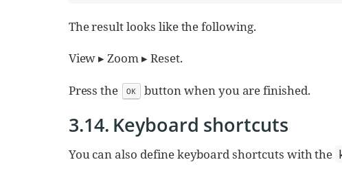

Bonjour, ReStructuredText ! : essai d'un tutoriel
~~~~~~~~~~~~~~~~~~~~~~~~~~~~~~~~~~~~~~~~~~~~~~~~~

Une introduction à https://fr.wikipedia.org/wiki/ReStructuredText

essai de documentation et d'essais de mise en formes diverses.

Une table des matières est mise en place automatiquement.

.. sectnum:: Un essai pour maîtriser l'écriture de la doc…

.. contents:: Table des matières

Première Partie
===============

*gras*, _italiques_ et autres mises en forme
--------------------------------------------

du texte **en gras** ou en *italique* ou bien **consi**déra*ble*ment ou bien _essai_ et encore : 3^2 et d~1~, d_2^4

des touches
-----------

Séquence de touches kbd:[Alt+F11]

Symboles et ligne de séparation
-------------------------------

(C) (R) (TM) -- ... -> <- => <= 

On peut utiliser le signe "fin de paragraphe" :
&#182;

Et aussi rajouter une ligne de séparation :

-----

du texte ici en dessous de la ligne de séparation

des liens
---------

* exemple

https://fr.wikipedia.org/wiki/ReStructuredText

* autre exemple

Une phrase avec un lien vers restrutured_ et `le site de SambaÉDU`_.

.. _restrutured_ : https://fr.wikipedia.org/wiki/ReStructuredText
.. _le site de SambaÉDU : https://www.sambaedu.org/

Références dans le document
---------------------------

À venir…

des listes
----------

* item 1
    * sous-item
    * encore un sous-item
* item 2
* item 3

1) liste 1
    a) sousliste a
    b) sousliste b
2) liste 2
3) liste suivante
    1) sousliste a
        1) sous-sous-liste
    2) sousliste b
    3) sousliste c

#) liste n
#) liste nb

des anotations et remarques
---------------------------

À venir…

citation
--------

| Après la pluie le beau temps.
| C'est la fête à la grenouille !

Deuxième Partie
===============

Inclure du code ou autre texte dans un cadre
--------------------------------------------

Voici le résultat de la commande :
  # lsblk
  NAME   MAJ:MIN RM   SIZE RO TYPE MOUNTPOINT
  sda      8:0    0 698,7G  0 disk 
  ├─sda1   8:1    0  19,9G  0 part /
  ├─sda2   8:2    0  19,9G  0 part 
  ├─sda3   8:3    0     1K  0 part 
  ├─sda5   8:5    0   5,5G  0 part [SWAP]
  └─sda6   8:6    0 653,3G  0 part /home
  sr0     11:0    1  1024M  0 rom

autre exemple :

    int main ( int argc, char *argv[] ) {
        printf("Hello World\n");
        return 0;
    }

Inclure des images
------------------

voici une image :

Les labels
----------

Term 1
    Definition 1

Term 2
    Definition 2

Les tableaux
------------

Voici un tableau :

+-----------+-----------+---------+
| Colonne 1 | Colonne 2 |Colonne 3|
+===========|===========|=========+
|1          |Item 1     |a        |
|2          |Item 2     |b        |
|3          |Item 3     |c        |
+-----------+-----------+---------+
|6          |Three items|d        |
+-----------+-----------+---------+

