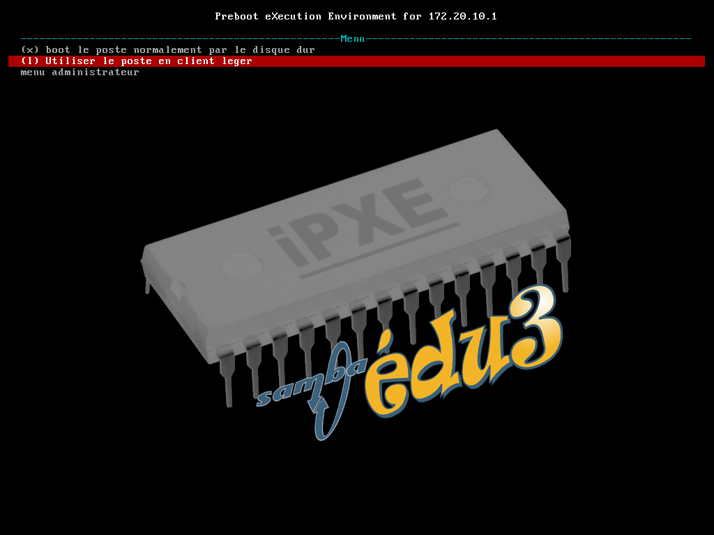
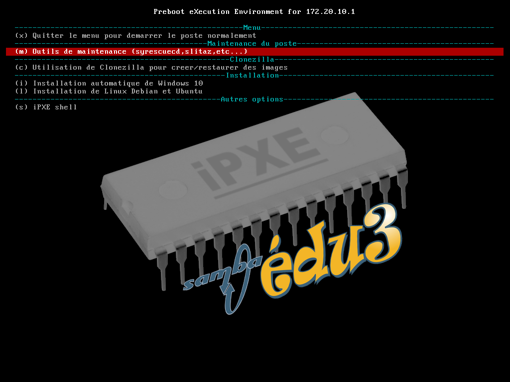
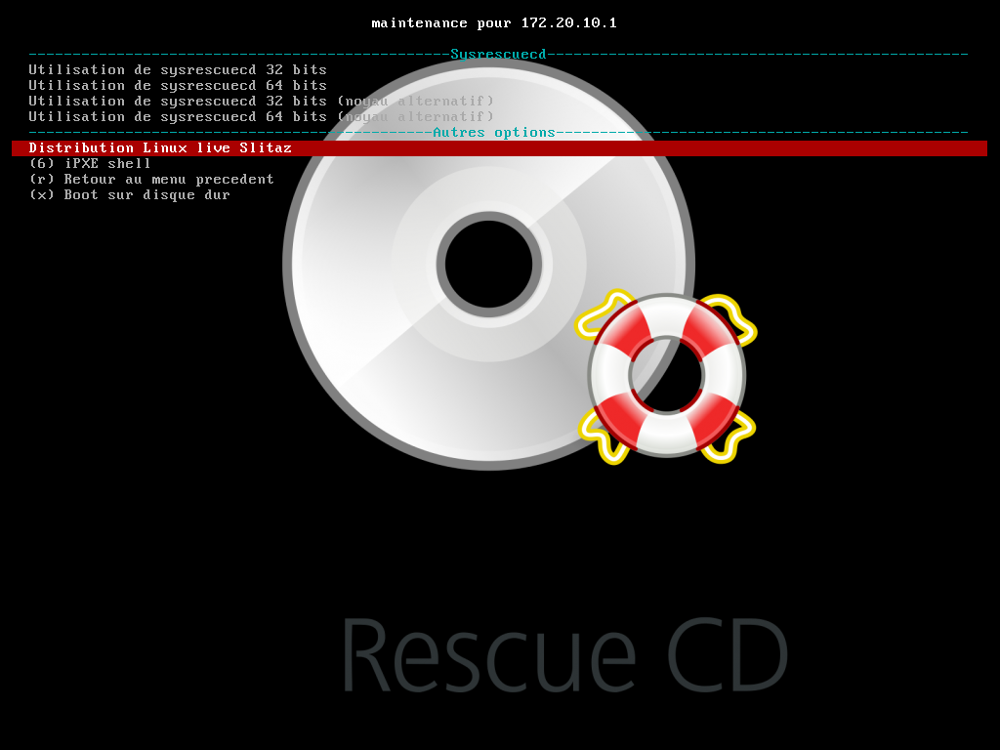
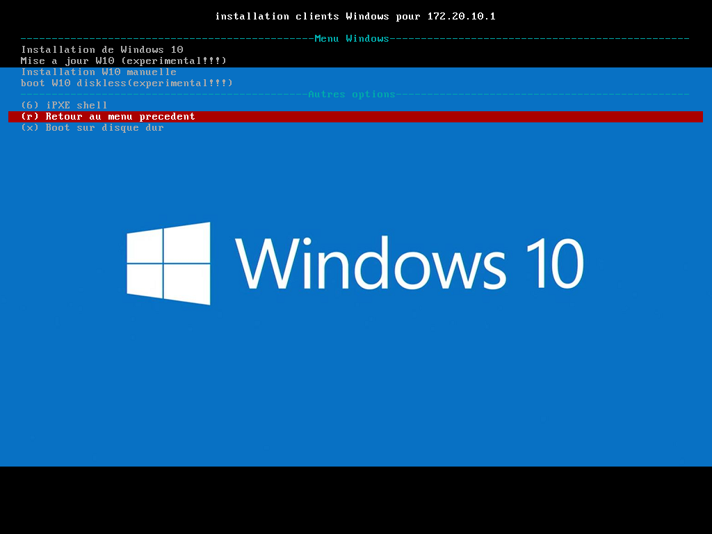
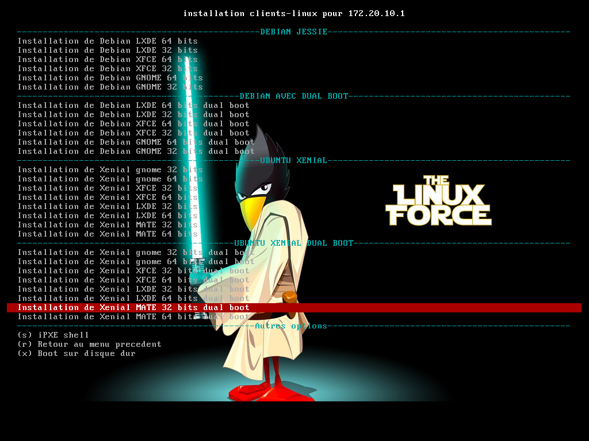
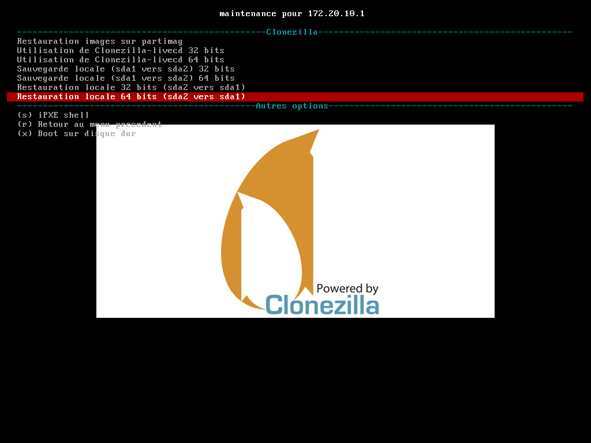

Pxe allant être abandonné au profit de Ipxe, il est possible d'utiliser ipxe pour l'instant en gardant un menu similaire au menu classique.

* [Installation du dispositif](#installation-du-dispositif)
* [Utilisation du nouveau menu ipxe](#utilisation-du-nouveau-menu-ipxe)
* [Modification du menu IPXE](#modification-du-menu-ipxe)


## Installation du dispositif##

On renomme l'ancien dispositif
```
mv /var/www/se3/ipxe  /var/www/se3/ipxe.sav
```
On va copier le dispositif expérimental dans un répertoire comme /var/se3, puis on fera un lien symbolique vers /var/www/se3/ipxe
```
cd /var/se3
git clone https://github.com/SambaEdu/sambaedu-ipxe.git
cd /var/www/se3
ln -s /var/se3/sambaedu-ipxe/sources/ipxe ipxe
```
On désactive ensuite l'interface graphique du menu pxe (partie tftp de l'interface admin du se3).
Actuellellement, le se3 lance le boot en PXE, puis ipxe est lancé ensuite si on appuie sur "i".

Le nouveau menu est lancé à partir d'un fichier php appelé boot-base.php. Il faut donc modidier le fichier /tftpboot/pxelinux.cfg/default
```
nano /tftpboot/pxelinux.cfg/default
```
On ajoute à la fin du fichier (en indiquant la bonne ip du se3)
```
label b
    kernel ipxe.lkrn
    append dhcp && chain http://172.20.0.2:909/ipxe/boot-base.php

```
Il faut aussi modifier le choix par défaut en haut du fichier.
```
default b
```

On peut également réduire le timeout pour que le menu ipxe soit lancé le plus vite possible, et surppimer toutes les autres entrées du fichier default pour être sur qu'aucun utilisateur ne lance une commande .

Pour l'installation automatique des w10, j'ai du procédé à une ou deux modification des liens symboliques puisque la page php ne se situe plus exactement au même endroit. Voir plus bas dans l'arborescence.


## Utilisation du nouveau menu ipxe
Lors du boot, le nouveau menu va apparaitre (comme l'ancien menu pxe)

Sans action de l'utilisateur,l'ordinateur va booter sur le disque dur de façon traditionnelle.

Pour aller dans le menu avancé, il faut indiquer un login *adminse3* et le mot de passe qui est l'ancien mot de passe du menu pxe. 
On peut retrouver/changer ce mot de passe dans l'interface du se3.

On arrive alors dans la partie avancée. On a plus qu'à aller dans la partie souhaitée et valider.






## Modification du menu IPXE

 Le menu est consitué d'une page php appelée boot-base.php. L'arborescence est la suivante
 ```
 /var/www/se3/ipxe
├── auth.php
├── boot-base.php
├── boot.php
├── clonezilla.php
├── config.php
├── functions.php
├── globals.php
├── gparted.php
├── hdt.php
├── ipxe.lkrn -> /tftpboot/ipxe.lkrn
├── ipxe.png
├── ipxe-se3.png
├── memtest86plus.php
├── menu.php
├── params2.php
├── params.php
├── php
│   ├── boot-admin.php
│   ├── client-leger
│   │   └── client-leger.php
│   ├── clonezilla
│   │   ├── clonezilla_live.php
│   │   ├── live32.php
│   │   ├── live64.php
│   │   ├── rest_locale32.php
│   │   ├── rest_locale64.php
│   │   ├── sav_locale32.php
│   │   └── sav_locale64.php
│   ├── clonezilla_menu.php
│   ├── installation-linux.php
│   ├── installation-windows.php
│   ├── install_linux
│   │   ├── deb_gnome32_dboot.php
│   │   ├── deb_gnome32.php
│   │   ├── deb_gnome64_dboot.php
│   │   ├── deb_gnome64.php
│   │   ├── deb_lxde32_dboot.php
│   │   ├── deb_lxde32.php
│   │   ├── deb_lxde64_dboot.php
│   │   ├── deb_lxde64.php
│   │   ├── deb_xfce32_dboot.php
│   │   ├── deb_xfce32.php
│   │   ├── deb_xfce64_dboot.php
│   │   ├── deb_xfce64.php
│   │   ├── lubuntu32_dboot.php
│   │   ├── lubuntu32.php
│   │   ├── lubuntu64_dboot.php
│   │   ├── lubuntu64.php
│   │   ├── mubuntu32_dboot.php
│   │   ├── mubuntu32.php
│   │   ├── mubuntu64_dboot.php
│   │   ├── mubuntu64.php
│   │   ├── ubuntu32_dboot.php
│   │   ├── ubuntu32.php
│   │   ├── ubuntu64_dboot.php
│   │   ├── ubuntu64.php
│   │   ├── xubuntu32_dboot.php
│   │   ├── xubuntu32.php
│   │   ├── xubuntu64_dboot.php
│   │   └── xubuntu64.php
│   ├── install_windows
│   │   ├── wimboot10li.php
│   │   ├── wimboot10.php
│   │   ├── wimboot10r.php
│   │   ├── wimboot7.php
│   │   ├── Win10
│   │   │   ├── boot
│   │   │   │   ├── bcd -> /var/se3/unattended/install/os/Win10/boot/bcd
│   │   │   │   ├── bcd.sav -> ../../../../../se3/unattended/install/os/Win10/boot/bcd
│   │   │   │   ├── boot.sdi -> /var/se3/unattended/install/os/Win10/boot/boot.sdi
│   │   │   │   └── boot.sdi.sav -> ../../../../../se3/unattended/install/os/Win10/boot/boot.sdi
│   │   │   ├── install.bat
│   │   │   ├── se3w10-vars.cmd -> /var/se3/unattended/install/os/netinst/se3w10-vars.cmd
│   │   │   ├── se3w10-vars.cmd.sav -> ../../../../se3/unattended/install/os/netinst/se3w10-vars.cmd
│   │   │   ├── sources
│   │   │   │   ├── boot.wim -> /var/se3/unattended/install/os/Win10/sources/boot.wim
│   │   │   │   └── boot.wim.sav -> ../../../../../se3/unattended/install/os/Win10/sources/boot.wim
│   │   │   ├── upgrade.bat
│   │   │   ├── wimboot
│   │   │   └── winpeshl.ini
│   │   ├── win10diskless2.php
│   │   ├── win10diskless.php
│   │   └── win7pe.php
│   ├── login.check2.php
│   ├── login.check.php
│   ├── login.check.php.sav
│   ├── maintenance.php
│   ├── modele.php
│   ├── mysql.php
│   ├── params.php
│   ├── params-test2.php
│   ├── params-test.php
│   ├── se4ad
│   │   └── se4ad.php
│   ├── slitaz
│   │   └── slitaz.php
│   ├── sysrescuecd
│   │   ├── altker32.php
│   │   ├── altker64.php
│   │   ├── rescue32.php
│   │   ├── rescue64.php
│   │   └── sysrescucd.php
│   └── windows10.png
├── png
│   ├── clonezilla.png
│   ├── ipxe-se3.png
│   ├── linux2.png
│   ├── linux.png
│   ├── sysrescuecd.png
│   └── windows10.png
├── preboot.php
├── wimboot10li.php
├── wimboot10 man.php
├── wimboot10.php
├── wimboot10r.php
├── wimboot7.php
├── wimboot.php
├── Win10
│   ├── boot
│   │   ├── bcd -> ../../../../../se3/unattended/install/os/Win10/boot/bcd
│   │   └── boot.sdi -> ../../../../../se3/unattended/install/os/Win10/boot/boot.sdi
│   ├── install.bat
│   ├── manu.bat
│   ├── se3w10-vars.cmd -> ../../../../se3/unattended/install/os/netinst/se3w10-vars.cmd
│   ├── sources
│   │   └── boot.wim -> ../../../../../se3/unattended/install/os/Win10/sources/boot.wim
│   ├── upgrade.bat
│   ├── wimboot
│   └── winpeshl.ini
├── win10diskless2.php
├── win10diskless.php
└── win7pe.php

 
 
```

Ainsi, on peut ajouter une entrée en ajouant un fichier php. Par exemple, si on a créé une page php  clonezilla personnalisée. On doit la placer dans le répertoire clonezilla . Il faut aussi modifier le fichier clonezilla_menu.php pour ajouter cette  entrée.
De même on pourra ajouter des photos dans le répertoire png et modifier le fichier de menu pour remplacer l'image présente par la nouvelle.
