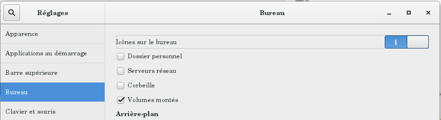

# Utilisation et gestion d'un `client-linux`

Une fois la post-installation terminée, le `client-linux` est prêt :
les utilisateurs peuvent ouvrir une session, si un compte leur a été attribué.

* [La documentation](#la-documentation)
* [Bureau des `clients-linux` `Debian/Jessie/gnome`](#bureau-des-clients-linux-debianjessiegnome)
* [Mot de passe du compte `root` d'un `client-linux`](#mot-de-passe-du-compte-root-dun-client-linux)
* [Utilisation d'un `terminal`](#utilisation-dun-terminal)
* [Utilisation des scripts `unefois`](#utilisation-des-scripts-unefois)


## La documentation

Pour la gestion des `clients-linux` [la documentation du paquet `se3-clients-linux`](../se3-clients-linux/README.md#gestion-des-stations-de-travail-debian-ou-ubuntu-dans-un-domaine-sambaÉdu-avec-le-paquet-se3-clients-linux) vous donnera quelques informations essentielles.

**Remarque :** Si vous utilisez des `clients-linux` pour la première fois, il faudra d'abord vous concentrer sur [le paramétrage du profil commun](../se3-clients-linux/gestion_profils.md#la-gestion-des-profils) à tous les comptes. Il y en a un par défaut lors de l'installation du paquet `se3-clients-linux` : il vous servira de base pour son adaptation aux usages de votre établissement. Et, pour cela, *faites-vous la main* sur un `client-linux` avant de passer à une installation progressive.

**Conseil :** Avant de généraliser l'installation des `clients-linux`, commencez par la salle des profs et les salles de classes. Ainsi, vos collègues se familiarisation avec le nouvel environnement (`Ubuntu` ou `Debian`) et seront plus à l'aise ensuite quand il s'agira de gérer les élèves en salle informatique face à la nouveauté de l'usage des [systèmes libres `GNU/Linux`](https://fr.wikipedia.org/wiki/Linux#Philosophie_du_projet_:_esprit_hacker_et_logiciel_libre).


## Bureau des `clients-linux` `Debian/Jessie/gnome`

Lors de la première installation des `clients-linux` `Debian/Jessie/Gnome`, si on n'a pas encore configuré le profil pour ces `clients-linux`, on se retrouve avec un Bureau "vide" par défaut.

On peut laisser le système ainsi mais si on veut voir apparaître les partages sur le Bureau, il faut configurer le profil via le `skel`.

Pour cela, il faut lancer l'application **Outils système/outil de personnalisation** et dans l'onglet **Bureau**, activer les icônes sur le Bureau ; ne laisser cocher que les volumes montés.


Ensuite, vous [rajoutez le fichier **.config/dconf/user** dans le `skel`](../se3-clients-linux/gestion_profils.md#la-gestion-des-profils) pour que tous les utilisateurs aient la même configuration.


## Mot de passe du compte `root` d'un `client-linux`

Chaque `client-linux` a un compte `root` qui permet son administration. Le mot de passe de ce compte local est le même que celui du compte `adminse3`.


## Utilisation d'un `terminal`

Si vous voulez intervenir directement sur un `client-linux`,
le mieux est d'ouvrir un terminal en `root`. Cependant, si cela concerne plusieurs `clients-linux`, vous pourrez [utiliser un script `unefois`](#utilisation-des-scripts-unefois), en ayant auparavant testé le script sur un des `client-linux`…

Cela peut se faire de plusieurs façons :

- utiliser un `terminal` depuis un autre `client-linux`
en utilisant la commande suivante pour laquelle **ip_client**
désigne l'`IP` du `client-linux` que vous voulez administrer :
```ssh
ssh root@ip_client
```
Vous répondrez **yes** à la question posée
puis vous donnerez le mot de passe du compte `adminse3`.

- ouvrir une session sur le `client-linux` à administrer puis ouvrir un `terminal`
et lancer la commande suivante :
```ssh
su -l
```
Vous donnerez le mot de passe du compte `adminse3`.

**Remarque :** pour fermer la session `root` ouverte via un `terminal`,
il suffit d'utiliser la commande suivante :
```ssh
exit
```

## Utilisation des scripts `unefois`

Une autre façon de gérer un parc de `clients-linux` est d'utiliser le mécanisme des scripts `unefois`, mécanisme décrit dans [la documentation du paquet `se3-clients-linux`](../se3-clients-linux/repertoire_unefois.md#le-répertoire-unefois).


