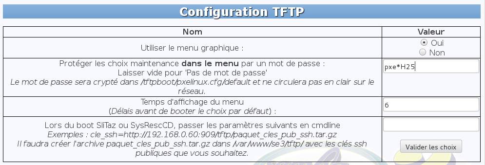
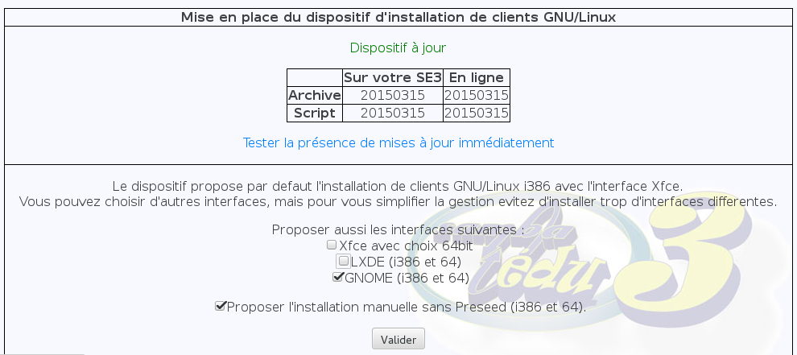
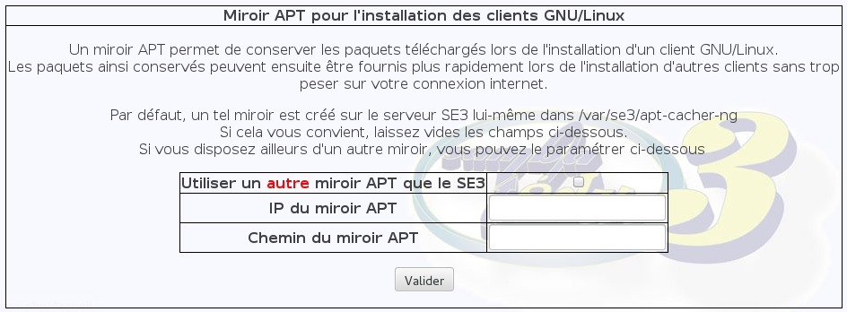

# Mise en place du dispositif d'installation de clients `Gnu/Linux`


* [Prérequis](#prérequis)
    * [Côté serveur `se3`](#côté-serveur-se3)
        * [Serveur `se3` à jour](#serveur-se3-à-jour)
        * [Module `TFTP` installé](#module-tftp-installé)
        * [Module `se3-clients-linux` installé](#module-se3-clients-linux-installé)
        * [Message éventuel concernant le serveur `NTP`](#message-éventuel-concernant-le-serveur-ntp)
        * [Un coup d'œil dans le répertoire `/tftpboot/clients_linux/`](#un-coup-dœil-dans-le-répertoire-tftpbootclients_linux)
    * [Côté `client linux`](#côté-client-linux)
        * [Mode `PXE`](#mode-pxe)
        * [Présence éventuelle d'autres systèmes d'exploitation](#présence-éventuelle-dautres-systèmes-dexploitation)
* [Configuration du serveur `TFTP`](#configuration-du-serveur-tftp)
    * [Le mot de passe](#le-mot-de-passe)
    * [Les environnements de Bureau](#les-environnements-de-bureau)
    * [Mise en place du mécanisme](#mise-en-place-du-mécanisme)
    * [Mise à jour](#mise-à-jour)
    * [Fichier de log de la mise en place](#fichier-de-log-de-la-mise-en-place)
    * [Le miroir local](#le-miroir-local)


## Prérequis

### Côté serveur `se3`

#### Serveur `se3` à jour

Mettre à jour le serveur `se3`.

Ce dernier doit impérativement être en version `Wheezy`. Si vous avez encore votre serveur `se3` en version `squeeze`, nous vous conseillons d'effectuer [la migration vers la version `wheezy`](../se3-migration/SqueezeToWheezy.md).


#### Module `TFTP` installé

Il faut que le module `se3-clonage`, dit [`TFTP`](https://fr.wikipedia.org/wiki/Trivial_File_Transfer_Protocol), soit installé.

* Si c'est le cas vérifiez qu'il est bien dans la dernière version : au moins **0.88** (le mettre à jour si nécessaire).

Pour cela, vous pouvez utilisez la commande suivante dans un terminal en `root` sur le `se3` :
```sh
apt-cache policy se3-clonage
```

* Sinon installez le module `se3-clonage` puis activez le mode graphique via l'interface web du serveur `se3`.

**Conseil :** mettez **un mot de passe** ([voir ci-dessous](#le-mot-de-passe)) : cela évitera l'utilisation intempestive du mode `PXE` des ordinateurs de votre réseau par les utilisateurs.


#### Module `se3-clients-linux` installé

Si vous souhaitez intégrer vos clients Linux au domaine `se3`, il vous faut aussi installer le module `se3-clients-linux`.

* S'il est déjà installé, vérifiez qu'il est bien dans la dernière version : au moins **2.1.1** (le mettre à jour si nécessaire).

Pour cela, vous pouvez utilisez la commande suivante dans un terminal en `root` sur le `se3` :
```sh
apt-cache policy se3-clients-linux
```

* Sinon installez le module puis activez le mode graphique via l'interface web du serveur `se3`.


#### Message éventuel concernant le serveur `NTP`

Lors de l'installation du paquet, si jamais
vous obtenez un message vous indiquant que `le serveur NTP` ne
semble pas fonctionner, avant de passer à la suite, vous
devez vous rendre sur la console d'administration Web de
votre serveur (dans Configuration générale → Paramètres
serveur) afin de spécifier l'adresse d'un serveur de temps
qui fonctionne correctement (chose que l'on peut vérifier
ensuite dans la page de diagnostic du serveur).

Une fois le paramétrage effectué il vous suffit de reconfigurer
le paquet `se3-clients-linux` en lançant, en tant que `root` sur une console du
serveur `se3`, la commande suivante :
```sh
dpkg-reconfigure se3-clients-linux
```
Si tout se passe bien, vous ne devriez plus obtenir
d'avertissement à propos du serveur `NTP`.


#### Un coup d'œil dans le répertoire `/tftpboot/clients_linux/`

Sur le serveur `se3`, le répertoire `/tftpboot/clients_linux/` contient un certain nombre de fichiers, d'archives ou de répertoires.

Nous vous conseillons de supprimer le contenu de ce répertoire pour repartir sur des bases propres, le dispositif ayant été modifié de façon importante pour les clients `Debian/Jessie`.

La mise en place de ce dispositif utilisera ce répertoire qui contiendra, une fois la mise en place terminée, le script de mise en place, une archive `tar.gz` et le répertoire obtenu à partir de cette archive.


### Côté `client linux`

#### Mode `PXE`

Le client doit pouvoir démarrer en mode `PXE`. Ce mode est lancé au démarrage en utilisant la touche `F12`.

Il faut que le mode `PXE` soit activé dans le [`Bios`](https://fr.wikipedia.org/wiki/Basic_Input_Output_System) de l'ordinateur. Selon les ordinateurs, l'activation de ce mode `PXE` est plus ou moins aisé.

Sur certains ordinateurs, ce mode peut être nommé à l'aide d''une expression contenant l'abréviation `NIC` ou le mot `Network`.

En en profitera pour activer aussi le [`WoL`](https://fr.wikipedia.org/wiki/Wake-on-LAN) qui vous sera utile pour la gestion des clients-linux (allumage et extension à distance : voir le module de gestion dans l'interface web du `se3`).

Ainsi sur certains ordinateurs de la marque `Fujitsu`, son activation n'est possible que si auparavant on a activé le mode `Low power`. On se demande bien pourquoi ces constructeurs s'ingénient à cacher ces fonctions, dans le genre "pourquoi faire simple quand on peut faire compliqué…".


#### Présence éventuelle d'autres systèmes d'exploitation

La machine sur laquelle vous désirez installer un client-linux contient la plupart du temps un ou plusieurs systèmes d'exploitation.

Deux options s'offrent à vous : soit vous ne voulez plus utiliser ces systèmes d'exploitation, soit vous désirez les garder.

Dans le premier cas, il suffira de lancer une installation en `simple-boot`.

Dans le second cas, il faudra laisser **un espace libre** à côté des partitions contenant les systèmes d'exploitation déjà présents et lancer une installation en `double-boot`. Au besoin, pour cela, vous réinstallez ces systèmes d'exploitation.


## Configuration du serveur TFTP

### Le mot de passe

Nous en avons déjà parlé dans les prérequis : indispensable !



### Les environnements de Bureau

Choisissez votre environnement de Bureau parmi ceux proposés dans l'interface web du `se3` :

* `Gnome`
* `Lxde`
* `Xfce`

Vous pouvez en choisir plusieurs mais nous vous conseillons de n'en choisir qu'un seul. La plus utilisée est `Gnome`, les autres étant plus légères : votre choix tiendra compte du matériel sur lequel vous faite l'installation et de votre familiarité avec l'un ou l'autre de ces environnements de Bureau. Vous pourrez bien entendu revenir sur ce choix autant de fois que vous le désirez, en n'oubliant pas de valider.


Vous pouvez aussi choisir **une installation manuelle** : il faudra alors répondre aux questions posées lors de l'installation du système d'exploitation ; l'intégration et la post-installation ne sera pas faite non plus dans ce cas-là.

**Remarque :** le choix de la distribution, `Debian` ou `Ubuntu`, sera fait lors de l'utilisation du dispositif, devant le `client-linux` à installer, via le mode `PXE`.


### Mise en place du mécanisme

La validation du ou des choix effectués déclenchera la mise en place du dispositif : **cliquez sur le bouton `Valider`** de la partie concernant le choix de l'environnement de Bureau.


### Mise à jour

Si une nouvelle version du paquet `pxe-client-linux` est proposée, il suffira de cliquer à nouveau sur ce bouton de la partie concernant le choix de l'environnement de Bureau pour effectuer la mise à jour sur votre serveur `se3`.

De même, si les archives netboot `Ubuntu` ou `Debian` ont changé, cliquez à nouveau sur ce bouton de la partie concernant le choix de l'environnement de Bureau pour mettre à jour les fichiers d'amorce de l'installation via le mode `PXE`.


### Fichier de log de la mise en place

Un fichier de log concernant la mise en place du mécanisme est disponible : `/root/compte_rendu_install_client_linux_mise_en_place_${ladate}.txt`.


### Le miroir local

Le serveur `se3`, s'il est à jour, propose un miroir local par le biais du paquet `apt-cacher-ng`.

Ce système permet une gestion souple et efficace des paquets.

Cependant, **si vous désirez gérer votre propre miroir local sur un autre serveur**, cela est possible en cochant la case correspondante, en indiquant son adresse `IP` et le chemin du miroir sur ce serveur distant.


Dans ce cas là, il faudra redéclencher la mise en place du dispositif comme cela est indiqué ci-dessus.

