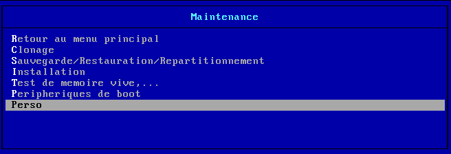
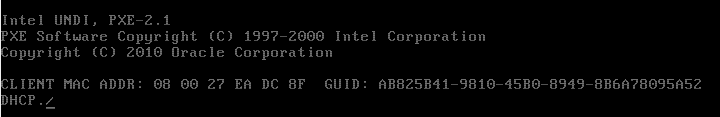
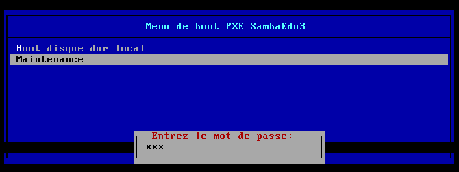
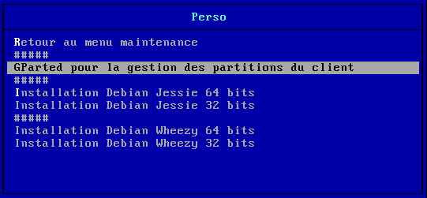
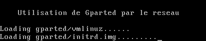
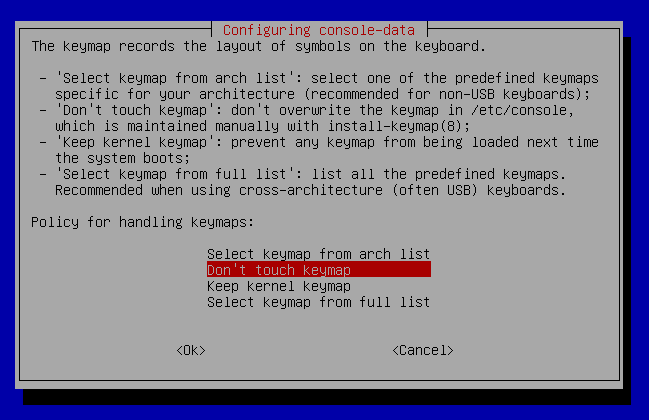
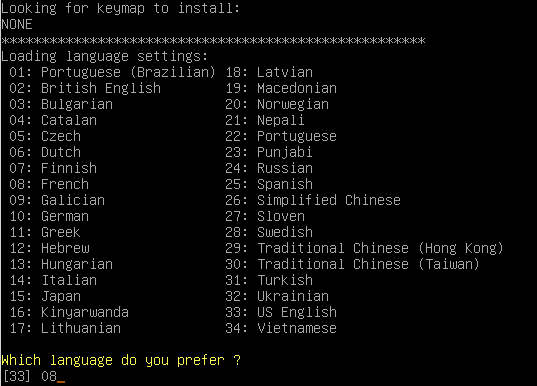
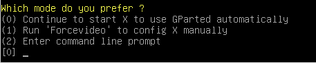
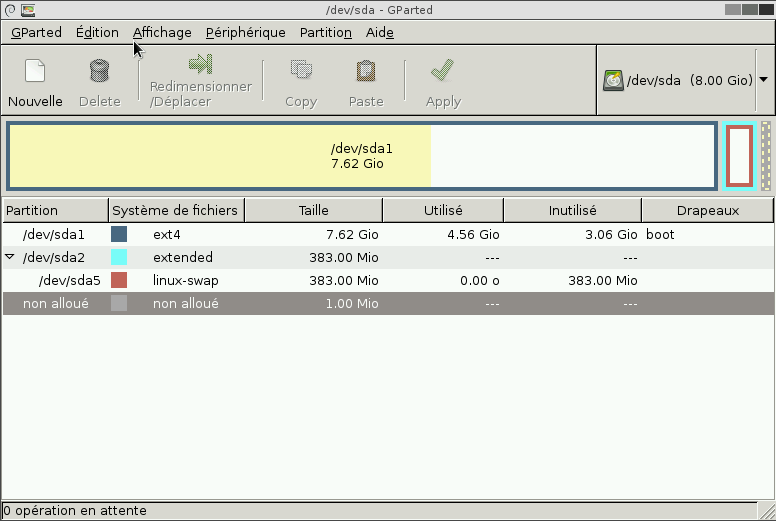

# Menu pxe `perso.menu`

* [Vue d'ensemble](#vue-densemble)
* [Mise en place](#mise-en-place)
* [Démarrage en `PXE`](#démarrage-en-pxe)
* [Accès au menu `Perso`](#accès-au-menu-perso)
* [Exemples d'utilisation](#exemples-dutilisation)
    * [Gparted](#gparted)
        * [Mise en place des fichiers de `GParted`](#mise-en-place-des-fichiers-de-gparted)
            * [Télécharger l'archive](#télécharger-larchive)
            * [Copier les fichiers d'amorçage](#copier-les-fichiers-damorçage)
            * [Copier le fichier de fonctionnement de `GParted`](#copier-le-fichier-de-fonctionnement-de-gparted)
            * [Gestion du répertoire temporaire](#gestion-du-répertoire-temporaire)
        * [Mise en place du menu pxe](#mise-en-place-du-menu-pxe)
        * [Utilisation](#utilisation)
    * [Installer `Debian Jessie` en semi-automatique](#installer-debian-jessie-en-semi-automatique)
        * [Mise en place dans le menu `pxe`](#mise-en-place-dans-le-menu-pxe)
        * [Mise en place du fichier `preseed`](#mise-en-place-du-fichier-preseed)
    * [Installer `Debian Stretch`](#installer-debian-stretch)
    * [Restaurer une image clonezilla stockée sur un partage samba](#restaurer-une-image-clonezilla-stockée-sur-un-partage-samba)


## Vue d'ensemble

Le répertoire `/tftpboot/pxelinux.cfg/` du serveur `se3` contient des menus qui permettent d'amorcer des outils ou les installateurs des systèmes d'exploitation `Debian` ou `Ubuntu` :

* default
* maintenance.menu
* peripheriques.menu
* test.menu
* clonage.menu
* linux.menu
* install.menu
* inst_buntu.cfg
* inst_debian.cfg

Ces menus peuvent être modifiés mais ces modifications ne seront pas conservées suite à une mise à jour du paquet `se3-clonage`.

Si vous souhaitez utiliser un menu à votre convenance et qui soit perenne, cela est possible : il suffit d'ajouter un fichier `perso.menu` dans le répertoire `/tftpboot/pxelinux.cfg/`.

Le fichier `perso.menu` contiendra les commandes d'amorçages via le mécanisme `pxe` que vous souhaitez mettre en place. Des exemples sont donnés ci-dessous.


## Mise en place

Dans le répertoire `/tftpboot/pxelinux.cfg/`, créez le fichier `perso.menu` :
```ssh
touch /tftpboot/pxelinux.cfg/perso.menu
```

Remettez à jour le module `se3-clonage` :
```ssh
apt-get install se3-clonage
```

Dans le menu `maintenance.menu`, il apparaîtra maintenant une entrée vers votre menu perso.



**Menu de base :**

Au début du fichier `perso.menu` (nano /tftpboot/pxelinux.cfg/perso.menu), mettez les commandes qui permettent de revenir au menu précédent qui est le menu `maintenance.menu` :
```ssh
menu title Perso

LABEL Menu_principal
    MENU LABEL ^Retour au menu Maintenance
    KERNEL menu.c32
    APPEND pxelinux.cfg/maintenance.menu

LABEL #####

```

Par la suite, vous compléterez ce fichier `perso.menu` par les entrées nécessaires aux applications que vous souhaitez utiliser. Quelques exemples sont donnés ci-dessous.


## Démarrage en `PXE`

Pour amorcer une machine via le réseau, avec `PXE`, appuyez sur la touche `F12` lors du démarrage de cet ordinateur.


**Remarque :** il faut que le mode `PXE` soit activé dans le `Bios` de l'ordinateur. Voir [les prérequis](misenplace.md#prérequis) concernant les clients linux.


## Accès au menu `Perso`

**Remarque :** la navigation dans les menus `PXE` se fait à l'aide des touches `↑` et `↓` ; pour sélectionner une des entrées du menu, il suffit d'utiliser la touche `Entrée`.

Une 1ère étape est proposée afin de sécuriser ce mode de fonctionnement : après avoir choisi l'entrée `Maintenance`…

… un mot de passe est requis.

Il suffit ensuite de choisir l'entrée `Perso`…


…pour avoir accès aux diverses utilisations que vous mettrez en place (voir des exemples ci-dessous).


## Exemples d'utilisation

### Gparted

`GParted` (GNOME Partition Editor) sert à créer, supprimer, redimensionner, déplacer, vérifier et copier des partitions, et les systèmes de fichiers qui s’y trouvent. Il peut être notamment utilisé pour faire de la place en vue d’installer un nouveau système d’exploitation, réorganiser l’utilisation du disque, copier les données résidentes sur des disques durs et effectuer une copie d’une partition sur un autre disque. [Une documentation](http://gparted.sourceforge.net/display-doc.php?name=help-manual&lang=fr) est disponible pour toutes ces opérations.

Pour utiliser `GParted` via le réseau, il faut mettre en place les commandes d'amorçage dans le fichier `perso.menu` et les fichiers nécessaires lors de cet amorçage et lors de l'utilisation.


#### Mise en place des fichiers de `GParted`

Les indications qui suivent sont issues de [la documentation `GParted live on PXE Server`](http://gparted.sourceforge.net/livepxe.php). Nous vous recommendons de suivre cette documentation si des changements sont nécessaires lors de mises à jour ultérieures de `GParted`.


##### Télécharger l'archive

Téléchargez l'archive (dans la commande, on a pris celle correspondant à l'architecture `amd64` mais on pourra utiliser aussi celle correspondant à `i686` ou à `i686-pae`) contenant le nécessaire dans un répertoire temporaire et décompressez-la :
```ssh
mkdir /tftpboot/tempgparted
wget -P /tftpboot/tempgparted http://sourceforge.net/projects/gparted/files/gparted-live-stable/0.25.0-1/gparted-live-0.25.0-1-amd64.zip
mkdir -p /tftpboot/tempgparted/gparted
unzip /tftpboot/tempgparted/gparted-live-*-amd64.zip -d /tftpboot/tempgparted/gparted/
```

**Remarque :** la version de `GParted` pouvant évoluer, il faudra adapter la commande de téléchargement ci-dessus. Ainsi, au lieu de `0.25.0-1`, vous pourriez mettre `0.27.0-1` qui est [la version stable](https://sourceforge.net/projects/gparted/files/gparted-live-stable/) en novembre 2016.


##### Copier les fichiers d'amorçage

Les fichiers pour l'amorçage sont à placer dans un sous-répertoire de `/tftpboot` : *gparted* par exemple.
```ssh
mkdir -p /tftpboot/gparted
cp /tftpboot/tempgparted/gparted/live/{vmlinuz,initrd.img} /tftpboot/gparted/
```


##### Copier le fichier de fonctionnement de `GParted`

Le fichier nécessaire au fonctionnement *live* de `GParted` est à placer dans une partie accessible via le réseau : dans le répertoire `/var/www/` du serveur `se3`.

Vous pourriez créer un répertoire */var/www/gparted* mais lors d'une réinstallation ou d'une migration vers un nouveau serveur `se3`, il faudrait le remettre en place. Le mieux est donc de le placer dans le répertoire `/home/netlogon/clients_linux/install/messcripts_perso/` comme cela il sera sauvegardé et restauré en cas de changement de serveur :
```ssh
mkdir -p /home/netlogon/clients-linux/install/messcripts_perso/gparted
cp /tftpboot/tempgparted/gparted/live/filesystem.squashfs /var/www/install/messcripts_perso/gparted/
```

##### Gestion du répertoire temporaire

Une fois les fichiers en place, on peut supprimer quelques éléments dans le répertoire temporaire `/tftpboot/tempgparted`. On pourrait le supprimer mais il est intéressant de le garder avec l'archive téléchargée pour se souvenir de la version de `Gparted` mise en place.


#### Mise en place du menu pxe

Dans le fichier `perso.menu` (nano /tftpboot/pxelinux.cfg/perso.menu), rajoutez les lignes suivantes
(en remplaçant *IP-du-se3* par la valeur correspondant à votre réseau) :
```ssh
LABEL GParted
    MENU LABEL GParted pour la gestion des partitions
    kernel gparted/vmlinuz
    append initrd=gparted/initrd.img boot=live config components union=overlay username=user noswap noeject ip= vga=788 fetch=http://IP-du-se3/install/messcripts_perso/gparted/filesystem.squashfs
    TEXT HELP
    Utilisation de Gparted par le reseau
    ENDTEXT
```

**Remarque :** la version de `GParted` pouvant évoluer, il faudra adapter, si cela est nécessaire, les paramètres de la ligne *append* ci-dessus. Un coup d'œil dans [la documentation `Gparted live`](http://gparted.sourceforge.net/livepxe.php) pourra être utile…


#### Utilisation

Il suffit de démarrer le client via le mode `pxe` (touche `F12`) et ensuite de choisir le menu `perso` comme cela a été décrit ci-dessus.

Vous choisissez alors l'entrée `Gparted` :


Et c'est parti :


Lors de la mise en place de `GParted`, il est demandé quelques précisions :

* le clavier



Il suffira de taper sur la touche `Entrée`.

* la langue d'usage



Pour le français, indiquez `08`.

* mode d'utilisation



Il suffira de taper sur la touche `Entrée`.

Enfin, on obtient l'interface de gestion des partitions du client.




### Installer `Debian Jessie` en semi-automatique

Vous pouvez profiter du mécanisme d'installation de `Debian Jessie` via le mode `pxe` pour obtenir l'installation d'un système non intégré. Cela peut servir à installer `Debian/Jessie` sur l'ordinateur personnel d'un collègue…

Il faut donc adapter un des fichiers preseed disponibles dans le répertoire */home/netlogon/clients-linux/install/* et ajouter une entrée au menu perso pour l'utiliser.


#### Mise en place dans le menu `pxe`

Dans le fichier `perso.menu` (nano /tftpboot/pxelinux.cfg/perso.menu), rajoutez, par exemple, les lignes suivantes (les … indiquent que l'on peut avoir des lignes avant et des lignes après):
```ssh
…
LABEL DebianJessiesemiautoamd64
    MENU LABEL ^Netboot Debian jessie Preseed semi-auto (amd64)
    KERNEL  debian-installer/amd64/linux
    APPEND  keymap=fr(latin9) language=fr country=FR locale=fr_FR.UTF-8 netcfg/dhcp_timeout=60 preseed/url=http://###_IP_SE3_###/install/messcripts_perso/semi-auto_preseed_debian.cfg initrd=debian-installer/amd64/initrd.gz --
    TEXT HELP
    Installation semi-automatique de Debian jessie amd64 avec gnome-desktop
    ENDTEXT
…
```
Dans la ligne `APPEND`, vous remplacerez *###_IP_SE3_###* par l'IP de votre se3
et vous adapterez éventuellement *le nom du fichier preseed*
(ici, on a mis *semi-auto_preseed_debian.cfg*)
fichier preseed à placer, par exemple, dans le répertoire des scripts perso (comme ici).


#### Mise en place du fichier `preseed`

Le fichier `preseed` contient toutes les réponses aux questions posées lors d'une installation classique : cela rend le système d'installation automatique sans intervention de la part de l'utilisateur.

Pour une installation semi-automatique, on fera en sorte que certaines questions soient posées (**nom de la machine, nom du domaine, partitionnement, mot de passe root, identifiant et mot de passe d'un compte lambda** par exemple).

Pour cela, on peut prendre un des fichiers preseed qui se trouvent dans le répertoire */home/netlogon/clients-linux/install/* et commenter les lignes correspondantes aux questions dont on souhaite avoir les questions au cours de l'installation. Les réponses aux questions commencent la plupart du temps par *d-i*.

**Remarque :** pour commenter une ligne, il suffit de mettre un **#** au début de cette ligne.

Il faudra aussi modifier **la section 10** qui permet de préparer la post-installation. Si vous n'en avez pas l'usage, il sera plus rapide de commenter la ligne commençant par *d-i preseed/late_command string*.

**Un conseil :** si c'est pour un usage personnel, il peut être intéressant, et pratique lors d'une ré-installation ultérieure, d'avoir le répertoire */home* dans une partition à part. Pour cela, il faudra remplacer le paramètre **atomic** par **home** (voir **la section 5** du fichier preseed).

Vous renommerez ce fichier preseed ainsi modifié
(par exemple le nommer *semi-auto_preseed_debian.cfg*)
et le placerez dans le répertoire */home/netlogon/clients-linux/install/messcripts_perso/* :
ainsi il ne sera pas supprimé lors d'une mise à jour du mécanisme.

Une fois le système installé, il faudra (selon l'usage de cette machine) supprimer le fichier */etc/apt/apt.conf* qui a été créé pour tenir compte du miroir `apt-cacher` géré par le `se3`.


### Installer `Debian Stretch`

La version `Stretch` de `Debian` étant bientôt en stable, vous pouvez d'ors et déjà l'essayer via une installation `netboot`.


* Télécharger l'archive

On crée un répertoire temporaire et on y télécharge l'archive netboot.tar.gz et on la décompresse.
```sh
mkdir /tftpboot/tempstretch
cd /tftpboot/tempstretch
wget http://ftp.debian.org/debian/dists/stretch/main/installer-amd64/current/images/netboot/netboot.tar.gz -O stretch_netboot.tar.gz
tar -xzf stretch_netboot.tar.gz
cd ..
```

* Copier les fichiers d'amorçage

On crée le répertoire /tftpboot/stretch et on y copie le répertoire amd64 de l'archive netboot décompressée ci-dessus et on peut supprimer le répertoire temporaire.
```sh
mkdir /tftpboot/stretch
cp -r /tftpboot/tempstretch/debian-installer/amd64 /tftpboot/stretch/amd64
rm -rf /tftpboot/tempstretch
```

* Mise en place d'une entrée dans le menu pxe

On édite le fichier **perso.menu** (nano /tftpboot/pxelinux.cfg/perso.menu) puis on ajoute les lignes suivantes (les … indiquent que l'on peut avoir des lignes avant et des lignes après):

```sh
…
LABEL Installation manuelle stretch amd64
     MENU LABEL ^Netboot en manuel stretch (amd64)
     KERNEL stretch/amd64/linux
     APPEND vga=normal initrd=stretch/amd64/initrd.gz --quiet
     TEXT HELP
     Installation manuelle de Debian stretch amd64
     ENDTEXT
…
```

Bonne installation :-)


## Restaurer une image clonezilla stockée sur un partage samba

L'intéret est de pouvoir stocker des images propres d'un type de poste non intégré. En cas de contamination d'une salle par un virus, il est facile de restaurer un poste, de l'intégrer puis de lancer un clonage, ou tout simplement de restaurer chaque poste avec cette image.

L'image clonezilla est stockée sur u partage samba qui peut être se3 ou un autre serveur.

On ajoute dans le fichier perso.menu (nano /tftpboot/pxelinux.cfg/perso.menu) les lignes suivantes
```ssh 
...
label Clonezilla-live 
MENU LABEL Clonezilla restore m72esciences (partimag)
KERNEL clonezilla64/vmlinuz
APPEND initrd=clonezilla64/initrd.img boot=live config noswap nolocales edd=on nomodeset  ocs_prerun="mount -t cifs //172.20.0.6/partimag /home/partimag/ -o user=clonezilla,password=clonezilla123"  ocs_live_run="ocs-sr  -e1 auto -e2  -r -j2  -p reboot restoredisk  m72esciencesv4 sda" ocs_live_extra_param="" keyboard-layouts="fr" ocs_live_batch="no" locales="fr_FR.UTF-8" vga=788 nosplash noprompt fetch=tftp://172.20.0.2/clonezilla64/filesystem.squashfs
 ```
**Attention à la casse, ce qui est derrière APPEND doit être sur une même ligne**

Ici l'image du poste non intégré est stockée sur un serveur debian avec samba installé. Un partage "partimag" a été créé sur ce serveur.

Un compte local et samba clonezilla a été crée sans aucun accès ssh, ou bash car le mdp *clonezilla123* va s'afficher très briévement à l'écran lors du montage automatique du partage samba.

L'image appelée m72esciencesV4 restaurée va écraser tout le disque sda. Après clonage, le pc va redémarrer.

Plus d'informations [ici](<http://wiki.dane.ac-versailles.fr/index.php?title=Clonage_presque_automatis%C3%A9_avec_clonezilla>)
