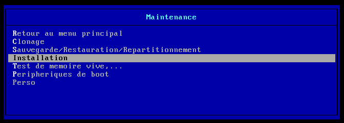
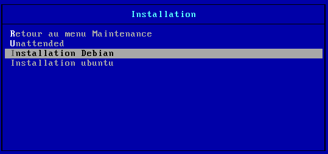
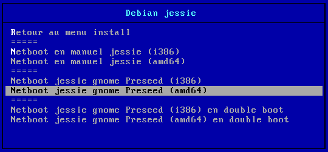
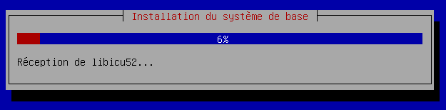
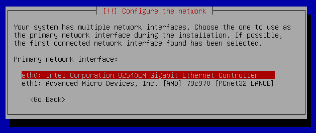
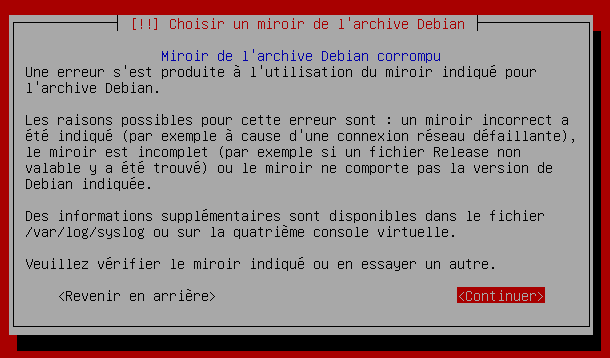
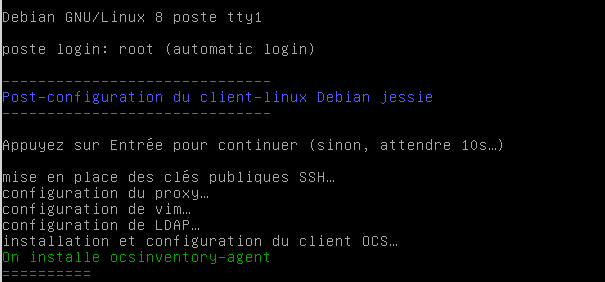

# Utilisation du dispositif d'installation de clients `Gnu/Linux`

* [Vue d'ensemble](#vue-densemble)
* [Démarrage en `PXE`](#démarrage-en-pxe)
* [Menus pxe disponibles](#menus-pxe-disponibles)
* [Installation du système `phase 1`](#installation-du-système-phase-1)
* [Quelques précisions](#quelques-précisions)
    * [Installation en double-boot](#installation-en-double-boot)
    * [Les firmwares pour la carte réseau](#les-firmwares-pour-la-carte-réseau)
    * [Fichiers de log de la phase 1](#fichiers-de-log-de-la-phase-1)
    * [Problèmes éventuels lors de la phase 1](#problèmes-éventuels-lors-de-la-phase-1)
        * [Problème 1 : carte réseau et microprogramme](#problème-1--carte-réseau-et-microprogramme)
        * [Problème 2 : 2 cartes réseaux détectées](#problème-2--2-cartes-réseaux-détectées)
        * [Problème 3 : un fond bleu figé](#problème-3--un-fond-bleu-figé)
        * [Problème 4 : installation qui se fige](#problème-4--installation-qui-se-fige)
        * [Problème 5 : système de fichiers racines](#problème-5--système-de-fichiers-racines)
        * [Problème 6 : montage d'un système de fichiers](#problème-6--montage-dun-système-de-fichiers)
        * [Problème 7 : corruption de miroir](#problème-7--corruption-de-miroir)
        * [Analyser un problème](#analyser-un-problème)
* [Réservation de l'`IP` du `client-linux`](#réservation-de-lip-du-client-linux)
    * [Cas d'une nouvelle machine](#cas-dune-nouvelle-machine)
    * [Cas d'une machine ayant une réservation](#cas-dune-machine-ayant-une-réservation)
    * [Nom du `client-linux`](#nom-du-client-linux)
* [Post-installation `phase 2`](#post-installation-phase-2)
    * [Après le 1er redémmarage](#après-le-redémmarage)
    * [Fichiers de log de la phase 2](#fichiers-de-log-de-la-phase-2)
    * [Cas d'une intégration différée](#cas-dune-intégration-différée)
* [Utilisation et gestion du `client-linux`](gestionclients.md#utilisation-et-gestion-dun-client-linux)


## Vue d'ensemble

Une fois le dispositif en place, son utilisation est relativement simple.

Voici les étapes à suivre :

* démarrer une machine en `PXE` (touche `F12`)
* choisir une des installations proposées

Ensuite, tout se déroulera de façon automatique, sans intervention de votre part :

* installation du système (**phase 1**)
* 1er redémarrage
* post-installation et intégration au domaine `se3` (**phase 2**)
* 2ème redémarrage

On obtient ainsi un client `Gnu/Linux` sur lequel on peut ouvrir une session avec un des comptes disponibles dans [l'annuaire `Ldap`](https://fr.wikipedia.org/wiki/Lightweight_Directory_Access_Protocol) du serveur `se3`.

**Remarque 1 :** à la fin de la post-installation (**phase 2**), il est lancé un [script perso](messcripts.md#lancement-dun-script-perso-en-fin-de-post-installation-des-clients-linux) que vous pouvez utiliser pour apporter votre touche personnelle au `client-linux` ;-)

**Remarque 2 :** de même, une [liste de paquets perso](listeapplis.md#la-liste-perso) à installer lors de cette phase de post-installation est à votre disposition. Sinon, il est toujours possible de le faire par la suite à l'aide des scripts `unefois`.


## Démarrage en `PXE`

Pour amorcer une machine via le réseau, avec `PXE`, appuyez sur la touche `F12` lors du démarrage de cet ordinateur.


**Remarque :** il faut que le mode `PXE` soit activé dans le `Bios` de l'ordinateur. Voir [les prérequis](misenplace.md#prérequis) concernant les clients linux.


## Menus `PXE` disponibles

**Remarque :** la navigation dans les menus `PXE` se fait à l'aide des touches `↑` et `↓` ; pour sélectionner une des entrées du menu, il suffit d'utiliser la touche `Entrée`.

Une 1ère étape est proposée afin de sécuriser ce mode de fonctionnement : après avoir choisi l'entrée `Maintenance`…

… un mot de passe est requis.

Ensuite, choisissez l'entrée `Installation`…


… et enfin une des entrées `Installation Debian` ou `Installation Ubuntu`.


Vous pourrez alors choisir `l'environnement de Bureau` à installer, selon les architectures `i386` et `amd64` et selon qu'un système d'exploitation est déjà installé (à condition d'avoir laissé un espace vide non formaté) pour obtenir un `double-boot`.

→ dans ce menu, `Gnome` est l'environnement de Bureau proposé.


## Installation du système (phase 1)

L'installation du système choisi se fait automatiquement.


**Remarque :** la première utilisation de ce mécanisme peut être assez longue mais les installations suivantes seront nettement plus rapides. En effet, l'installation utilise le miroir local géré par le paquet `apt-caher-ng` du serveur `se3` qui doit récupérer (et par la suite mettre à jour si nécessaire) les paquets utiles à l'installation via les dépôts officiels. Une fois ces paquets récupérés, ils sont alors disponibles localement et on profite alors du débit du réseau interne qui est nettement plus rapide.


## Quelques précisions

### Installation en double-boot

Les menus `pxe`, que ce soit pour `Debian` ou pour `Ubuntu`, propose une installation en double-boot (voir les copies d'écran ci-dessus).

_Une condition à respecter_ pour cela est qu'il y ait un espace libre (ie non partitionné) sur le disque dur qui contient déjà l'installation d'un système d'exploitation, quelqu'il soit. L'espace libre doit être après l'espace partitionné.

**Attention :** s'il n'y a pas d'espace libre, ou s'il est insuffisant, l'installateur vous prévient et si vous lui dites de continuer, il écrase tout "menu menu" : hop ! Plus que du `GNU/Linux`, vite fait bien fait ;-)


### Les firmwares pour la carte réseau

Les micro-programmes (ou `firmwares`) pour la carte réseau ne sont plus à fournir via une clé `usb` : ils ont été incorporés au fichier d'amorçage `initrd.gz`.

Cependant, vous pourrez trouver ces `firmwares` sur [le site de Debian dédié à la diffusion des images d'installation](http://cdimage.debian.org/cdimage/unofficial/non-free/firmware/jessie/current/).


### Fichiers de log de la phase 1

Des fichiers de log de la phase 1 sont disponibles dans `/var/log/installer/syslog`.


### Problèmes éventuels lors de la phase 1

#### Problème 1 : carte réseau et microprogramme

Au début de l'installation, certaines cartes réseau ont besoin d'un micro-programme et il ne se trouve pas dans ceux qui sont incorporés comme cela est expliqué ci-dessus : l'installation demande alors ce micro-programme (ou firmware).

**Solution :** noter les références du micro-programme et répondre Non pour poursuivre l'installation. Par la suite, il suffira d'installer le paquet correspondant à ce micro-programme. Par exemple, pour certaines cartes réseau `Broadcom`, on installera le paquet `firmware-b43-installer` (via un `terminal` à l'aide de la commande *aptitude install firmware-b43-installer*).


#### Problème 2 : 2 cartes réseaux détectées

Au début de l'installation, le système détecte 2 cartes réseaux ; c'est souvent le cas d'un portable ayant une interface `Ethernet` et une interface `Wifi` et, dans ce cas, les interfaces peuvent être nommées `eth0` et `wlan0`. On peut avoir aussi 2 interfaces `Ethernet`, nommées `eth0` et `eth1` comme dans l'image ci-dessous.


**Solution :** il suffira de choisir l'interface branchée au réseau, cette interface est souvent `eth0`, comme sur l'image ci-dessus.


#### Problème 3 : un fond bleu figé

Sur certaines machines, au début, après avoir choisi et lancé l'installation, l'installation se fige sur un fond bleu… En passant sur la 4ème console qui donne les `syslog` (avec la combinaison de touches `Ctrl+Alt+F4`) on reste bloqué sur les lignes suivantes :
```ssh
check missing firmware, installing package /firmware/firmare-linux-nonfree_0.43_all.deb
check missing firmware : removing and loading kernel module tg3
```
C'est donc un problème concernant un des firmwares à fournir qui est pourtant bien un des firmwares incorporés.

**Solution :** en passant sur la fenêtre principale (à l'aide de la combinaison de touches `Ctrl+c`), le script est relancé et ça passe....Ce doit être un bug de l'installeur AMHA, donc pas grand chose à faire…


#### Problème 4 : installation qui se fige

Sur certaines machines (Dell Optiplex 330), l'installation se fige à l'amorce et si on relance l'installation, elle se fige à un autre moment.

**Solution :** configurer le `Bios` de la machine pour accepter le mode `WoL` ([Wake On Line](https://fr.wikipedia.org/wiki/Wake-on-LAN)). Relancer ensuite l'installation.


#### Problème 5 : système de fichiers racines

L'installation s'arrête sur un message d'erreur : `Pas de système de fichiers racines. Aucun système de fichiers n'a été choisi comme fichier racine`.

**Solution :** une clé usb, un lecteur de disquette usb, un lecteur de carte interne ou une imprimante sont branchés sur le client : les enlever et relancer l'installation.


#### Problème 6 : montage d'un système de fichiers

L'installation s'arrête sur le message d'erreur suivant :


**Solution :** mettre à jour les archives netboot `Ubuntu` ou `Debian`, qui ont dû changer lors d'une évolution de version, en revalidant le choix de l'environnement du Bureau (Voir le module `Serveur TFTP` de l'interface du `se3`).


#### Problème 7 : corruption de miroir

L'installation s'arrête sur un message de corruption du miroir


**Solution :** rétablir la connexion avec l'internet soit du `se3`, soit de la `passerelle` puis relancer l'installation.


#### Analyser un problème

Si votre problème n'est pas encore dans la liste ci-dessus,
il est possible de l'analyser en utilisant **les consoles disponibles lors de l'installation**.

* **Ctrl+Alt+F1 :** sortie graphique de l'installation
* **Ctrl+Alt+F4 :** sortie des journaux de l'installation
* **Ctrl+Alt+F2 :** console permettant quelques commandes pendant l'installation


## Réservation de l'`IP` du `client-linux`

### Cas d'une nouvelle machine

Pendant que le `client-linux` est en train de s'installer, vous avez le temps (de 20 min à 30 min environ) de lui réserver une adresse `IP` ([Internet Protocol](https://fr.wikipedia.org/wiki/Adresse_IP)) par l'intermédiaire de l'interface web du serveur `se3` avec le module `Serveur dhcp`.

Cette réservation est indispensable car lors de la post-intallation (**Phase 2** décrite ci-dessous), c'est par l'intermédiaire de l'annuaire `Ldap` du serveur `se3` que le mécanisme récupère le nom du `client-linux`.

Sinon, la post-installation vous demandera d'attribuer un nom au `client-linux`, sans toutefois inclure ce nom à l'annuaire du `se3`.


### Cas d'une machine ayant une réservation

Si vous installez une machine qui a une réservation, vous pouvez directement lancer l'installation. Le `client-linux` aura la même adresse `IP` et le même nom que celui qui est inscrit dans l'annuaire `Ldap` du serveur `se3`.

Si vous voulez changer le nom ou l'`IP` inscrits dans l'annuaire `Ldap` du serveur `se3`, le mieux est de supprimer cette réservation, de supprimer son éventuelle appartenance à un ou des parcs et, enfin, de supprimer aussi son entrée dans l'annuaire `Ldap` du serveur `se3`. Une fois cela fait, vous pouvez recommencer la procédure de réservation.


### Nom du `client-linux`

Le nom du `client-linux` doit respecter certaines règles qui seront vérifiées lors de la post-installation/intégration.

**Les caractères autorisés pour le choix du nom d'hôte sont :**  
  → les 26 lettres de l'alphabet en minuscules ou en majuscules, **sans accents**  
  → les chiffres  
  → le tiret du 6 (-)  
  → et c'est tout !  

**Nombre de caractères :** *De plus, le nom de la machine ne soit pas faire plus de 15 caractères*.

Pour faciliter la gestion des `clients-linux`, vous pouvez structurer le nom pour tenir compte, d'une part, des particularités de votre établissement et, d'autre part, des possibilités offertes par les scripts `unefois`.

Par exemple, vous pouvez nommer des machines en référence à la salle où elles se trouvent (cas d'une salle informatique smm1 : smm1-01, smm1-02,…) ou bien en référence à leur utilisation (cas des ordinateurs dans les salles de cours : cours-eg1, cours-eg2, cours-musique,…).


## Post-installation (phase 2)

### Après le redémmarage

Une fois le système installé, la machine redémarre et la post-installation est lancée automatiquement.


Au redémarrage suivant, le client `GNU∕Linux` est prêt ;-) et son administration se fait via le paquet `se3-clients-linux`.

**Remarque :** si vous n'avez pas réservé une `IP` [voir ci-dessus](#réservation-de-lip-du-client-linux), la post-installation sera interrompue pour demander un nom pour le `client linux`. Cependant, ce nom ne sera pas inscrit dans l'annuaire `Ldap` du serveur `se3`.


### Fichiers de log de la phase 2

Un compte-rendu de cette `phase 2` est disponible avec le fichier `/root/compte_rendu_post-install_ladate.txt`.


### Cas d'une intégration différée

Si vous ne désirez pas intégrer la machine installée au domaine géré par le serveur `se3`, il suffira de répondre`n` quand la question sera posée au cours de la phase 2. **Toute autre réponse déclenchera l'intégration**.

Vous pourrez le faire par la suite, comme cela est indiqué à la fin de la post-installation.

