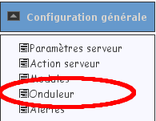
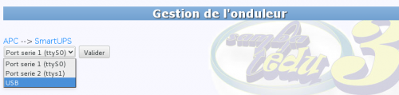
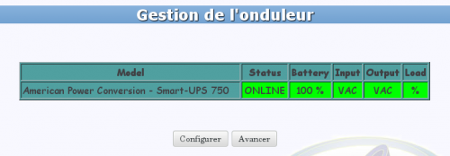
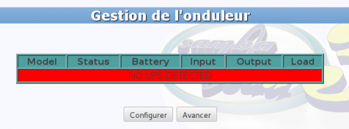
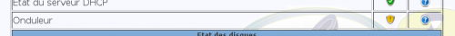

# Configurer l’onduleur 

(auteurs :  Michel Suquet, Stéphane Laine)

* [L’interface graphique](#linterface-graphique)
* [Cas d’un port usb](#cas-dun-port-usb)
* [Cas d’un port série](#cas-dun-port-série)


## L’interface graphique

Pour configurer l’onduleur, utilisez **l’interface web du se3** : 

- avec le module **Configuration générale**, rentrer dans le menu **Onduleur** :



- choisir ensuite votre onduleur grâce aux menus déroulants :




- vous devriez obtenir le résultat suivant ::smiley:



**Remarque** : dans cet article, on a pris comme exemple un onduleur smart-ups 750 ; si votre onduleur est différent, il faudra adapter les différentes commandes en conséquence.


## Cas d’un port usb

**0. Configuration via l’interface web**
La configuration de l’onduleur par l’intermédiaire de l’interface graphique ne permet pas d’obtenir une configuration de l’onduleur…

→ dans le menu Onduleur, tout n’est pas au vert…



→ ou dans la page Diagnostic, le bouclier n’est pas au vert…



… **elle est tout de même indispensable** car elle met en place et configure, bien que partiellement, des fichiers que nous n’aurons plus qu’à vérifier ou à modifier légèrement.

Pour compléter cette configuration, si cela est nécessaire (tout n’est pas au vert, y compris dans la page **Diagnostic**), nous allons utiliser la ligne de commande via un terminal en root sur le serveur `se3`. Pour cela, **dans le cas d’un port usb**, nous vous proposons une procédure dont les différentes étapes sont décrites ci-dessous.

**Important :** si dans les étapes suivantes vous constatez qu'un des fichiers est vide (sauf mention particulière bien entendu), ce n'est sans doute pas normal : reprenez la configuration en repartant de l'étape 0 ! Si malgré cela, la situation persiste, n'hésitez pas à utiliser la liste de Caen pour exposer votre problème.

**Remarque :** l'étape 0 peut servir à réinitialiser le service en cas de problème avec l'utilisation de l'onduleur. Il faudra ensuite rejouer les différentes étapes ci-dessous pour compléter la configuration du service.


**1. Repérer des informations de l’onduleur**

À l’aide de la commande suivante : 
```
lsusb
```
→ cette commande donne le bus, le périphérique, le vendorid, le productid et le constructeur

→ mettons que l’on ait, par exemple, les informations suivantes :

    Bus 002 Device 008 ID 051d:0003 American Power Conversion UPS

Dans cet exemple, 002 est le bus, 008 est le périphérique, 051d est le vendorid et 0003 est le productid. Le constructeur est American Power Conversion UPS.

**Remarque** : vous obtiendrez sans doute des informations différentes pour votre se3 ; il suffira d’adapter en conséquence les lignes de commandes et indications qui suivent. Pour ces commandes, nous prendrons les informations de l’exemple ci-dessus (cas d’un smart-ups 750).


**2. Analyser les droits sur le bus de l’onduleur**

    À l’aide de la commande suivante (si 002 est le bus et 008 le périphérique) : 
    
```
ls -l /dev/bus/usb/002/008
```
→ on devrait avoir une ligne avec root : nut

→ si on n’a pas cela mais par exemple un root:root, c’est qu’il y a un problème de droits et on rétablit ces droits avec la commande suivante (002 est le bus, 008 le périphérique) :

    chgrp nut /dev/bus/usb/002/008
    
**nota** : relancez la commande *ls -l /dev/bus/usb/002/008* pour vérifier


**3. Arrêter le service nut**

Comme nous allons modifier des fichiers de configuration du paquet nut, le mieux est d’arrêter le service nut. Il sera remis en fonction à l’étape 9. 

```
/etc/init.d/nut-server stop
```


**4. Vérification/modification du fichier /etc/nut/ups.conf**

→ nano /etc/nut/ups.conf

Rajouter, si nécessaire, dans le fichier /etc/nut/ups.conf les 2 lignes suivantes (voir ci-dessus pour le vendorid et le productid) :

```
    […]
    vendorid=051d
    productid=0003
    […]
```

**5. Vérification/modification du fichier /lib/udev/rules.d/52-nut-usbups.rules**

→ nano /lib/udev/rules.d/52-nut-usbups.rules

J’ai ajouté/modifié les lignes suivantes (voir ci-dessus pour le vendorid et le productid) :

```
    […]
    # APC
    # my particular APC UPS - usbhid-ups
    ATTR(idVendor)=="051d", ATTR(idProduct)=="0003", MODE="664", GROUP="nut"
    […]

**Remarque** : ne sachant pas si cette étape 5 est nécessaire, je la mentionne ; elle vous sera peut-être utile et il faudra alors créer ce fichier s’il n’existe pas :

```
mkdir -p /lib/udev/rules.d

touch /lib/udev/rules.d/52-nut-usbups.rules
```

**6. Vérification des autres fichiers**

    Nous donnons ici quelques indications à titre de vérification. Normalement, il ne devrait pas y avoir de modification à faire.

→ nano /etc/nut/nut.conf
```
    MODE=standalone
```

→ nano /etc/nut/upsd.conf
```
    # /etc/nut/upsd.conf
    ACL all 0.0.0.0/0
    ACL localhost 127.0.0.1/32
    ACCEPT localhost
    REJECT all
```

→ nano /etc/default/nut
```
    # /etc/default/nut
    START_UPSD=yes
    START_UPSMON=yes
```

→ nano /etc/nut/upsd.users
```
    # define the user rights according to the ACL in upsd.conf
    [user]
    password = mypassword
    allowfrom = localhost lan
    upsmon master
```

→ nano /etc/nut/upsmon.conf
```
    # define the ups to monitor and the permissions
    MONITOR myups@localhost 1 user mypassword master
    # define the shutdown comand
    SHUTDOWNCMD "/sbin/shutdown -h now"
```

**nota** : repérez les paramètres communs aux fichiers /etc/nut/upsd.users et /etc/nut/upsmon.conf. qui peuvent être différents de ceux indiqués ici. 

**7. Donner les droits de lecture de la configuration**

À l’aide des commandes suivantes :

```
chown root:nut /etc/nut/upsd.* /etc/nut/upsmon.conf
```

```
chmod u=rw,g=r,o= /etc/nut/upsd.* /etc/nut/upsmon.conf
```

**8. Lancer le pilote de l’onduleur**

Vérification de la configuration à l’aide de la commande suivante : 

```
upsdrvctl start
```

[Un bug du paquet nut](https://bugzilla.redhat.com/show_bug.cgi?id=1187286) peut mettre en échec cette vérification : le répertoire /var/run/nut n’étant pas créé.

Pour contourner ce bug, il faut créer le répertoire /var/run/nut et lui affecter nut comme propriétaire et aussi comme groupe :


```
mkdir /var/run/nut

chown nut.nut /var/run/nut
```

On relance la vérification :

```
upsdrvctl start
```

**nota** : Il se peut qu’il y ait un message à propos de pollonly : à ignorer, comme nous le confirme la lecture de la page [usbhid-ups](http://networkupstools.org/docs/man/usbhid-ups.html).

**9. Démarrage du service nut**

À l’aide de la commande suivante : 

```
/etc/init.d/nut-server start
```

**10. Démarrage du daemon**

À l’aide de la commande suivante : 


```
/etc/init.d/nut-server status
```

**11. Vérifier le fonctionnement de l’onduleur**

À l’aide de la commande suivante : 


```
upsc myups
```

**12. Vérifier l’interface web du se3**

Dans l’interface web, page **Diagnostic** ou page **Onduleur**, tout doit être au vert ::smiley:


## Cas d’un port série

Pour un onduleur n’ayant pas de port usb mais un port série, il devrait suffire d’ajouter nut au groupe dialout avec la commande suivante :

```
addgroup nut dialout
```

Cependant cette indication n'a pas été testée. Le mieux est d'utiliser un port `usb`, port disponible pour tous les onduleurs récents.

