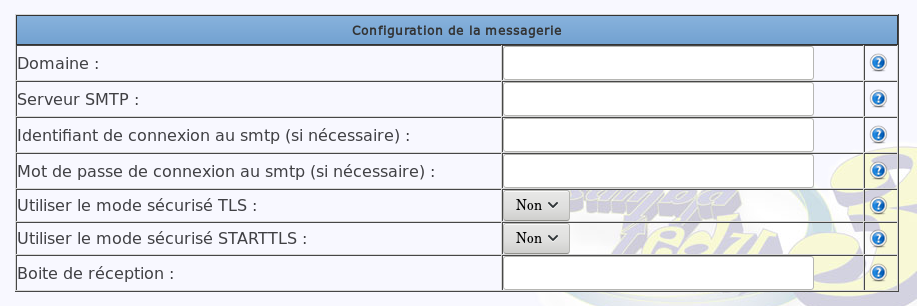
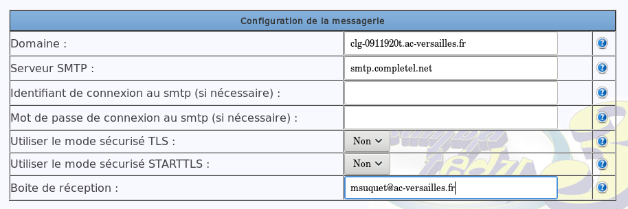

# Configurer la messagerie du `se3`

* [Des infos à recueillir](#des-infos-à-recueillir)
* [Configuration via l'interface `web`](#configuration-via-linterface-web)
* [Cas de certains FAI refusant les envois de mails par root](#cas-de-certains-fai-refusant-les-envois-de-mails-par-root)
* [Vérification](#vérification)
* [Envoi de mails à deux adresses](#envoi-de-mail-à-deux-adresses)

## Des infos à recueillir

Pour que votre `se3` vous envoie quelques messages d'informations de son fonctionnement, il s'agit de lui communiquer quelques paramètres qui vont permettre le bon fonctionnement de la messagerie. Notamment si vous la passerelle est un `Amon`.

Contrairement au `Slis`, le serveur `Amon` ne peut pas servir de relais `SMTP` pour envoyer des courriels vers l’extérieur.

Il faut donc utiliser un serveur `SMTP externe` : celui du `FAI` (Fournisseur d'Accès à Internet) du réseau de l'établissement peut convenir, même s'il nécessite une authentification.

Vous avez besoin de connaître les paramètres suivants :

* **Domaine** : saisir un domaine qui existe et se termine par exemple par **.ac-versailles.fr** (si vous êtes dans l'académie de Versailles). Si vous disposez d’un nom fourni par la `DSI` pour accéder à votre réseau depuis l’extérieur, celui-ci peut convenir.
* **Serveur SMTP** : saisir l’adresse de votre serveur `SMTP` externe. Ce peut être celui de votre `FAI`, ou un serveur `SMTP` externe, suivi du port utilisé s’il est différent du port 25 par défaut (bloqué chez de nombreux `FAI`).
* **Boîte de réception** : une adresse mail valide, à laquelle le SE3 écrira ;-). Ce peut-être votre adresse de messagerie académique mais ce n'est pas une obligation.

Éventuellement, si c'est nécessaire, vous aurez aussi besoin de connaître l'Identifiant de connexion au serveur `SMTP` de votre `FAI` et si vous utilisez le mode sécurisé `TLS` ou `STARTTLS`.

Dans ce qui suit, nous supposons que, d'une part, le `FAI` est **completel.com** (son `SMTP` est **smtp.completel.net**, information que l'on peut trouver via un moteur de recherche), et d'autre part, que la boîte de réception est celle de votre adresse de messagerie académique. Vous adapterez en fonction de votre situation.


## Configuration via l'interface `web`

Tout se passe dans l'interface web du se3 avec l'entrée `Configuration générale/Paramètres serveur`. Il suffit de cliquer sur la ligne correspondant à "Expédition des messages système". On obtient un tableau à renseigner.


Avec les informations réunies (voir ci-dessus), vous complétez les champs de configuration de la messagerie dans l'interface web du `se3`.


Vous validez et vous devriez recevoir un message de confirmation de la part du `se3`.

## Cas de certains FAI refusant les envois de mails par root

Chez certains FAI (dont k-net.fr), il n'est pas possible d'envoyer un mail depuis **root**. Il faut donc créer un `alias` dans ssmtp: root sera appelé par son adresse mail. On va devoir créer une **adresse mail chez le FAI**. C'est cette adresse qui sera associée à root et qui permettra l'envoi de mail.

```
nano /etc/ssmtp/revaliases
```

On indique dans le fichier:

```
root: monadresse@mail.fr
```

Chez K-net.fr, j'ai du utiliser le protocole *STARTTLS* et indiquer le mot de passe associé à l'adresse mail.

Par conséquent, le mdp apparait en clair dans le fichier /etc/ssmtp/ssmtp.conf. Il faut donc impérativement changer les droits de ce fichier si un accès bash est laissé aux utilisateurs.

```
chmod 660 /etc/ssmtp/ssmtp.conf
```
## Vérification

Le test d’envoi de message de l’interface web devrait fonctionner : dans la page diagnostic, vous cliquez sur le bouclier vert correspondant à la ligne "Configuration de l'expédition des mails" et un menu contextuel permettra d'envoyer un message de test.


Pour recevoir un mail immédiatement à une adresse donnée, on pourra aussi lancer la commande suivante, via un terminal en ssh sur le `se3` :

```sh
echo "test" | mail mon@dresse.tld
```

## Envoi de mails à deux adresses
Le se3 peut envoyer un mail à deux adresses. Pour cela il faut éditer le fichier de configuration en ligne de commande sur le serveur.
```
nano /etc/ssmtp/ssmtp.conf 
```
On ajoute alors une deuxième après la premièer indiquant la deuxième adresse mail de root.

```
root=addresse1@mail.com
root=addresse2@mail.com
```
**ATTENTION**: Il ne faut plus aller dans la partie "configuration de mails" de l'interface, la moindre validation (même sans changement) écrase le fichie de configuration, il faut alors de nouveau faire l'opération.
