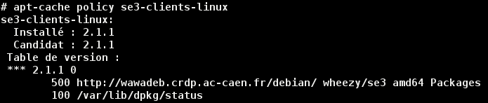

# Gestion des stations de travail `Debian` ou `Ubuntu` dans un domaine `SambaÉdu` avec le paquet `se3-clients-linux`


**Documentation générale du module `se3-clients-linux`**


## Table des matières

* [Objectifs](#objectifs)
* [Version du paquet `se3-clients-linux`](#version-du-paquet-se3-clients-linux)
* [Installation et mise à jour du paquet `se3-clients-linux`](#installation-et-mise-à-jour-du-paquet-se3-clients-linux)
* [Distributions `GNU/Linux` testées](#distributions-gnulinux-test%C3%A9es)
* [Avertissements](#avertissements)
* [Visite rapide du répertoire `clients-linux/` du serveur `se3`](visite_rapide.md#visite-rapide-du-répertoire-clients-linux-du-serveur-se3)
* [Reconfiguration du paquet et restauration des droits](reconfiguration_restauration.md#reconfiguration-du-paquet-et-restauration-des-droits)
* [Les partages des utilisateurs](partages_utilisateurs.md#les-partages-des-utilisateurs)
* [La gestion des profils](gestion_profils.md#la-gestion-des-profils)
* [Le répertoire `unefois/`](repertoire_unefois.md#le-répertoire-unefois)
* [Des variables et des fonctions prêtes à l'emploi](variables_fonctions.md#des-variables-et-des-fonctions-prêtes-à-lemploi-pour-des-scripts)
* [Le script de `logon`](script_logon.md#le-script-de-logon)
* [Personnalisation avec le `logon_perso`](logon_perso.md#personnaliser-le-script-de-logon)
* [Des variables et des fonctions utiles pour le `logon_perso`](variables_fonctions_logon.md#quelques-variables-et-fonctions-prêtes-à-lemploi-pour-personnaliser-le-script-de-logon)
* [Les logs pour détecter un problème](logs_detecter_probleme.md#les-logs-pour-détecter-un-problème)
* [Le cas des classes nomades](classes_nomades.md#le-cas-des-classes-nomades)
* [Un mot sur les imprimantes](imprimantes.md#un-mot-sur-les-imprimantes)
* [Intégration manuelle d'un `client-linux`](impatients.md#intégration-manuelle-dun-client-linux)
* [Les options des scripts d'intégration](options_scripts.md#les-options-des-scripts-dintégration)
* [Désinstallation/réinstallation du paquet `se3-clients-linux`](desinstall_reinstall_paquet.md#désinstallationréinstallation-du-paquet-se3-clients-linux)
* [La "désintégration" (fonctionalité dépréciée)](desintegration.md#la-désintégration-dépréciée)
* [Annexes](#annexes)
* [Ressources externes](#ressources-externes)
* [Les contributeurs](#lescontributeurs)


## Objectifs

Le but de cette documentation est de donner quelques indications et conseils quant à la gestion des `clients-linux`.

La mise en place du paquet `se3-clients-linux` est décrite dans [la documentation du paquet `pxe-clients-linux`](../pxe-clients-linux/README.md#installation-de-clients-linux-debian-et-ubuntu-via-se3--intégration-automatique) que vous consulterez  avec profit : ce paquet `pxe-clients-linux` donne accès au mécanisme d'installation/intégration automatique
que nous vous conseillons fortement d'utiliser.

**Remarque :** nous avons laissé les explications de mise en place et d'intégration manuelles issues des premières versions : elles vous apporteront des précisions complémentaires sur le fonctionnement général du mécanisme.

En pratique, après avoir utilisé le mécanisme d'installation/intégration automatique mentionné ci-dessus, l'objectif est de pouvoir ouvrir une session
sur un `client-linux` avec un compte du domaine et d'avoir
accès à l'essentiel des partages offerts par le serveur
`SambaÉdu` en fonction du compte.

Le fonctionnement de l'ensemble du paquet a été écrit de
manière à tenter de minimiser le trafic réseau entre un
`client-linux` et le serveur, notamment au moment de
l'ouverture de session où la gestion des profils est très
différente de celle mise en place pour les `clients-windows`
(voir la documentation pour plus de précisions).


## Version du paquet `se3-clients-linux`

La version actuelle du paquet `se3-clients-linux` est la **2.1.1**.

**Remarque :** La documentation est actuellement en relecture et mise à niveau : il se peut donc que certaines parties de la version **2.1.1** ne soient pas encore documentées.

Pour connaître la version installée sur votre se3,
vous pouvez utilisez la commande suivante,
dans un terminal, en `root` sur le `se3` :
```sh
apt-cache policy se3-clients-linux
```



## Installation et mise à jour du paquet `se3-clients-linux`

Pour installer ou mettre à jour le paquet `se3-clients-linux`,
à l'aide d'un terminal en `root` sur le `se3`,
la commande est la suivante :
```sh
# Et oui, c'est curieux mais `apt-get install` permet de
# mettre à jour un paquet (et de l'installer s'il ne l'est
# pas déjà).
apt-get install se3-clients-linux
```

Cette mise à jour peut aussi se faire via `l'interface web` du `se3`.


## Distributions `GNU/Linux` testées

Les distributions `GNU/Linux` qui ont été testées sont :

* Debian `Jessie` (version 8)
* Ubuntu `Xenial Xerus` (version 16.04)
* Ubuntu Mate `Xenial Xerus` (version 16.04)
* Xubuntu `Xenial Xerus` (version 16.04)
* Lubuntu `Xenial Xerus` (version 16.04)

**Remarque :** Les versions antérieures (voir la liste ci-dessous), bien que gérées par le paquet `se3-clients-linux`, ne bénéficieront pas des évolutions disponibles pour les version `Jessie` et `Xenial`.

* Debian `Squeeze` (version 6)
* Debian `Wheezy` (version 7)
* Ubuntu `Precise Pangolin` (version 12.04)
* Xubuntu `Precise Pangolin` (version 12.04)
* Ubuntu `Trusty Tahr` (version 14.04)
* Xubuntu `Trusty Tahr` (version 14.04)
* Lubuntu `Trusty Tahr` (version 14.04)


## Avertissements

L'intégration est censée fonctionner
avec les distributions ci-desssus **dans leur configuration
proposée par défaut**, notamment au niveau du « display
manager », c'est-à-dire le programme qui se lance au
démarrage et qui affiche une fenêtre de connexion permettant
d'ouvrir une session après authentification via un
identifiant et un mot de passe.

Sous `Jessie` par exemple,
le « display manager » par défaut remplissant cette fonction s'appelle
`Gdm3` si vous utilisez `Gnome` comme environnement de Bureau
et `Lightdm` pour les autres environnements de Bureau
et sous `Ubuntu`
il s'agit de `Lightdm` pour tous les environnements de Bureau.

Tout au long de la documentation, il est supposé que c'est bien le cas.

Si jamais vous tenez à changer de « display manager » sur
votre distribution, il est quasiment certain que vous devrez
modifier le script d'intégration de la distribution parce
que celui-ci ne fonctionnera pas en l'état : à partir de `Jessie`
et `Trusty`, une vérification est faite aussi sur le « display manager ».

Si vous tenez à changer uniquement l'environnement de bureau,
il est possible que le script d'intégration fonctionne en l'état
malgré tout, mais nous ne pouvons en rien vous garantir le
résultat final, et l'apparition de régressions ici ou là par
rapport à ce qui est annoncé dans ce document n'est pas à
exclure.


## Annexes

* [Intégrer le service `LTSP` à un serveur `se3 Wheezy`](ltsp.md#installation-du-service-ltsp---client-lourd-fat-client-sur-un-serveur-samba-edu-3)
* [Installer un miroir local `APT` de cache avec `apt-cacher-ng`](apt-cacher-ng.md#mise-en-place-dapt-cacher-ng)
* [Documentation pour le (futur) contributeur/développeur](../dev-clients-linux/README.md#documentation-pour-le-futur--contributeurdéveloppeur)
* [Installer et tester en toute sécurité la version du paquet issue de la branche `se3testing`](upgrade-via-se3testing.md#installer-et-tester-en-toute-sécurité-la-version-du-paquet-issue-de-la-branche-se3testing)
* [Intégrer un serveur `Owncloud 9` à un `se3 Wheezy`](owncloud.md#installation-downcloud-9-90-ou-91-sur-un-serveur-samba-edu-3)


## Ressources externes

* [Installer un réseau `se3` virtuel avec `VirtualBox`](http://wiki.dane.ac-versailles.fr/index.php?title=Installer_un_r%C3%A9seau_SE3_avec_VirtualBox)
* [Installation de clients `Debian Wheezy` via `Se3` avec intégration automatique](http://www-annexe.ac-rouen.fr/productions/tice/SE3_install_wheezy_pxe_web_gen_web/co/SE3_install_wheezy_pxe_web.html)
* [Installer un serveur `LTSP Jessie` dans un réseau `se3`](http://wiki.dane.ac-versailles.fr/index.php?title=Installer_un_serveur_de_clients_l%C3%A9gers_%28LTSP_sous_Debian_Jessie%29_dans_un_r%C3%A9seau_Se3)
* [Installer un serveur `Owncloud 8` dans un réseau `se3`](http://wiki.dane.ac-versailles.fr/index.php?title=Installer_un_serveur_owncloud_8_avec_l%27annuaire_du_se3)


## Les contributeurs

Les personnes qui ont contribué à la rédaction de cette documentation sont :

* Nicolas Aldegheri
* Louis-Maurice de Sousa
* Laurent Joëts
* François Lafont
* Arnaud Malpeyre
* Franck Molle
* Michel Suquet

