# Ajout de clonezilla au PXE du se3. Utilisation en clonage, sauvegarde, restauration (par Marc Bansse)

**Clonezilla est un Logiciel opensource permettant de faire/restaurer des images de disques, de partitions. 
Ces images peuvent être stockées localement sur une partition, un disque dur externe ou tout simplement sur 
le se3 par connexion ssh.**

**SOMMAIRE**

* [Première partie : installation de clonezilla sur le serveur](#1-installation-de-clonezilla-sur-le-serveur)
* [Deuxième partie : modification des entrées du menu PXE](#2-modification-des-entrées-du-menu-pxe)
* [Troisième partie : Sauvegardes et restauration de partitions dans le menu PXE](#3-sauvegardes-et-restauration-de-partitions-dans-le-menu-pxe)


Une connexion en ssh sur le serveur se3 se fera par défaut dans le répertoire /home/partimag/

Il peut être judicieux de rajouter un disque dur interne sur le se3. Ce disque sera monté de façon permanente en /home/partimag.
Il pourrait contenir des images de chaque type de PC, des partitions spécifiques à des pc d’une salle si des logiciels spécifiques ne peuvent être déployées par WPKG.

Un disque dur séparé n’est pas obligatoire mais permettra de faire des clonages sans que l’activité du serveur ne s’en trouve diminuée. Le format peut-être en ext3, ntfs, fat32 ou autre puisque les images générées sont découpées en fichiers de taille inférieure à 2 G0.

Clonezilla permet aussi de copier une image de partition vers une autre partition locale, servant ainsi de sauvegarde à la première, comme le fait le module du se3.

Le but est de pouvoir démarrer Clonezilla sur le poste client directement en PXE en vue de le restaurer/creer une image du poste, ou tout simplement faire une sauvegarde/restauration de partitions.

## 1-Installation de clonezilla sur le serveur

Les images au format ZIP de clonezilla peuvent être téléchargées aux adresses suivantes :

[http://downloads.sourceforge.net/project/clonezilla/clonezilla_live_stable/2.1.2-43/clonezilla-live-2.1.2-43-i686-pae.zip](http://downloads.sourceforge.net/project/clonezilla/clonezilla_live_stable/2.1.2-43/clonezilla-live-2.1.2-43-i686-pae.zip)

http://downloads.sourceforge.net/project/clonezilla/clonezilla_live_stable/2.1.2-43/clonezilla-live-2.1.2-43-i486.zip

http://downloads.sourceforge.net/project/clonezilla/clonezilla_live_stable/2.1.2-43/clonezilla-live-2.1.2-43-amd64.zip

Version alternative basée sur Ubuntu raring (utilisée sur mon se3)

http://downloads.sourceforge.net/project/clonezilla/clonezilla_live_alternative/20130819-raring/clonezilla-live-20130819-raring-i386.zip

**Remarque** : Je n’ai testé que la version "raring" dans mon établissement. Les autres sont peut-être plus ou moins performantes ou reconnues.

En cas de maj, les liens ne seront plus valides, mais les archives pourront être téléchargées ici :

http://clonezilla.org/downloads/download.php?branch=stable

Ouvrir une session root au choix sur le serveur, sur un poste client Windows avec Putty ou plus simplement une connexion en ssh avec un client linux (qui va rendre le copier coller des lignes suivantes bien plus pratique...)

Depuis le client linux


```sh
# ssh -22 root@ipduse3
```
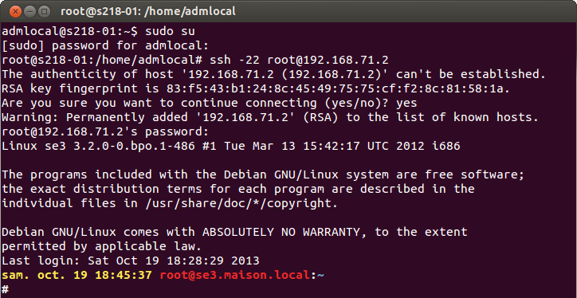

```sh
# mkdir /tftpboot/clonezilla

# cd /tftpboot/clonezilla

# wget http://downloads.sourceforge.net/project/clonezilla/clonezilla_live_alternative/20140518-trusty/clonezilla-live-20140518-trusty-amd64.zip
```
*Décompression de l’archive clonezilla.*


```sh
# unzip -j clonezilla-live-*.zip
```

**Différents fichiers se retrouvent alors dans ce répertoire**

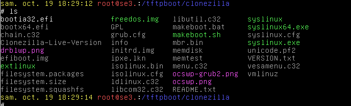

Une fois décompressé, le fichier.zip peut être effacé.

## 2-Modification des entrées du menu PXE

Le module PXE doit être activé au niveau du se3, ainsi que la mise en place d’un mot de passe.

Le menu PXE contient certaines lignes préremplies (lancement de Slitaz, de Sysrescuecd, etc. ).

Pour ajouter ou supprimer des entées à ce menu, il va donc falloir modifier certains fichiers sur le se3.

Ces fichiers se trouvent dans le répertoire/tftpboot/pxelinux.cfg/ 

Il faudra modifier le fichier Linux.menu si vous voulez que les entrées apparaissent dans la partie maintenance.

Il y a alors deux possibilités :

- Soit vous éditez à la main le fichier maintenance.menu (ou clonage.menu) en ajoutant le lancement de clonezilla

- Soit vous allez ajouter un fichier clonezilla.menu qui contiendra toutes les informations de lancement, sauvegarde/restauration personnalisées.

La deuxième méthode sera clairement plus simple pour la mise en place, et pour la gestion des futures mises à jour du paquet se3-clonage.

### Première méthode

Pour éditer les fichiers, les non spécialistes du terminal (comme moi) pourront utiliser Filezilla et se connecter dessus en ssh. (aller dans le gestionnaire de sites)

[Filezilla est disponible pour windows, Linux et Mac.](https://filezilla-project.org/download.php?type=client)

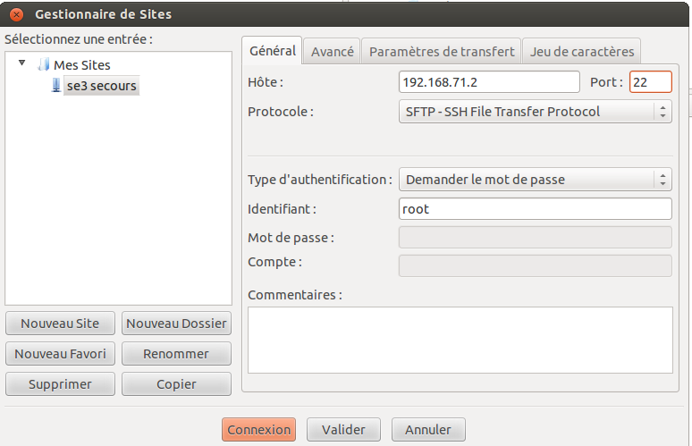

Un déplacement dans le répertoire /tftpboot/pxelinux.cfg/ se fera par simples clics

Les fichiers pourront alors être édités par gedit par un simple clic droit sur le fichier.

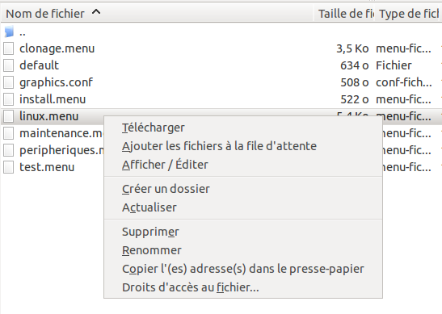


```sh
# cd /tftpboot/pxelinux.cfg (ou se déplacer jusqu’à cet emplacement)
```
Ajouter à maintenance.menu les lignes suivantes en adaptant l’ip du serveur se3 à votre configuration


```sh
label Clonezilla-live
MENU LABEL Clonezilla Live (Ramdisk)

KERNEL clonezilla/vmlinuz

APPEND initrd=clonezilla/initrd.img boot=live config noswap nolocales edd=on nomodeset ocs_live_run="ocs-live-general" ocs_live_extra_param="" keyboard-layouts="fr" ocs_live_batch="no" locales="" vga=788 nosplash noprompt fetch=tftp://IPDUSE3/clonezilla/filesystem.squashfs
```
ATTENTION : CE QUI SUIT « APPEND » EST SENSE ETRE SUR UNE SEULE LIGNE, IL NE FAUT DONC PAS APPUYER SUR ENTRER

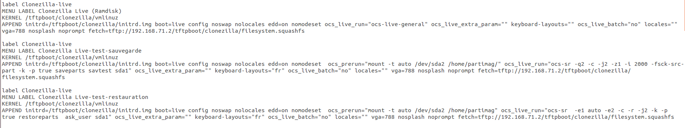

Enregistrer et quitter le fichier. (si on utilise filezilla bien préciser « envoyer à nouveau le fichier vers le serveur » en cliquant sur oui)

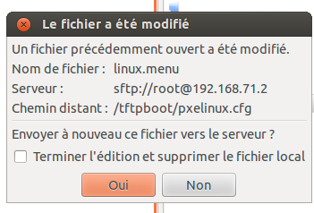

Cette commande permettra seulement de démarrer clonezilla par le PXE. Toutes les options (langue,clavier, sauvegarde,restauration...) devront être entrées devant le poste.

Clonezilla apparaît maintenant dans le menu maintenance.

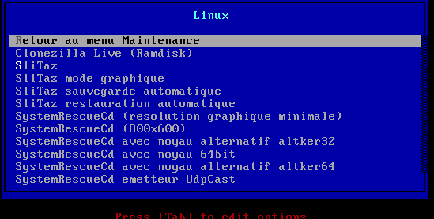

### Deuxième méthode

Une mise à jour du paquet se3-clonage écrasera le fichier linux.menu

Il faut donc mieux créer un fichier clonezilla.menu qui contiendra toutes les lignes de lancement de clonezilla, ainsi que les lignes de sauvegarde/restauration personnalisées. Ce fichier ne sera pas écrasé par une mise à jour. Il faudra néanmoins préciser au menu de lancer cet ajout dans le pxe en rajoutant au fichier maintenance.menu


```sh
LABEL Clonezilla
      MENU LABEL ^Clonezilla
      KERNEL menu.c32
      APPEND pxelinux.cfg/clonezilla.menu
```
Cet ajout sera à faire à chaque maj du paquet se3-clonage.

Les fichiers clonezilla.menu et maintenance.menu sont dans l’archive suivante. Il faudra évidemment changer les paramètres selon la configuration de votre serveur se3, ainsi que selon vos partitions de sauvegarde/restauration.

Fichier ZIP

## 3-Sauvegardes et restauration de partitions dans le menu PXE

Le but de cette nouvelle partie est de créer deux entrées au PXE , permettant à un professeur passant beaucoup de temps dans une salle informatique de lancer des sauvegardes , de les restaurer sans avoir besoin de mots de passe admin ou root.

Il aura seulement besoin du mot de passe du menu PXE.

Les disques durs de mes postes clients ont tous une partition de sauvegarde sda4. La partition windows étant sda1. Les lignes suivantes devront être adaptées à la configuation des postes.

De même on pourra ajouter plusieurs fois les paragraphes mais en changeant l’intitulé (LABEL) et en lui donnant par exemple le label "sauvegarde pc salle sx-y".

Ajouter au fichier .menu ces deux parties après la première


```sh
label Clonezilla-live
MENU LABEL Clonezilla Live-test-sauvegarde-sda1-vers-sda4
KERNEL clonezilla/vmlinuz
APPEND initrd=clonezilla/initrd.img boot=live config noswap nolocales edd=on nomodeset  ocs_prerun="mount -t auto /dev/sda4 /home/partimag/" ocs_live_run="ocs-sr -q2 -c -j2 -z1 -i 2000 -fsck-src-part -k -p true saveparts save sda1" ocs_live_extra_param="" keyboard-layouts="fr" ocs_live_batch="no" locales="" vga=788 nosplash noprompt fetch=tftp://IPDUSE3/clonezilla/filesystem.squashfs


label Clonezilla-live
MENU LABEL Clonezilla Live-test-restauration-sda4-vers-sda1
KERNEL clonezilla/vmlinuz
APPEND initrd=clonezilla/initrd.img boot=live config noswap nolocales edd=on nomodeset  ocs_prerun="mount -t auto /dev/sda4 /home/partimag" ocs_live_run="ocs-sr  -e1 auto -e2 -c -r -j2 -k -p true restoreparts  ask_user sda1" ocs_live_extra_param="" keyboard-layouts="fr" ocs_live_batch="no" locales="" vga=788 nosplash noprompt fetch=tftp://IPDUSE3/clonezilla/filesystem.squashfs
```

Enregistrer et quitter

Les trois entrées doivent maintenant apparaître dans le menu **/maintenance/sauvegarde/restauration**

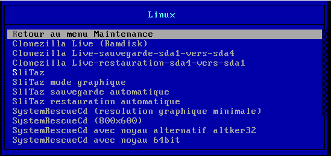

Chaque sauvegarde s’appellera « save+date ». Plusieurs sauvegardes peuvent se retrouver sur sda4 tant qu’il reste de la place. La date est ajoutée automatiquement au nom de la sauvegarde.

Dans le cas de la restauration, il faudra choisir manuellement devant chaque poste la sauvegarde à utiliser.

## Dernière partie : Utilisation de clonezilla pour fabriquer des images des disques ou partitions à envoyer vers le serveur ou sur un disque externe.

On vient de fabriquer un poste modèle optimisé, possédant plusieurs partitions différentes (NTFS,EXT3,FAT32,etc). La présence de grub ne pose strictement aucun problème puisque clonezilla supporte un nombre impressionnant de type de format.

On désire maintenant envoyer cette image vers le se3 dans le /home/partimag en vue de déployer cette image vers d’autres pc ou sur un disque dur neuf.

Démarrer le poste à sauvegarder par le pxe. Choisir clonezilla live (ramdisk)

Choisir Francais. Modifier le codage clavier>azerty> latin9

Si on ne change pas le mode de clavier, il sera simplement en qwerty. Attention donc au mdp root à rentrer.

**Attention** : Parfois le changement ne se fait quand même pas bien, vérifier donc si le clavier n’est pas en qwerty ou continuer mais il faudra s’en rappeler.

Choisir Disque-Image

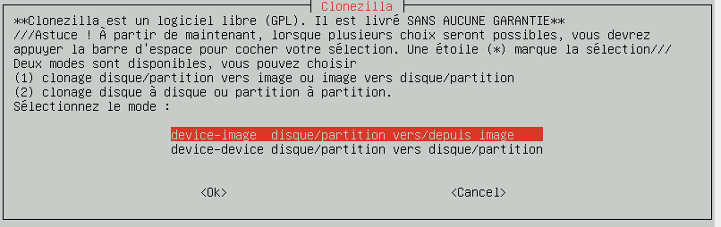

Sélectionner « ssh_server » puis choisir l’ip du se3, le port 22 et le compte-root ( Le choix d’un disque local (usb) est tout à fait possible. Il faudra juste le choisir local dev puis choisir le disque cible désiré.)

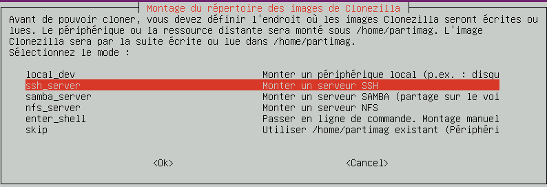

Choisir le répertoire où seront copiées les images (par défaut /home/partimag/)
Laisser le mode débutant.

Choisir savedisk pour créer un image du disk entier (marche avec tout type de partition !)
Sinon choisir saveparts pour une sauvegarde de partition.

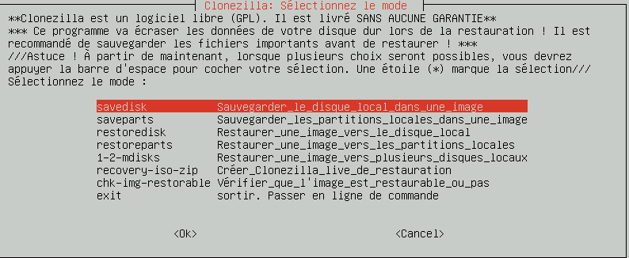

Pour la restauration ce sera exactement pareil, mais il faudra choisir restoredisk ou restoreparts.

Choisir le nom de l’image incluant le modèle de PC/salle +divers à ajouter, la date sera mise d’office sur le nom.

La copie commence dès que l’utilisateur à confirmé. Dans le cas de la restauration il faut confirmer **deux fois**.

Il vous sera proposé d’éditer un fichier contenant les options lancées, ce qui peut s’avérer utile pour modifier ou créer de nouvelles entrées dans le PXE.

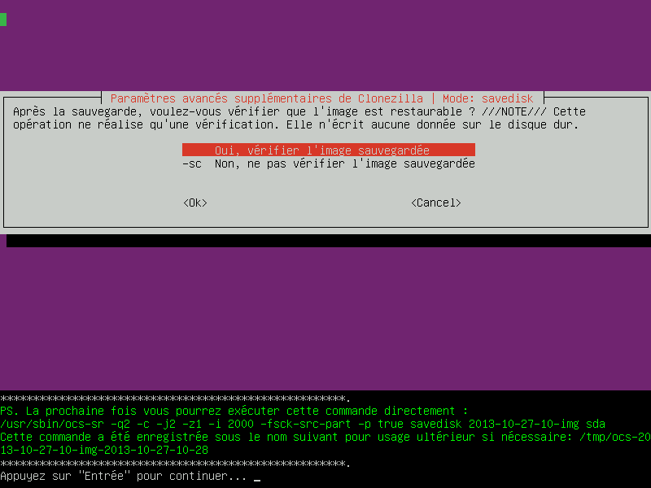

A la fin, un écran vous demandera si vous voulez éteindre/redémarer ou continuer en ligne de commande.


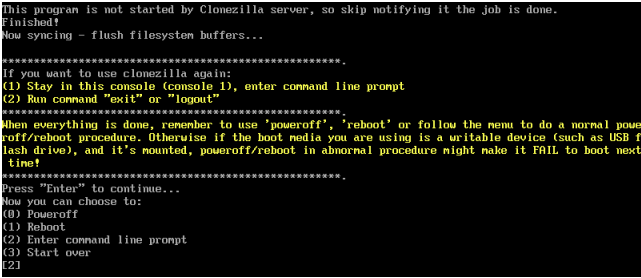

La liste complète des options de clonezilla peut se trouver [ici](http://restonux.wikispaces.com/documentation+clonezilla)

Bonne installation !
