#Préambule

On se propose ici de décrire la mise en place d'une imprimante réseau sur un réseau SambaEdu

* Serveur SambaEdu3 sous Wheezy
* Clients windows 7 32 bits et 64 bits

Dans cet exemple et sur les copies d'écran, il s'agit d'une imprimante réseau HP Laserjet 1022n dont l'adresse IP est 172.16.108.100.

Pour l'ensemble des étapes qui suivent, on utilisera un poste sous Windows 4 64 bits, faisant partie du même parc que l'imprimante, et sur lequel on aura ouvert la session "admin".

#Trouver les drivers
La première étape consiste à télécharger les drivers sur le site du constructeur.

Pour le modèle utilisé dans cet exemple, on les trouvera ici : http://support.hp.com/fr-fr/drivers/selfservice/HP-LaserJet-1000-Printer-series/439424/model/439432

Le driver pour Windows 7 32 bits se nomme : lj1018_1020_1022-HB-pnp-win32-fr.exe

Le driver pour Windows 7 64 bits se nomme :
lj1018_1020_1022-HB-pnp-win64-fr.exe

Une fois téléchargés, il faut
Extraire le contenu avec par exemple 7-zip dans deux dossiers distincts.

#Sur le serveur
##Ajouter l'imprimante
Sur le serveur, menu Imprimantes -> Nouvelle imprimante

Saisir les informations concernant l'imprimante :
* Un nom (8 caractères max, pas d'espace)
* L'URI (généralement, son adresse IP)
* L'emplacement de l'imprimante (généralement la salle)
* Une description (N/B, couleur, modèle, etc.)

Sélectionner le protocole `TCP/IP`.

Cochez `Pilote Windows du client déployable`.

TODO Pour le reste, je ne suis pas certain...

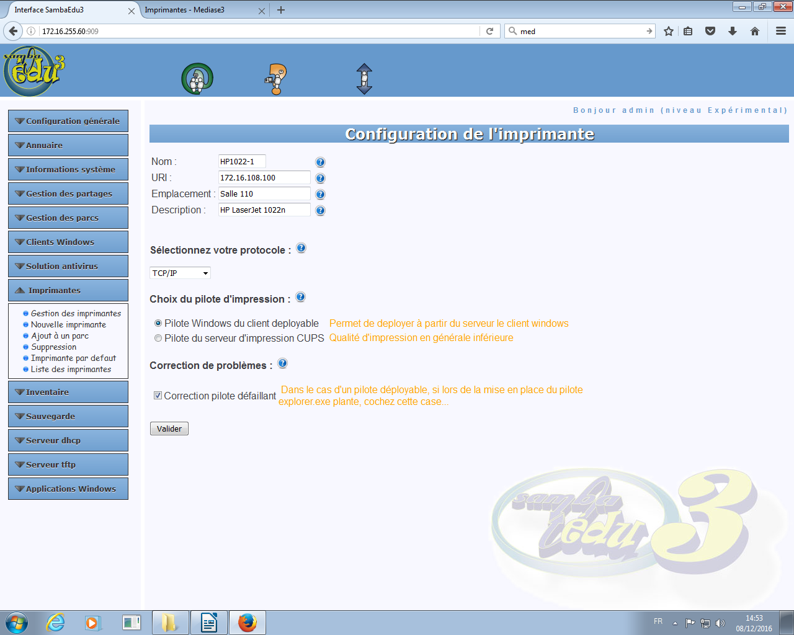

##Ajouter l'imprimante au parc
Menu `Imprimantes` -> `Ajout à un parc`

Sélectionner le parc, puis l'imprimante à intégrer.

#La console MMC

Ouvrir la console MMC en lançant la commande mmc.exe

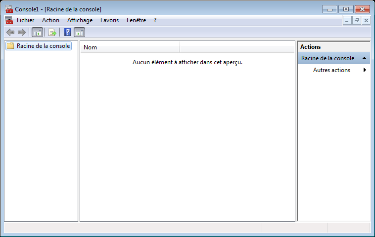

##Ajouter le module de gestion des imprimantes
Menu `Fichier` -> `Ajouter/Supprimer un composant logiciel enfichable`

Sélectionner `Gestion de l'impression` dans la colonne de gauche, cliquer sur `Ajouter`, puis valider.

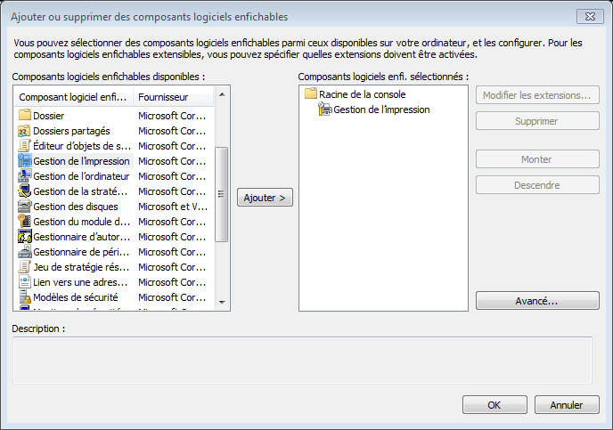

##Ajouter le serveur Se3
Clic droit sur `Gestion de l'impression` -> `Ajouter/Supprimer des serveurs`

Cliquer sur `Parcourir`, afin de sélectionner le serveur Se3 soit par son nom, soit par son adresse IP, puis cliquer sur `Ajouter à la liste`, puis valider.

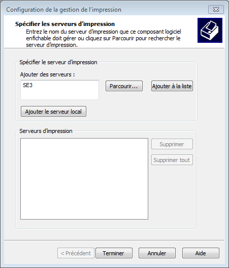

##Lister les imprimantes

Vérifier que la branche `Serveur d'impression` -> `Se3` -> `Imprimantes` contient bien l'imprimante précédemment créée via l'interface web du Se3.

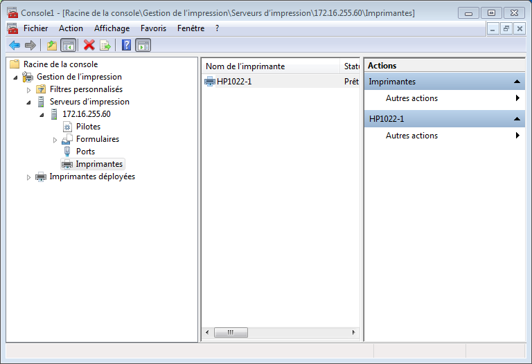

##Ajouter les pilotes
Clic droit sur la branche `Pilotes` -> `Ajouter un pilote...`

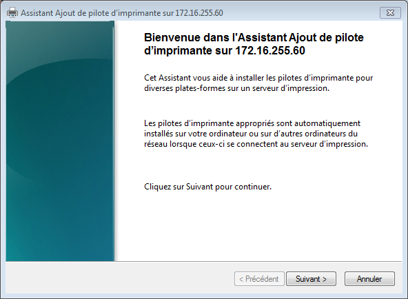

Cliquer sur `Suivant`.

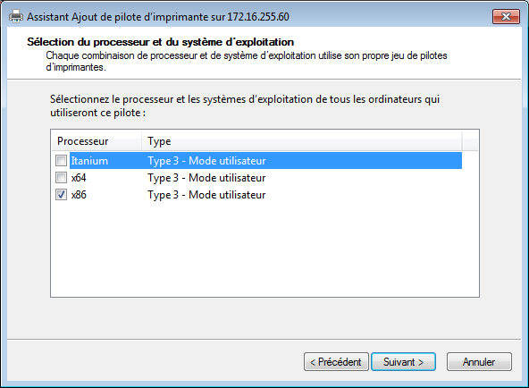

Commencer systématiquement par ajouter le pilote x86 (32 bits).

Cliquer sur `Suivant`.

Choisir le pilote correspondant précédemment téléchargé et décompressé correspondant à l'architecture sélectionné, et suivre les étapes d'installation.

Une fois le pilote 32 bits instalé, recommencer la procédure pur le pilote 64 bits.

Attention : les deux pilotes doivent porter le même nom.

##Affecter les pilotes à l'imprimante

Dans la branche `Imprimantes`, faire un clic droit -> `Propriétés` sur l'imprimante souhaitée.

À la question "[...] Voulez-vous installer le pilote maintenant ?", répondre `Non`.

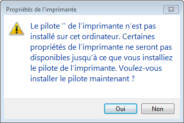

Sélectionner l'onglet `Avancé`.

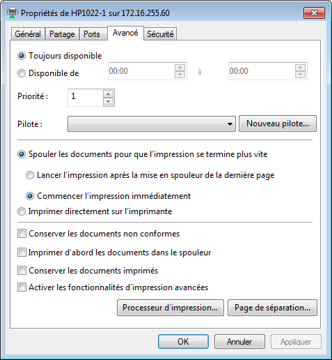

Dans la liste des pilotes, choisir le pilote précédemment ajouté, puis cliquer sur `Appliquer`.

À la question "Faites-vous confiance à cette imprimante ?", répondre `Installer le pilote`.

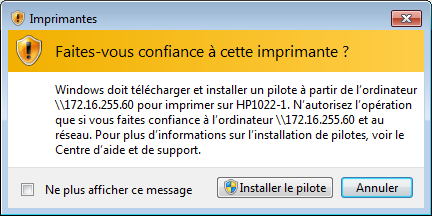

À la question "[...] Certaines propriétés de l'imprimante ne seront pas disponibles jusqu'à ce que vous installiez le pilote de l'imprimante. Voulez-vous installer le pilote maintenant ?", répondre `Oui`.

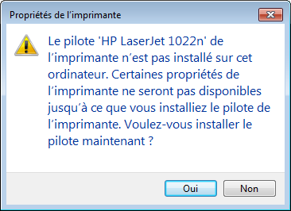

L'imprimante est maintenant déployable automatiquement sur l'ensemble des machines du parc concerné.

TODO-ÀVERIFIER Il se peut qu'un message demandant l'autorisation d'installer l'imprinante apparaisse une fois sur les postes du parcs. À priori, un simple utilisateur du domaine peut répondre oui, et le message n'apparaît plus par la suite.

Un xml `pb-imprimante-w7.xml` a été proposé par Emmanuel Farcy sur la liste pour résoudre ce problème.