# SE3 et EBP
Utilisation du PGI client-serveur EBP dans un environnement sambaedu 3/4

**Ce tutoriel est à destination des professeurs ressources/administrateurs des réseaux pédagogiques pour la mise en place du serveur permettant l'utilisation en mode client/serveur.**

*Article en cours de rédaction, donc non terminé.

* [Présentation](#présentation)
* [Mise en place du serveur Linux SQL](#mise-en-place-du-serveur-linux-sql)
     * [Quelques recommandations pour le serveur](#quelques-recommandations-pour-le-serveur)
     * [Installation du système d'exploitation](#installation-du-système-d-exploitation)
     * [Installation du moteur SQL](#installation-du-moteur-sql)
     * [Sécurisation du serveur MySQL](#sécurisation-du-serveur-mysql)
     * [Création d'un utilisateur pouvant lire et écrire dans les bases de données](#création-dun-utilisateur-pouvant-lire-et-écrire-dans-les-bases-de-données)
* [Installation des clients EBP](#installation-des-clients-ebp)
* [activation du logiciel](#activation-du-logiciel)
* [Upload d'une base mysql avec le client sur le serveur](#upload-dune-base-mysql-avec-le-client-sur-le-serveur)
* [Création et gestion des raccourcis](#création-et-gestion-des-raccourcis) 
     * [Création de raccourcis](#création-de-raccourcis)
     * [Utilisation-gestion des utilisateurs-raccourcis par les élèves-professeurs](#utilisation-gestion-des-utilisateurs-raccourcis-par-les-élèves-professeurs)
* [Accès aux bases MySQL par les professeurs](#accès-aux-bases-mysql-par-les-professeurs)
     * [Utilisation de Workbench pour Windows](#utilisation-de-workbench-pour-windows)
     * [Utilisation de phpmyadmin](#utilisation-de-phpmyadmin)
* [sauvegardes hebdomadaires des bases mysql](#sauvegardes-hebdomadaires-des-bases-mysql)
## Présentation
EBP est un logiciel type PGI. Il peut être utilisé de façon `collaborative` en `mode client-serveur` avec la mise en place d'un serveur dédié. Un élève pourra donc travailler sur n'importe quel poste de l'établissement doté du client EBP.

L'utilisation en établissement scolaire sous `SambaEdu` est parfaitement fonctionnelle et **pratique** grâce à ses lecteurs réseaux partagés sur lesquels seront placés les raccourcis vers les bases.

Ce document s'appuie sur le travail de Cristophe cessac (Christophe.cessac@ac-orleans-tours.fr), avec l'aide  de mes collègues Madjid Hamoumraoui (Madjid.Hamoumraoui@ac-versailles.fr),Bersoullé Edith (Edith-Clau.Lemasson@ac-versailles.fr) professeurs au lycée Jacques Prévert de Longjumeau.

IL ne sera **pas nécéssaire** d'utiliser un `Windows serveur` voir de créer `un autre domaine`,d'acheter plusieurs NAS qui ne permettent qu'à un petit nombre d'utilisateurs simultanés de travailler).

**Principe**: On installera sur `un serveur dédié` une ditribution  `open-source` Linux Server (Débian ou Ubuntu) avec un moteur mysql. Ce serveur sera placé dans le réseau pédagogique au même titre que le `se3` et utilisera donc le **domaine existant.**

Il faudra créer ensuite au moins un compte utilisateur/administrateur de bases mysql. C'est ce compte qui sera utilisé par les professeurs pour uploader/dupliquer/supprimer les bases que les élèves vont utiliser.

Les clients EBP sous  Windows se connecteront au serveur au moyen de raccourcis. Plusieurs élèves pourront ainsi travailler sur une même base de donnée et gérer chacun leur tâche de façon collaborative.

L'upload de bases EBP se fera avec le client EBP. La suppression elle, pourra se faire avec des outils graphiques sous Windows/linux, rendant la gestion par un professeur non initié à Linux **très simple**.

## Mise en place du serveur Linux SQL

### Quelques recommandations pour le serveur
Les bases MySQL prennent beaucoup de place physique sur le serveur. Il faut donc prévoir un serveur muni d'un espace de stockage important. De même, les disques sont beaucoup solicités, on évitera les disques durs pour NAS. Des disques durs pour serveurs sont à favoriser.
On pourra prévoir de mettre des disques identiques en raid 10 (mode miroir) ou des disques ssd pro. 
Dans notre lycée, le serveur possède 12 Go de RAM, ainsi que 4 disques serveurs de 1To chacun, ainsi qu'un SSD PRO servant de cache.
On pourra aussi virtualiser le serveur avec Proxmox 5, ce qui permettra de faire facilement des sauvegardes/restaurations du serveur. L'utilisation de Proxmox est vraiment très simple.

Plus d'infos ici: https://github.com/SambaEdu/se3-docs/blob/master/se3-virtualisation/proxmox.md

De même l'achat d'un disque du externe de capacité importante, ou l'utilisation d'un partage réseau permettra de sauvegarder les bases mysql en cas de panne du serveur ou de réinstallation (voir plus bas)


### Installation du système d'exploitation
L'installation décrite ici a été faite sur une debian server Jessie (version 8). Le plus simple est de télécharger l'iso netinstall disponible ici:
https://www.debian.org/CD/netinst/

Sauf serveur très vieux ou particulier, on choisira la version amd64:
https://cdimage.debian.org/mirror/cdimage/archive/8.10.0/amd64/iso-cd/debian-8.10.0-amd64-netinst.iso

REMARQUE: La version **9** de Debian (stretch) a pour moteur mysql `Mariadb`. Il faut tester la compatibilité des bases  avec cette version. *(A venir)

On gravera le fichier iso téléchargé sur un cd. Il suffira de booter sur le cd et de se laisser guider. Une installation par clef usb est également possible. L'iso doit être placée sur la clef à l'aide d'un logiciel comme **unetbootin** .

-On choisir la mode d'installation **install** et non graphical install.
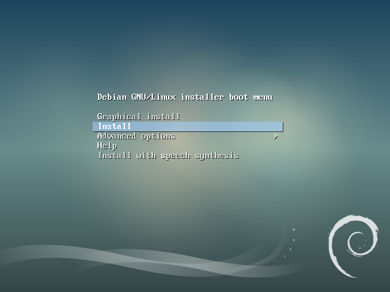

- Choix de la langue: Français évidemment. Idem pour le pays et la configuration du clavier.
- Nom de machine: choisir un nom netbios avec moins de 15 caractères (et si possible sans caractères spéciaux à l'exception du   tiret.
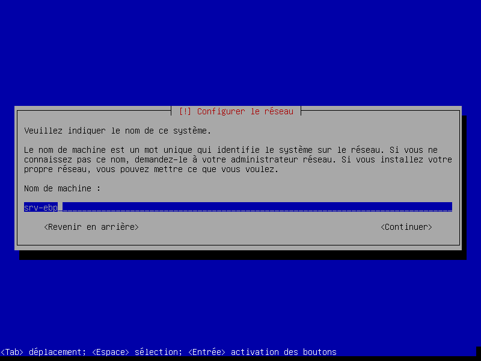
- Domaine: Vous pouvez laisser cet espace **vide** si le serveur ne sera disponible qu'en interne (ce qui sera le cas ici).
- Mot de passe root: Choisir un mot de passe **complexe**. Il faudra l'entrer deux fois (et il n'apparait pas à l'écran).
- Choix d'un utilisateur: Choisir également un mot de passe solide [qui ne soit pas le même] que root.
- Partionnement: choisir d'utiliser le disque entier (convient ici puisqu'on mettra en place plus tard un système de sauvegarde externe des bases). On installera également tout le système dans une même partition.
- Outil de gestion des paquets Debian: On utilisera "pas d'autre analyse de cd".
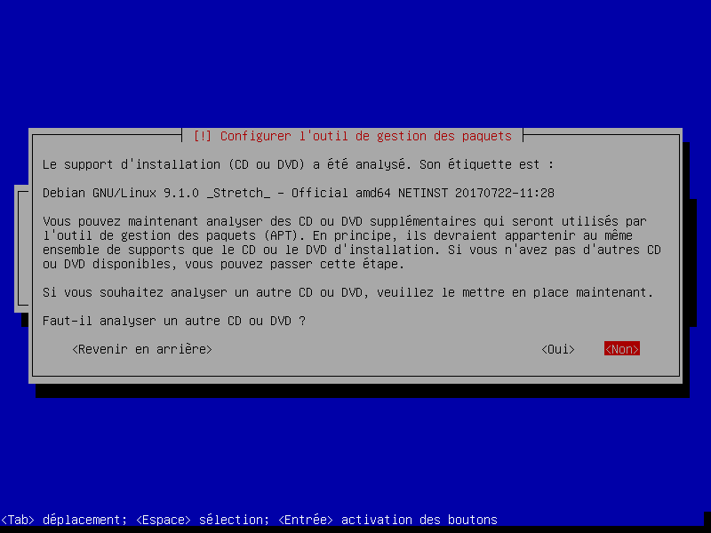
- Choix du miroir: Si on est débutant on choisira `France` puis `ftp.fr.debian.org`. Si le se3 sert de miroir local, on pourra choisir `saisie manuelle` (en haut de la liste), puis **nom d'hote**: http://172.20.0.2:9999/ (en changeant l'ip par celle du se3). Le répertoire du miroir sera alors `/ftp.fr.debian.org/debian/` .
- Serveur proxy: Si l'établissement possède un serveur proxy (souvent le AMON), il faut l'indiquer ici(ex http://172.20.0.1:3128/).
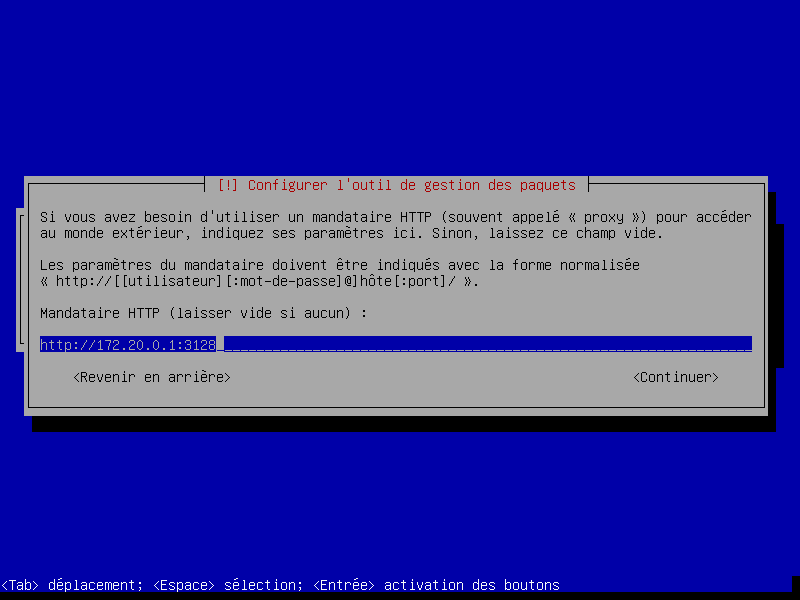
- Participation à des études anonymes: A vous de voir, mais à priori non.
- Choix des paquets à installer :  on ne cochera que les utilitaires usuels du système, ainsi que le `serveur ssh`. Tout autre choix est à décocher (surtout le choix d'une interface graphique qui ne sera d'aucune utilité pour un serveur sql).
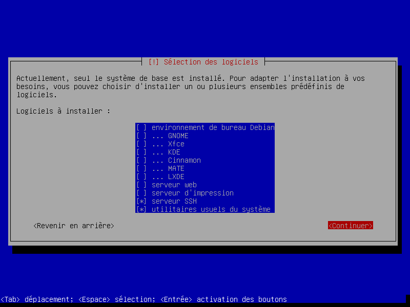
- Installer le grub sur le secteur d'amorçage: OUI (ou le serveur ne pourra pas démarrer de façon autonome).
- Périphérique où sera installé grub: choisir le premier disque (/dev/sda)

L'installation se finalise. Le serveur va redémarrer. **Penser à enlever le support d'installation pour que celle-ci ne recommence pas en boucle.**

On se connecte en root sur le serveur en entrant le login "root" et le mot de passe choisi au début.

Pour que le serveur garde la même ip, il faudra bien penser à faire une réservation d'adresse (on peut aussi modifier le fichier /etc/network/interfaces pour inscrire en dur l'adresse du serveur). Ici la carte réseau s'appelle enp0se mais sur Jessie elle prendra le nom d'eth0 .
```
nano /etc/network/interfaces
```

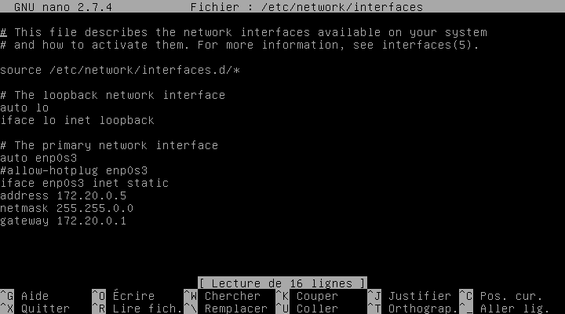
On relance ensuite la connexion réseau par
```
service networking restart
```
On peut redémarrer le serveur pour plus de sureté.


### Installation du moteur SQL
Le serveur est maintenant acif, mais le service SQL n'est pas installé.

On se connecte en root sur le serveur puis on lance l'installation du serveur SQL.
```
apt-get install mysql-server
```
Le serveur est maintenant doté d'un moteur mysql. Le mdp "root mysql"  est demandé (on évitera de mettre le même mot de passe que le "root" du système).

### Sécurisation du serveur MySQL
Il faut sécuriser l'accès au serveur en interdisant la connexion distante en root.

On lance la commande:

```
mysql_secure_installation
```

On indique de nouveau le mdp donné avant.

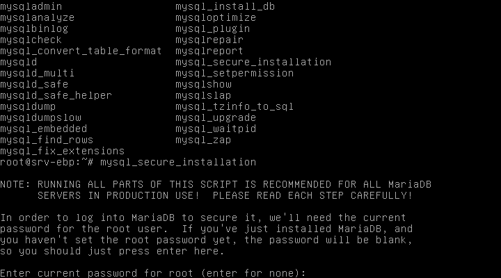


On supprimera ensuite l'utilisateur anonyme en tapant Y pour "remove anonymous users"
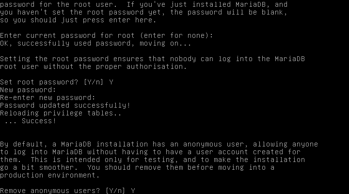
On désactivera ensuite l'accès "root" aux utilisateurs: ainsi, une connection "root" sera possible uniquement sur le serveur, mais impossible avec des outils de gestion MySQL comme phpmyadmin ou MySQL Workbench (sur Windows). Par la suite, on créera un utilisateur ayant des droits d'accès sur les bases.

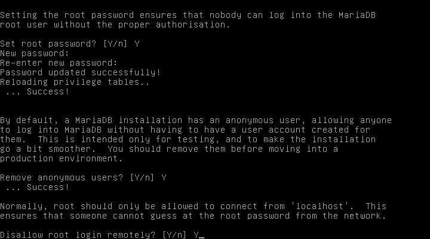
On supprime également les bases de tests et autres fichiers inutiles.

### Création d'un utilisateur pouvant lire et écrire dans les bases de données
Il faut maintenant créer un nouvel utilisateur de bases mysql, car les enseignants n'auront pas accès au compte root.

On accède à la console mysql en tapant
```
mysql -u root -p
```
Ensuite on va indiquer qu'un nouvel utilisateur de base mysql doit être créé.

```
CREATE USER 'adminmysql'@'%' IDENTIFIED BY 'mysql123';
```
L'utilisateur est maintenant créé, il ne reste plus qu'à lui donner des droits de lecteure/écriture sur les bases. le "%" indique que cet utilisateur pourra se connecter depuis n'importe quelle ip de l'établissement, ce qui est nécéssaire pour que les postes clients puissent lire/écrire sur le serveur.

```
GRANT ALL PRIVILEGES ON * . * TO 'adminmysql'@'%';
```
Il faut maintenant appliquer les différents changements effectués.
```
FLUSH PRIVILEGES;
```

On pourra évidemment créer plusieurs utilisateurs. Une fois les opérations terminées on peut quitter la console Mysql.

```
exit
```

Par défaut, les connexions mysql sont uniquement possibles depuis le serveur (localhost).
On va donc modifier le fichier de configuration
```
nano /etc/mysql/my.cnf
```
On ira jusqu'à la ligne **bind-address = 127.0.0.1** et on la remplacera l'ip 127.0.0.1 par **0.0.0.0** 

On relance le service mysql.
```
service mysql restart
```
On peut tenter un accès depuis un ordinateur quelconque avec mysql-workbench ou phpmyadmin.


## Installation des clients EBP

Choisir le mode **Installation réseau**.
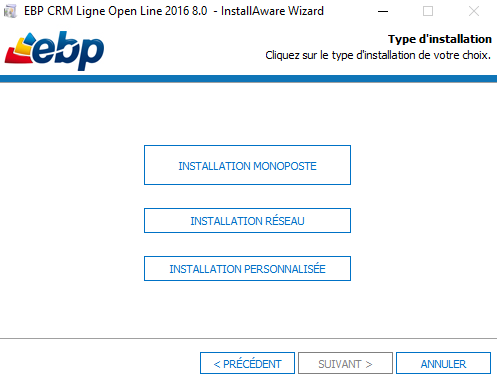

Séléctionner ensuite le mode **client** seulement. 
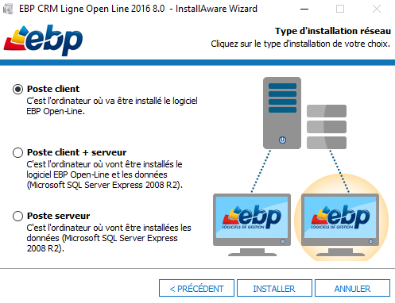


## activation du logiciel

* Méthode à l'ancienne

Il est plus que probable que l'établissement n'utilise pas la dernière version des clients EBP. Lors de la première execution, il faudra activer le module manuellement.

Choisir **activer le logiciel**

Puis activer manuellement. Entrer les renseignements de licence tels qu'ils figurent sur le courrier d'EBP. Puis cliquer sur **activer le logiciel**.

Normalement un message doit indiquer que le logiciel est bien activé.


On precède de la même façon pour chacun des composants EBP.

* Sauvegarde/restauration du fichier `licence.xml`
Une fois tous les logiciels activés, on pourra sauvegarder le fichiere licence.xml placé dans 'C:\ProgramData\EBP'. 

Si on doit réinstaller les logiciels sur un autre type de poste, on procedra à l'installation, puis on copiera le fichier dans le répertoire du nouveau poste. 
Si la licence est valide, l'activation se fera sans avoir à tout entrer une nouvelle fois.

## Upload d'une base mysql avec le client sur le serveur.
**ATTENTION: On ne peut pas uploader une base avec un client supérieur.**

Si on a déjà dans le serveur une base 7 et que les clients sont mis à jours en version 8, alors il faudra faire une sauvegarde de la base en mode `txt` pour la restaurer à nouveau sur le serveur.

Dans l'exemple suivant, on a placé sur le disque dur le fichier.zip contenant la base "Equipestars" .
On lance l'un des modules (Par exemple le module "Paye"). On ira ensuite sur "OUTILS>RESTAURATION" .
On indique l'emplacement du fichier
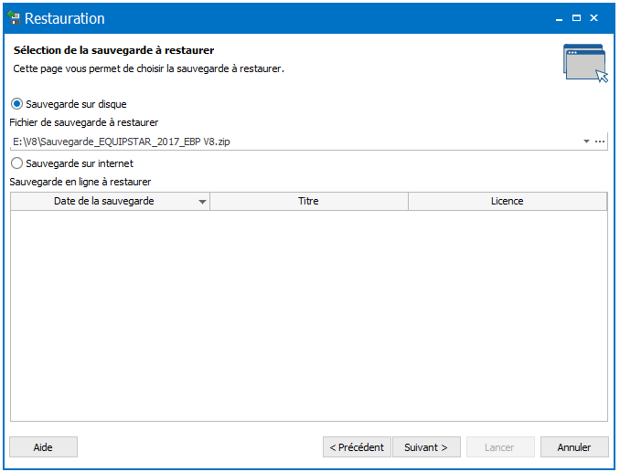

On valide. On choisi "inclure le dossier". Puis suivant.
On choisi les modules à incorporer dans la base.

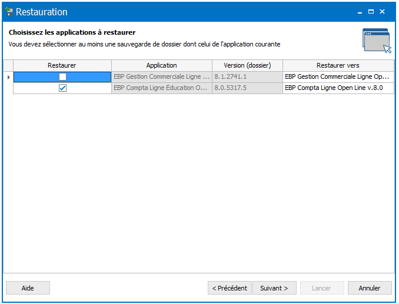

On va ensuite choisir le type de serveur SQL, en l'occurence un serveur Linux "**SUN MYSQL**".


Il faut entrer les données de l'utilisateur créé précédemment pour utiliser/gérer les bases.

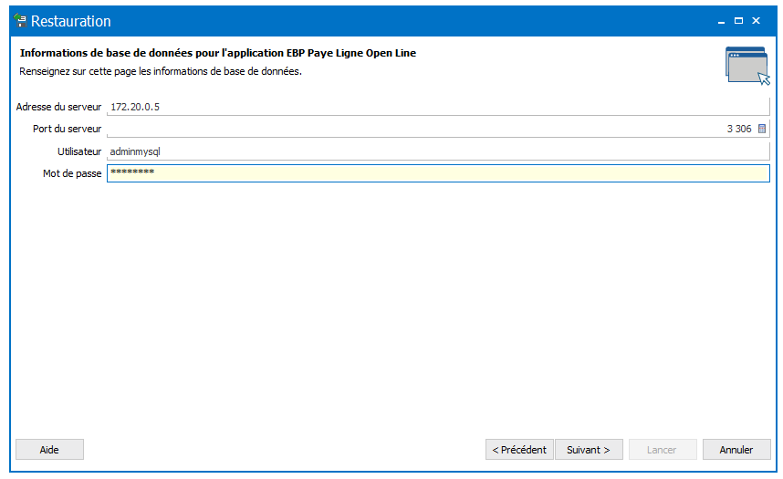

Il faut indiquer à quel endroit sera copiée localement "la base". Dans les faits, **seul un raccourci vers la base va être créé** puisque les données sont sur le serveur. On peut donc choisir n'importe quel endroit (disque réseau comme lecteur H:(Classes) ou une clef USB, puis faire une copie plus tard vers les lecteurs réseau.)


On valide. La base se restaure sur le serveur.

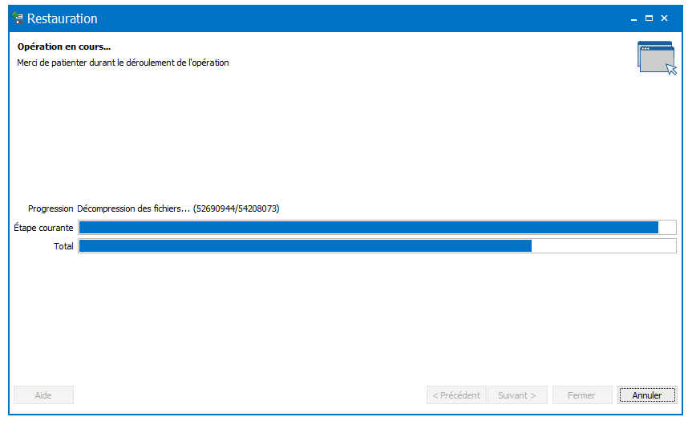

Si tout va bien, vous devriez avoir un message indiquant que la base s'est restaurée correctement.

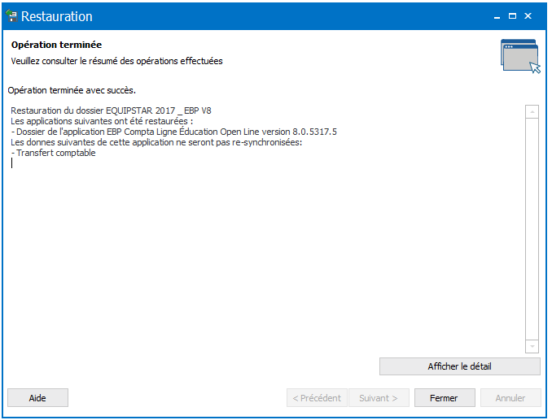

REMARQUES:
 Les raccourcis EBP (fichier.ebp) contiennent diverses infos comme l'ip du serveur, le login, le nom de la base. [Le MDP est lui crypté pour des raisons de sécurité.]

```
<?xml version="1.0" encoding="utf-8"?>
<Shortcut xmlns:xsd="http://www.w3.org/2001/XMLSchema" xmlns:xsi="http://www.w3.org/2001/XMLSchema-instance">
  <DatabaseShortcuts>
    <DatabaseShortcut>
      <SchemaId>9c9c51d5-d6fd-44fc-9724-a63a935a6fc7</SchemaId>
      <DatabaseId>5725272d-4e8c-44bc-bf15-873384650ea0</DatabaseId>
      <ApplicationId>8938492b-f049-4957-bb8e-71fe66db6845</ApplicationId>
      <ApplicationVersion>8.0</ApplicationVersion>
      <ConnectionString>providerid=478AD2A9-D144-4ef9-9626-42EFF41D5005;server=172.20.0.5;database=EQUIPSTAR 2017 _ EBP V8_9c9c51d5-d6fd-44fc-9724-a63a935a6fc7;port=3306;user id=adminmysql;encryptedpwd=F87xxxxxxxxx;</ConnectionString>
    </DatabaseShortcut>
  </DatabaseShortcuts>
  <IsDemoDatabase>false</IsDemoDatabase>
</Shortcut>
```


On peut aussi restaurer plusieurs fois la même base de donnée: on fera cependant attention à ne pas donner le même nom au dossier créé. Ce sera d'ailleurs bien plus pratique dans la gestion des raccourcis.
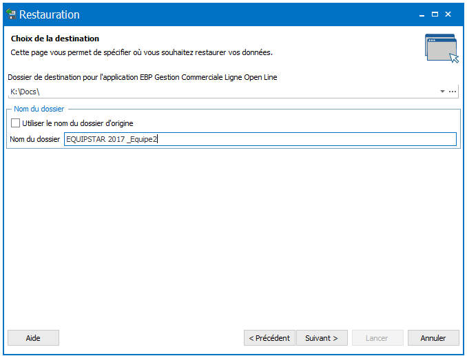

## Création et gestion des raccourcis 

### Création de raccourcis
Si pour une raison ou une autre, il fallait recréer un raccourci vers une base existente, c'est possible avec le client.
Pour cela, on fera "Fichier" puis "Créer un raccourci". On indique à nouveau les coordonnées du serveur, ainsi que les identifiants. Il faut alors choisir la base parmi la liste de celles présentes sur le serveur.


### Utilisation-gestion des utilisateurs-raccourcis par les élèves-professeurs
Les utilisateurs de SambaEdu disposent de différents lecteurs réseau (lecteur Classe, lecteur personnel,etc.)
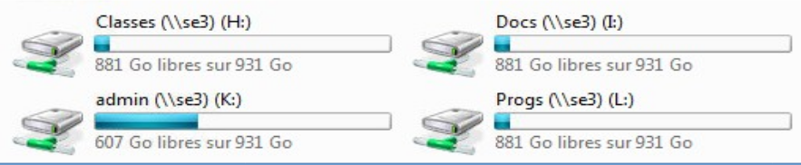

Pour qu'un élève puisse se connecter de n'importe quel poste de l'établissement, on placera le raccourci vers la base dans le lecteur `Classes`. Si on a créé une base pour 4 élèves, il sera judicieux de placer le racourci dans `Classes>login` (donc faire 4 copiers coller). Ainsi, seuls les 4 élèves pourront se connecter à la base de données.

On pourrait aussi placer ce fichier dans le répertoire `Classe>_Travail` mais dans ce cas, **il sera accessible à tous les élèves de la classe**, ce qui n'est pas grave si on a créé des utilisateurs personnalisés avec login/mdp dans la base. 
Pour cela, il suffira d'aller dans la partie `Paramêtres>Utilisateurs` de la base ouverte avec un code admin. On pourra aussi supprimer les accès existants, modifier les mdp,etc.
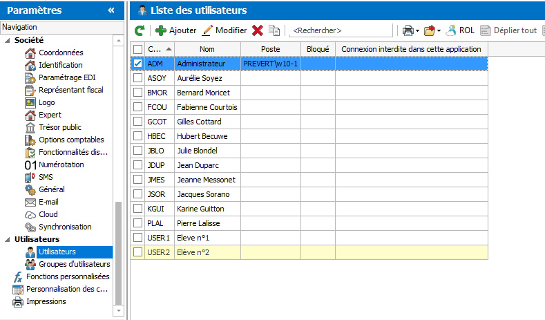

## Accès aux bases MySQL par les professeurs

### Utilisation de Workbench pour Windows
Il est techniquement possible de faire toutes les opérations en ligne de commande sur le serveur, mais on pourra utiliser divers logiciels comme MySQL WOrkbench pour les opérations de gestion de base.

**A noter que Workbench n'est pas compatible avec les moteurs mysql basés sur Mariadb.**

Il faut télécharger ce logiciel ici
https://dev.mysql.com/downloads/workbench/

A noter que la présence de .Netframework est nécéssaire pour utiliser MySQL Workbench, ainsi que Microsoft Visual C++ 2015

.Netframework 4.5.2 nécéssaire (https://www.microsoft.com/net/download/thank-you/net452?survey=false)

L'installeur MySQL permet d'ajouter tout un tas de modules, ici seul le module Workbench nous intéresse. 
Dans la partie `choosing a Setup Type`, on prendra `Custom` puis on choisira seulement mySQL Workbench.

On lance le logiciel. On fera "+" puis on entre les paramètres de connexion de la base
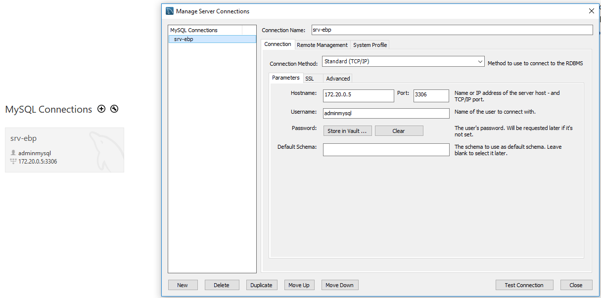

On ferme la fenetre, puis on lance la connexion. Le mot de passe va être demandé. On pourra stocker le mdp sur le poste, mais il est plus prudent de laisser le reglage avec mdp à entrer.

On pourra cliquer sur "server status" pour voir l'état du serveur.
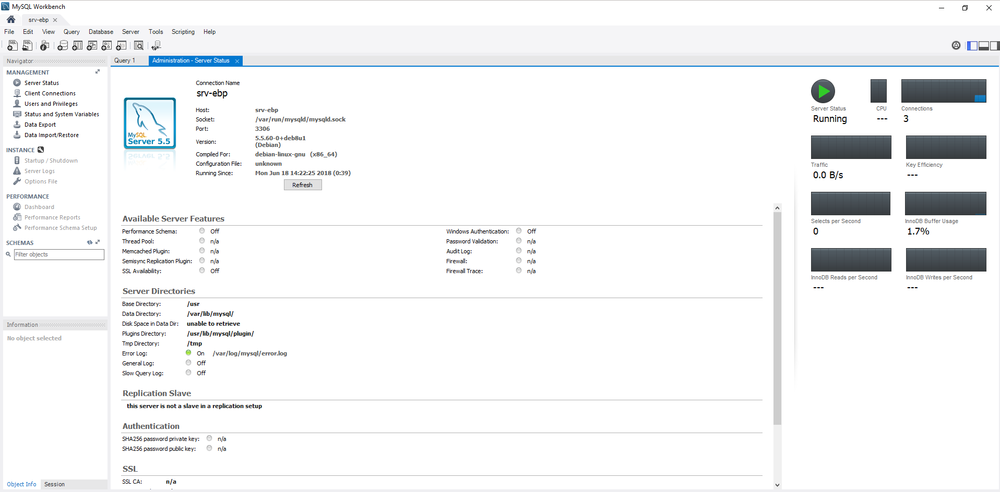

Pour supprimer une base, il suffit de cliquer sur le nom de  la base (en bas à droite) puis de faire un clic droit, puis "DROP SCHEMA". On valide


### Utilisation de phpmyadmin
`Phpmyadmin` est un outil permettant de gérer les bases mysql avec une interface web. Phpmyadmin est donc lancé avec un simple navigateur.

Sur le serveur on lancera:
```
apt-get install phpmyadmin
```
`phpmyadmin` nécéssite la présence d'un serveur web. Il sera demandé quel serveur web choisir. On prendra **apache2**.

A la question :" Faut-il configurer la base de données de phpmyadmin avec dbconfig-common ?" On répondra OUI.


On entrera le mdp "root MYSQL" , puis on choisira un mdp pour l'interface d'aministration (mais on se connectera avec le compte créé pour lire/écrire les bases).

On se connecte sur l'interface en tapant sur un navigateur:

http://ipduserveur/phpmyadmin/  (ex: http://172.20.0.5/phpmyadmin/ ).

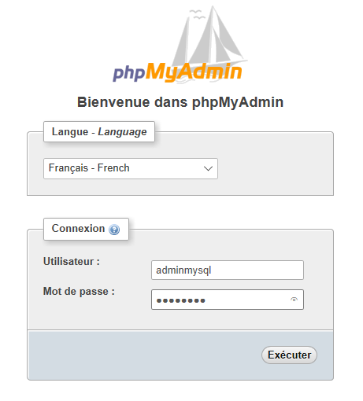

On arrive sur la page d'accueil du serveur.

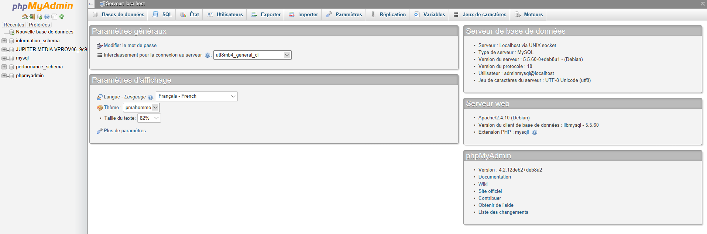

Sur la capture d'écran, on peut voir à gauche la présence d'une base restaurée sur le serveur avec le client EBP.

Pour supprimer cette base, il suffira de cliquer dessus, puis d'aller dans "Opérations" puis "Supprimer la base de données".


## sauvegardes hebdomadaires des bases mysql
On va créer un répertoire savmysql à la racine du disque.
```
mkdir /savmysql
```
Ce répertoire va servir de point de montage d'un disque dur externe, interne, partage samba, nas...

On peut créer un script contenant ces lignes. Ce script appelé savmysql est placé dans /root et doit être executable
```cd /root
touch savmysql.sh
chmod u+x /root/savmysql.sh
```

Dans l'exemple décrit en dessous, un partage réseau est monté dans le répertoire savmysql. Le login/mdp du partage est placé dans un fichier credential.

Montage d'un partage samba
```
mount -t cifs //172.20.0.11/savmysql /savmysql 
```
Login et mdp seront demandés pour accéder au partage.

On peut évidemment remplacer le partage samba par un disque due externe USB (par exemple /dev/sdg1)
```
mount -t auto /dev/sdg1 /savmysql
```
On pourra également utiliser un partage NFS. Un grand nombre de tutoriels expliquent comment mettre cela en place.


**Contenu du script de sauvegarde**
on édite le fichier
```
nano /root/savmysql.sh
```
On copie dans le fichier les lignes suivantes:
```
#!/bin/bash
mysqldump --user=adminmysql --password=mysql123 --all-databases | gzip > /savmysql/sauvegarde-`date +%Y-%m-%d-%H-%M`.sql.gz
exit
```
Le mot de passe étant en clair dans le fichier, il faut impérativement restreindre l'acès à ce fichier.
```
chmod 700 /root/savmysql.sh
```
L'utilisateur root va sauvegarder l'ensemble des bases compressées dans un fichier comportant la date et l'heure.
Ainsi, en cas de crash du serveur, il sera possible d'en refabriquer un avec les mêmes paramètres et de restaurer la dernière sauvegarde existante.

Ce script peut-être lancé en tache cron de façon hebdomadaire.
```
crontab -e
```
On ajoute en bas du fichier:
```
0 4 * * 0 /root/savmysql
```
Maintenant, le script est lancé tous les dimanches à 4h00 du matin. Vous disposez donc d'une sauvegarde complète hebdomadaire.
Il faudra de temps en temps en supprimer quelques unes ou le disque sera saturé (même si la compression est ici très eficace).

Les bases, une fois décompressées (unzip nomdufichier.zip) pourront être restaurées avec cette commande.

```
mysql --user=adminmysql --password=mysql123 < fichier_source.sql
```
L'opération sera très longue, mais efficace. Vu la taille des sauvegardes, il faut mieux faire cette restauration en ligne de commande (CLI) plutôt qu'avec des outils graphiques. (risques d'erreurs/plantages plus importants).


