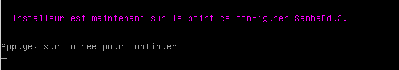

# Installation automatique d'un `Se3`

…article en chantier…

* [Préliminaires](#préliminaires)
    * [Objectif](#objectif)
    * [Étapes de l'installation automatique d'un `se3`](#Étapes-de-linstallation-automatique-dun-se3)
    * [Vue d'ensemble des préparatifs](#vue-densemble-des-préparatifs)
* [Phase 1 : Les fichiers `preseed` et `setup_se3`](#phase-1--les-fichiers-preseed-et-setup_se3)
    * [Création des fichiers `preseed` et `setup_se3`](#création-des-fichiers-preseed-et-setup_se3)
    * [Téléchargement des fichiers](#téléchargement-des-fichiers)
    * [Utilisation du script `install_phase1.sh`](#utilisation-du-script-install_phase1sh)
    * [Les paramétres du script](#les-paramétres-du-script)
    * [Que fait le script **install_phase1.sh** ?](#que-fait-le-script-install_phase1sh-)
        * [Modification du fichier `preseed`](#modification-du-fichier-preseed)
        * [La méthode `file`](#la-méthode-file)
        * [La méthode `initrd`](#la-méthode-initrd)
* [Phase 2 : Utiliser l'archive d'installation personnalisée](#phase-2--utiliser-larchive-dinstallation-personnalisée)
    * [Sur un réseau virtuel](#sur-un-réseau-virtuel)
    * [Sur un `CD`](#sur-un-cd)
    * [Sur une clé `usb`](#sur-une-clé-usb)
    * [Utilisation de la clé `usb`, du `CD` , ou de l'image `iso`](#utilisation-de-la-clé-usb-du-cd-ou-de-limage-iso)
* [Phase 3 : connexion en `root` et installation du paquet `se3`](#phase-3--connexion-en-root-et-installation-du-paquet-se3)
* [Références](#références)


## Préliminaires


### Objectif

L'objectif est de créer un `CD` ou une clé `usb` d'installation complètement automatisée de son `se3 Wheezy`.

Ainsi, avec ce `CD` *personnalisé*, ou cette clé `usb`, et une sauvegarde de son `se3`, on pourra très rapidement (re)-mettre en production son `se3`, que ce soit sur la même machine ou sur une autre machine.

Pour la sauvegarde/restauration du `se3`, vous consulterez avec profit [la documentation ad hoc](../se3-sauvegarde/sauverestaure.md#sauvegarder-et-restaurer-un-serveur-se3).


### Étapes de l'installation automatique d'un `se3`

L'installation automatique d'un `se3` se déroule en 3 phases :

* **Phase 1 :** création des fichiers **se3.preseed** et **setup_se3.data** puis de l'archive personnalisée
* **Phase 2 :** installation du système d'exploitation `Debian` via l'archive personnalisée
* **Phase 3 :** installation du paquet **`se3` et consorts** et mise en place des mots de passe

Pour la description de chaque phase, vous consulterez [la documentation ad hoc](http://wwdeb.crdp.ac-caen.fr/mediase3/index.php/Installation_sous_Debian_Wheezy_en_mode_automatique).

Il s'agit, dans ce qui suit, de minimiser la manipulation des divers fichiers nécessaires lors de l'installation, en les incorporant, une fois pour toute, dans l'archive de l'installateur.

Ainsi, les 3 phases pourront s'enchaîner presque automatiquement.

>travail encore en chantier actuellement puisque nous sommes dans une phase de mise au point de ce projet d'automatisation.  
Les tests en machines virtuelles sont concluants.  
**Il reste à effectuer la même chose sur des machines réelles**.


### Vue d'ensemble des préparatifs

Lors de la phase 1 de l'installation classique sont créés les fichiers **se3.preseed** et **setup_se3.data** via l'interface de configuration.

Une fois cela effectué, on utilise le script **install_phase1.sh** pour obtenir une archive d'installation personalisée incorporant les 2 fichiers ci-dessus.

Deux méthodes sont décrites : la méthode "file" et la méthode "initrd". Le script utilise la méthode `initrd` qui a l'avantage de donner une archive pouvant être utilisée indifféremment via un `CD` ou via une clé `usb`.

Il suffit alors de démarrer une machine à partir d'un `CD` ou d'une clé `usb` contenant cette archive personnalisée pour que la phase 2 démarre et s'enchaîne sur la phase 3.


## Phase 1 : Les fichiers `preseed` et `setup_se3`

### Création des fichiers `preseed` et `setup_se3`

La phase 1 consiste à créer le fichier `preseed` (nommé ici **se3.preseed**) et le fichier **setup_se3.data** en utilisant [l'interface-outil de configuration](http://dimaker.tice.ac-caen.fr/dise3xp/se3conf-xp.php?dist=wheezy).

On pourra bien entendu utiliser un fichier **se3.preseed** existant, dans le cas d'une migration ou d'une ré-installation ou tout simplement par précaution : *mieux vaut prévenir que guérir*… Il y aura éventuellement des modifications à apporter en fonction des évolutions, que ce soit du point de vue des versions de `se3`, ou du point de vue du matériel, ou encore d'une optimisation des paramètres de ces fichiers.


### Téléchargement des fichiers

Une fois les fichiers **se3.preseed** et **setup_se3.data** ainsi créés, il s'agira de les télécharger en remplaçant les xxxx par le nombre qui convient (voir message de l'interface de création) :
```sh
wget http://dimaker.tice.ac-caen.fr/dise3wheezy/xxxx/{se3.preseed,setup_se3.data}
```


### Utilisation du script `install_phase1.sh`

Le script **install_phase1.sh** permet d'incorporer les fichiers **se3.preseed** et **setup_se3.data** à une archive `iso` d'installation de `Debian/Wheezy`.

* Préparation  
Il suffit de placer le script et les 2 fichiers précédents dans un répertoire puis de télécharger le script dans ce répertoire.

* Téléchargez le script **install_phase1.sh**  
```sh
wget https://github.com/SambaEdu/se3-docs/raw/master/se3-installation/install_phase1.sh
```

* Passez en `root`  
Il faudra donner le mot de passe du compte root.
```sh
su
```

* Lancez le script  
par exemple avec le paramétre -m (si on veut utiliser une **mini.iso**)
```sh
bash install_phase1.sh -m
```

* Récupérez l'archive d'installation personnalisée **my_wheezy_install.iso**:  
Vous obtenez ainsi une archive personnalisée nommée **my_wheezy_install.iso**, ainsi que le fichier **se3.preseed.modif** pour informations des modifications apportées au fichier se3.preseed pour son incorporation.


### Les paramétres du script

Le script **install_phase1.sh** s'utilise avec un paramétre.
voici la liste des différentes possibilités pour ce paramétre :

**-h**  → aide-mémoire  
**-m**  → utilisation d'une mini.iso mais sans incorporation des firmwares  
**-mf** → utilisation d'une mini.iso et incorporation des firmwares  
**-n**  → utilisation d'une nestinst.iso mais sans incorporation des firmwares  
**-nf** → utilisation d'une nestinst.iso avec incorporation des firmwares  
**-i**  → utilisation d'une iso fournie dans le même répertoire que le script  
*indiquer le nom de l'iso en complément du paramétre -i*

Le mieux est de commencer par essayer une [ wheezy mini.iso](http://ftp.fr.debian.org/debian/dists/wheezy/main/installer-amd64/current/images/netboot/) (avec ou sans les firmwares non-free) ou une [debian-7.11.0-amd64-netinst.iso](http://cdimage.debian.org/cdimage/archive/7.11.0/amd64/iso-cd/) ou une [firmware-7.11.0-amd64-netinst.iso](http://cdimage.debian.org/cdimage/unofficial/non-free/cd-including-firmware/archive/7.11.0+nonfree/amd64/iso-cd/).

Pour ces deux archives netinst, le temps de téléchargement est important. C'est nettement plus rapide avec une mini.iso. Pour les firmwares à incorporer à la mini.iso, le temps de téléchargement est important aussi…

Cependant, certaines machines nécessitent un installateur non classique : il suffira de le télécharger (ou de le concevoir car je ne sais s'il en existe pour wheezy…) et de le placer dans le même répertoire que le script et les 2 fichiers. Ensuite, utilisez le paramétre -i suivi du nom de l'archive iso.


### Que fait le script **install_phase1.sh** ?

Ci-dessous, vous trouverez les détails qui vous permettront de comprendre ce que produit le script **install_phase1.sh** ; le script utilise la méthode `initrd` mais nous présentons d'abord la méthode `file`.


#### Modification du fichier `preseed`

Pour une automatisation complète, il est nécessaire de modifier certaines parties du fichier **se3.preseed** :

* On l'édite :
```sh
nano se3.preseed
```

…quelques lignes à modifier :

* **Pour la langue, le pays et les locales (paramètres régionaux)**  
Modifiez les lignes correspondant au **Language**, au **Pays** et aux **Choix des paramètres régionaux** en remplaçant ces 3 parties par la suivante :
```sh
# MODIFIER : langue, pays et parametres regionaux
# mettre en append → locale=fr_FR
d-i debian-installer/locale string fr_FR
```
>Attention : bugs dans le preseed de dimaker… partie des locales
>```sh
# Choix des parametres regionaux (locales)
d-i     debian-installer/locale                            string fr_FR.UTF-8
d-i     debian-installer/supported-locales                 string br_FR.UTF-8, en_US.UTF-8
d-i     debian-installer/locale                            string fr_FR.UTF-8
```
>Pourquoi une ligne est présente 2 fois ? Pourquoi il y a br au lieu de fr dans la ligne du milieu ?  
>→ ce doit être un bug : **outil de création du preseed à modifier ?**

* **Pour le clavier**  
Remplacez les lignes correspondant au **Clavier** (xkb-keymap, layoutcode et keymap) par la partie suivante :
```sh
# MODIFIER : clavier "azerty"
# mettre en append → keymap=fr(latin9)
d-i keymap select fr(latin9)
```

* **Un script inutile dans Network configuration**  
Commentez la ligne :
```sh
# MODIFIER :
# netcfg.sh n'est à utiliser que dans le cas d'une préconfiguration de type network (avec preseed/url)
#d-i preseed/run string netcfg.sh
```
>**NB :** il faudrait éclaircir cela. 
>Ce fichier existe nul part dans une install avec preseed d'un wheezy, il a surement été rajouté par ceux qui ont fabriqué l'install du se3. Lorsqu'on l'enlève, il semble qu'il n'y a pas d'accès reseau pendannt l'exécution du preseed mais elle réapparait après ; c'est pourquoi j'ai été obligé de télécharger les fichiers plus loin dans le preseed avant de faire l'install ; ceux-là : http://dimaker.tice.ac-caen.fr/dise3wheezy/se3scripts.  
>Lorsque je laisse cette ligne, l'installateur bloque avec un message rouge et me dit : le fichier netcfg.sh est corrompu…  
>[TODO] remettre les wget dans le preseed à la fin ? lorsque cette command fonctionnera , ce sera possible.  
>J'ai remarqué de grosses différences entre l'exécution de l'iso modifiée pour être complètement automatique (qui bloque sur netcfg.sh) et l'iso normale qui s'installe avec auto url=://dimaker… beaucoup de fichiers sont installés en plus dans la 2eme… entre autre netcfg et killall. Pourquoi ?

* **Pour les dépôts**  
Il faut ajouter ces lignes :
```sh
# AJOUTER : pour indiquer le miroir et eventuellement le proxy pour atteindre le miroir
# Mirror settings
d-i mirror/country string manual
d-i mirror/http/hostname string httpredir.debian.org
d-i mirror/http/directory string /debian
d-i mirror/suite string wheezy
d-i mirror/http/proxy string
```
>**NB :** pour le proxy ne faut-il pas mettre la ligne suivante ?
>```sh
d-i mirror/http/proxy string http://192.168.1.1:3128
```
>**NB :** il faudrait que l'outil de création du preseed soit modifié, non ?

* **Pour les statistiques**  
Une  ligne à rajouter :
```sh
# AJOUTER : pour eviter de répondre à la question
# Some versions of the installer can report back on what software you have
# installed, and what software you use. The default is not to report back,
# but sending reports helps the project determine what software is most
# popular and include it on CDs.
popularity-contest popularity-contest/participate boolean false
```
>**NB :** il faudrait que l'outil de création du preseed soit modifié, non ?

* **Pour la mise en place de la phase 3**  
modifiez les commandes à la fin :
```sh
# MODIFIER : 
# Preseed commands : mise en place de l'autologin
# ----------------
d-i preseed/early_command string cp /cdrom/setup_se3.data ./; \
    cp /cdrom/se3scripts/* ./; \
    chmod +x se3-early-command.sh se3-post-base-installer.sh install_phase2.sh; \
    ./se3-early-command.sh se3-post-base-installer.sh 
```
* **Vérification de conformité**  
Voila , le fichier **se3.preseed** est prêt.  
On peut tester sa conformité à l'aide de la commande suivante :
```sh
debconf-set-selections -c se3.preseed

```
>**NB** Il me répond cela :  
```sh
warning: Unknown type configuration, skipping line 42
warning: Unknown type AUTO, skipping line 51
warning: Unknown type AUTO, skipping line 56
warning: Unknown type AUTO, skipping line 59
warning: Unknown type AUTO, skipping line 61
warning: Unknown type AUTO, skipping line 62
warning: Unknown type bolean, skipping line 133
```
>Ça veut dire quoi ? Il y a un problème ?  
>→ pour les 6 premiers warning, non ; mais pour le dernier, oui : il faudrait boolean au lieu de bolean… Outil de création du preseed à modifier ? [TODO]

* **Modification facultative**  
Dans le fichier **se3.preseed**, le mot de passe du compte root du `se3` est en clair. Vous pouvez le crypter en utilisant la ligne commentée ci-dessous (si vous décommentez cette ligne, supprimez les 2 autres…) :
```sh
# Passwd super user
# -----------------
d-i passwd/make-user boolean false
d-i passwd/root-password password MOTDEPASSEROOT
d-i passwd/root-password-again password MOTDEPASSEROOT
#d-i passwd/root-password-crypted password $1$HMEw.SQy$Vwfh.sIK52ZXkAJcLtzQ71
```

Pour obtenir un mot de passe crypté à partir du mot de passe en clair
(mettons que ce soit MOTDEPASSEROOT), vous utiliserez la commande suivante :

```sh
printf "MOTDEPASSEROOT" | mkpasswd -s -m md5
```

Le résultat sera copié/collé à la place de celui en exemple ($1$HMEw.SQy$Vwfh.sIK52ZXkAJcLtzQ71).


#### La méthode `file`

* Préparation :  
On télécharge l'archive **se3scripts.tar.gz** qui contient les fichiers nécessaires pour la phase 3, en la décompressant dans un répertoire **se3scripts** :
```sh
wget https://github.com/SambaEdu/se3-docs/raw/master/se3-installation/se3scripts.tar.gz
tar -xzf se3scripts.tar.gz
```

>**NB :** certains des fichiers, contenus dans cette archive **se3scripts.tar.gz**, ont été modifiés à partir des fichiers disponibles à l'`url` http://dimaker.tice.ac-caen.fr/dise3wheezy/se3scripts. On a rajouté le fichier inittab qui est nécessaire pour la mise en place de l'autologin au début de la phase 3.


* Téléchargement de l'installateur `Debian` :  
Comme nous allons incorporer les fichiers d'installation `Wheezy`, créés précédemment, dans un `cd` ou une clé `usb`, il nous faut pour cela une archive `Debian Wheezy`.

Tout d'abord, récupérez une image d'installation de `Debian`. Une image *netinst* suffit (testée) :
```sh
wget http://cdimage.debian.org/cdimage/archive/7.11.0/amd64/iso-cd/debian-7.11.0-amd64-netinst.iso
```

Si votre serveur dispose de matériel (carte résau notamment) non reconnus car nécessitant des firmwares non libres, préférez cette image (testée) :
```sh
wget http://cdimage.debian.org/cdimage/unofficial/non-free/cd-including-firmware/archive/7.11.0+nonfree/amd64/iso-cd/firmware-7.11.0-amd64-netinst.iso
```

**NB :** on peut aussi incorporer les firmwares à l'archive comme cela est fait dans le script install_phase1.sh.

* Création des répertoires de travail **isoorig** et **isonew** :  
Pour mener à bien la modification de l'installateur `Debian`, on va créer deux répertoires :
* **isoorig :** il contiendra le contenu de l'image d'origine
* **isonew :** il contiendra le contenu de votre image personnalisée
```sh
mkdir isoorig isonew
```

* Du répertoire **isoorig** au répertoire **isonew**  
On monte, dans le répertoire **isoorig**, l'archive `iso` téléchargée , puis on copie son contenu dans le répertoire **isonew**.

Si vous utilisez l'archive **debian-7.11.0-amd64-netinst.iso** :
```sh
mount -o loop -t iso9660 debian-7.11.0-amd64-netinst.iso isoorig
rsync -a -H isoorig/ isonew
```

Si vous utiliser l'autre archive, **firmware-7.11.0-amd64-netinst.iso** :
```sh
mount -o loop -t iso9660 firmware-7.11.0-amd64-netinst.iso isoorig
rsync -a -H isoorig/ isonew
```

Cela dit que l'image est montée en lecture seule, c'est normal.

* Dans le répertoire **isonew**  
Les modifications suivantes seront à réaliser dans le répertoire **isonew**.

On va maintenant faire en sorte que l'installateur se charge automatiquement.

On donne les droits en écriture aux 3 fichiers à modifier :
```sh
chmod 755 ./isonew/isolinux/txt.cfg ./isonew/isolinux/isolinux.cfg ./isonew/isolinux/prompt.cfg
```
>**NB :** Est-ce nécessaire ? Si on est en root, non.

On modifie le fichier **isolinux/txt.cfg** pour l'utilisation du fichier `preseed` lors de l'installation (phase 2).

→ On l'édite :
```sh
nano ./isonew/isolinux/txt.cfg
```

→ On le modifie ainsi :
```sh
default install
label install
	menu label ^Install
	menu default
	kernel /install.amd/vmlinuz 
	append locale=fr_FR keymap=fr(latin9) file=/cdrom/se3.preseed initrd=/install.amd/initrd.gz -- quiet
```
**Remarque :** Veillez à adapter **install.amd/initrd.gz** selon l'architecture utilisée, ici `64bit`. En cas de doute, regardez ce qu'il y a dans le répertoire **isoorig**.

Ensuite, cela étant facultatif, éditez **isolinux/isolinux.cfg** :
```sh
nano ./isonew/isolinux/isolinux.cfg
```
changez *timeout 0* en *timeout 4* (par exemple)

…puis, tout aussi facultatif, éditez **isolinux/prompt.cfg** :

```sh
nano ./isonew/isolinux/prompt.cfg
```
changez *prompt 0* en *prompt 1*.

**NB :** ces deux opérations facultatives ont pour effet de lancer directement l'installation une fois le `CD` lancé. Cela peut éventuellement posé un problème lors du 1er redémarrage si le `CD` (ou la clé `usb`) n'est pas retiré.

→ On copie les 2 fichiers du `preseed` à la racine du répertoire **isonew** et le sous-répertoire **se3scripts** (voir ci-dessus pour son contenu) :
```sh
cp se3.preseed ./isonew/
cp setup_se3.data ./isonew/
mkdir ./isonew/se3scripts
cp ./se3scripts/* ./isonew/se3scripts/
```

→ Enfin, on reconstitue le fichier des sommes de contrôle (cela dépend en fait des installateurs utilisés) puis on crée la nouvelle image `iso` :
```sh
cd isonew
md5sum `find -H -type f` > md5sum.txt
```
>→ l'option -follow est obsolète ; il faudrait mettre -L (d'après man find), mais comme il y a un problème avec -L qui boucle de part un lien symbolique, on utilise -H (ne pas suivre les liens symboliques)

```sh
apt-get install genisoimage
genisoimage -o ../my_wheezy_install.iso -r -J -no-emul-boot -boot-load-size 4 -boot-info-table -b isolinux/isolinux.bin -c isolinux/boot.cat ../isonew
cd ..
```
L’image est là (dans le repertoire contenant isonew), elle porte le nom **my_wheezy_install.iso**.


#### La méthode `initrd`

L'archive de l'installateur `Debian` **debian-7.11.0-amd64-netinst.iso** (environ 220 Mo) permet d'utiliser la méthode `file` qui est décrite ci-dessus.

Si l'on veut utiliser une archive moins volumineuse, comme la **mini.iso** (environ 25 Mo), il est nécessaire d'utiliser la méthode `initrd`.

Dans cette méthode, au lieu de placer les fichiers à la racine de l'archive `iso`, on les place dans l'archive **initrd.gz** qui se trouve soit dans l'archive `iso` ou dans le répertoire *install.amd* de cette archive ; d'où le nom de cette méthode.

La plupart des actions détaillées ci-dessus sont à reprendre avec quelques différences que nous allons préciser.

* fichiers **se3.preseed** et **setup_se3.data**  
les modifications sont pratiquement identiques sauf pour la partie "Preseed commands". Voici les modifications à apporter :
```sh
# MODIFIÉ
# Preseed commands : mise en place de l'autologin
# ----------------
d-i preseed/early_command string cp se3scripts/* ./; \
    chmod +x se3-early-command.sh se3-post-base-installer.sh install_phase2.sh; \
    ./se3-early-command.sh se3-post-base-installer.sh 
```

* téléchargement des fichiers **pour la phase 3**  
on place ces fichiers dans un répertoire **se3scripts** comme indiqué ci-dessus.

* téléchargement de l'installateur **mini.iso**  
on prend une archive plus petite que la précédente,
que l'on renomme, par exemple, **wheezy_mini.iso** :
```sh
wget http://ftp.fr.debian.org/debian/dists/wheezy/main/installer-amd64/current/images/netboot/mini.iso -O wheezy_mini.iso
```

* création des répertoires **isoorig** et **isonew**  
comme ci-dessus; on monte l'archive **wheezy_mini.iso** dans le répertoire **isoorig** et on copie le contenu dans le répertoire **isonew**.
```sh
mkdir isoorig isonew
mount -o loop -t iso9660 wheezy_mini.iso isoorig
rsync -a -H isoorig/ isonew
```

* modification du fichier **txt.cfg**  
une différence notable avec la méthode précédente est la modification du fichier **txt.cfg** de l'archive `iso`.

On l'édite :
```sh
nano ./isonew/txt.cfg
```
On le modifie ainsi :
```sh
default install
label install
	menu label ^Install
	menu default
	kernel linux
	append locale=fr_FR keymap=fr(latin9) initrd=initrd.gz -- quiet
```
**Remarque :** on ne modifie pas les fichiers **isolinux.cfg** et **prompt.cfg**.

* incorporation à l'archive **intitrd.gz**  
on se place dans le répertoire **isonew**, on y crée un répertoire **temp** dans lequel on se place et décompresse l'archive **initrd.gz**.  
Ensuite, on y copie les fichiers nécessaires à l'installation, que ce soit pour la phase 2 ou la phase 3. Et, pour finir, on reconstitue l'archive **initrd.gz**.
```sh
mkdir temp
cd temp
gunzip -dc ../initrd.gz | cpio -id --no-absolute-filenames
cp ../../se3.preseed preseed.cfg
cp ../../setup_se3.data setup_se3.data
cp ../../se3scripts se3scripts
find . | cpio -o -H newc | gzip > ../initrd.gz
cd ..
rm -rf temp/
```

* incorporation des **firmwares** (non testée…)  
si on souhaite incorporer les firmwares à l'archive d'installation, voici comment procéder :  
dans le répertoire **isonews**, on télécharge le fichier **firmwares.cpio.gz** et on l'incorpore à l'archive **initrd.gz**.
```sh
cp -p initrd.gz initrd.gz.orig
wget http://cdimage.debian.org/cdimage/unofficial/non-free/firmware/wheezy/current/firmware.cpio.gz
cat initrd.gz.orig firmware.cpio.gz > initrd.gz
rm -f initrd.gz.orig firmware.cpio.gz
```

* reconstitution de **l'archive `iso`**  
enfin, on reconstitue l'archive `iso` pour obtenir une archive personnalisée.
```sh
genisoimage -o ../my_wheezy_install.iso -r -J -no-emul-boot -boot-load-size 4 -boot-info-table -b isolinux.bin -c boot.cat ../isonew
cd ..
```

Et voilà, vous avez une archive `iso` prête pour l'installation d'un `se3`.


## Phase 2 : Utiliser l'archive d'installation personnalisée


### Sur un réseau virtuel

Sur une VM (Virtual Machine), il n'y a rien à faire de plus, on peut utiliser directement l'image `iso`.

D'ailleurs, nous vous conseillons de tester votre archive `iso` personnalisée sur une VM. Cela vous permettra de la valider.


### Sur un `CD`

* Insérez votre `CD` vierge d'une taille supérieure à la taille de l'image `iso` (supérieur à 300 Mo).

* Installez le programme **wodim** (pour graver) puis récupérez les informations sur le graveur :
```sh
apt-get install wodim
wodim --devices
```
Cela donne :
```sh
wodim: Overview of accessible drives (1 found) :
-------------------------------------------------------------------------
 0  dev='/dev/sg1'	rwrw-- : 'VBOX' 'CD-RW'
-------------------------------------------------------------------------
```
Ici,le graveur de `CD` est en /dev/sg1.  
**Important** Dans la suite, remplacez sg1 par l'identification de son graveur.

* Dans le cas où il est necessaire d'effacer le `CD` :
```sh
wodim -v blank=fast dev=/dev/sg1
```

* Démontez le graveur puis lancez la gravure du `CD` :
```sh
umount /dev/sg1
wodim -v dev=/dev/sg1 -dao ./my_wheezy_install.iso
```

* Vérifiez la copie :
```sh
mkdir /mnt/cdrom
mount /dev/sg1 /mnt/cdrom
diff /mnt/cdrom/ ./isonew/
umount /dev/cdrom
```
Le `CD` d'installation de votre `se3` est prêt.  
**À tester, mon graveur ne semble pas reconnu par linux, je n'ai pas pu tester cette partie**


### Sur une clé `usb`

**Important :** dans la réalisation de l'archive `iso` ci-dessus, **si vous utilisez la méthode `file`** (le cas n'étant pas à envisager pour la méthode `initrd`), il faudra remplacer **cdrom** par **hd-media** si on veut l'utiliser via une clé `usb`. Non encore testé [TODO]. Il y a 3 occurrences à remplacer : 1 dans le fichier **txt.cfg**, ligne **append**, et 2 dans le fichier **se3.preseed**, dans la partie **# Preseed commands : mise en place de l'autologin**.

* Insérez votre clé `usb` d'une taille supérieure à la taille de l'image `iso` (supérieure à 300 Mo).

En root, tapez :
```sh
fdisk –l
```
Cela donne :
```sh
  Disk /dev/sdX: 3 GB, 3997486080 bytes 
  255 heads, 63 sectors/track, 486 cylinders 
  Units = cylinders of 16065 * 512 = 8225280 bytes 
 
     Device Boot      Start         End      Blocks   Id  System 
  /dev/sdX1   *           1         487     3911796    6  FAT1
```
* Repérez le volume /dev/sdX à coté de Disk qui correspond à votre clé `usb` grâce au système de fichier (FAT 16 ou FAT 32) et à sa taille.

**Attention**, soyez certain de votre repérage. Si vous vous trompez de lettre, vous pouvez effacer un disque dur !  
**Important** dans la suite, remplacez X par la lettre qui convient pour la clé.

* Il est indispensable de démonter tous les points de montage de cette clé à l'aide de la commande umount puis lancez la copie :
```sh
umount /dev/sdX
cp ./my_wheezy_install.iso /dev/sdX && sync
```
* Vérifiez la copie :
```sh
mkdir /mnt/usb
mount /dev/sdX /mnt/usb
diff /mnt/usb/ ./isonew/
umount /dev/usb
```
La clé d'installation de votre se3 est prête.  
**À tester, la gravure sur clé a été testée mais pas la clé obtenue**


### Utilisation de la clé `usb`, du `CD`, ou de l'image `iso`

La machine démarre, il n'y a rien à faire, si ce n'est d'appuyer sur la touche `Entrée` au début :


L'installation est complètement automatique jusqu'à la première connexion en root : début de la phase 3.

**NB :** n'oubliez pas de retirer le `CD` ou la clé `usb` lors du 1er redémarrage, entre la phase 2 et la phase 3.


## Phase 3 : connexion en `root` et installation du paquet `se3`

**Remarque :** Il est dit [ici](http://wwdeb.crdp.ac-caen.fr/mediase3/index.php/FaqInstallnewserver#R.C3.A9cup.C3.A9ration_du_fichier_n.C3.A9cessaire_.C3.A0_l.27installation_du_nouveau_serveur) qu'il faut copier à ce moment le **secrets.tdb** en cas de migration mais ce n'est pas nécessaire. Le script **restaure_se3** s'occupe de tout.

Au redémarrage la connection en `root` est automatique (autologin) :


 - Il faut appuyer sur **Entrée** (on peut commenter un passage de install_phase2.sh pour qu'il ne le fasse pas)
 - Puis choisir **3** (sans serveur de communication) → peut-on rendre cela automatique ?
 **NB :** il faudrait corriger ce truc, car il ne tient pas compte du preseed, non ?
 - Puis saisir le mot de passe pour `adminse3` → c'est juste à la suite, comment l'éviter ?
 - Enfin, saisir 2 fois le nouveau mot de passe pour `root` (on peut commenter un passage de install_phase2.sh pour qu'il ne le fasse pas)

On pourrait aussi rajouter les lignes suivantes, avant de terminer dans install_phase2.sh
```sh
apt-get --yes --force-yes se3-clamav se3-dhcp se3-clients-linux se3-wpkg se3-ocs se3-clonage se3-pla se3-radius
```
Pour se3-backup il y a une intervention à faire en selectionnant apache2 puis ok, donc je ne sais pas si cela peut être complètement automatisé ?
```sh
apt-get --yes --force-yes se3-backup
```
Puis finir par une mise à jour :
```sh
apt-get -qq update
apt-get upgrade --quiet --assume-yes
```

Sans oublier de redémarrer le `se3` à la fin de la phase 3 :
```sh
reboot
```

>**NB** Il faudrait essayer de terminer l'automatisation complète de la phase 3 dans l'objectif d'une restauration ?

Le `se3` est pret à être restauré à partir d"une sauvegarde.


Il reste à tester que le `se3` est vraiment ok, en tout cas il est accessible en [IPSE3]:909.


## Références

Voici quelques références que nous avons utilisé pour la rédaction de cette documentation :
* Article du site [`Debian Facile`](https://debian-facile.org) : [preseed debian](https://debian-facile.org/doc:install:preseed) qui décrit l'incorporation d'un fichier `preseed`.
* Article du site [`Debian Facile`](https://debian-facile.org) : [graver une cle usb](https://debian-facile.org/doc:install:usb-boot) qui décrit la copie d'une image `iso` sur une cle `usb`.
* Article du site [`Debian Facile`](https://debian-facile.org) : [graver un cd](https://debian-facile.org/doc:systeme:wodim) qui décrit la copie d'une image `iso` sur un `CD`.
* La documentation officielle `Debian` concernant [l'installation via un preseed](https://www.debian.org/releases/wheezy/amd64/apb.html.fr).
* Un article sur [la modification de l'initrd](http://connect.ed-diamond.com/GNU-Linux-Magazine/GLMFHS-045/Une-installation-de-Debian-automatique).
* La documentation pour [incorporer des firmwares](https://wiki.debian.org/fr/DebianInstaller/NetbootFirmware#Exemples_pour_Debian_7_.22Wheezy.22).

