# Installation manuelle d'un `Se3`

* [Préliminaire](#préliminaire)
* [Fichier d'installation par le réseau](#fichier-dinstallation-par-le-réseau)
    * [Avec une clé `usb`](#avec-une-clé-usb)
* [Lancement de l'installation de `Debian` (Phase 1)](#lancement-de-linstallation-de-debian-phase-1)
    * [Langue, pays, clavier](#langue-pays-clavier)
    * [Le réseau](#le-réseau)
    * [Les utilisateurs et mots de passe](#les-utilisateurs-et-mots-de-passe)
    * [Le serveur de temps](#le-serveur-de-temps)
    * [Partitionnement des disques](#partitionnement-des-disques)
    * [Installation du système de base](#installation-du-système-de-base)
    * [Outil de gestion des paquets (APT)](#outil-de-gestion-des-paquets-apt)
    * [Choisir et installer des logiciels](#choisir-et-installer-des-logiciels)
    * [Programme de démarrage `GRUB`](#programme-de-démarrage-grub)
    * [Fin de l'installation](#fin-de-linstallation)
* [Installation des paquets `Se3` (Phase 2)](#installation-des-paquets-se3-phase-2)
    * [Le fichier `setup_se3.data`](#le-fichier-setup_se3data)
    * [Le script `install_phase2.sh`](#le-script-install_phase2sh)
    * [Lancement du script de la phase 2](#lancement-du-script-de-la-phase-2)


## Préliminaire

Cette documentation présente une installation manuelle d'un `se3` version `Wheezy`.

Un certain nombre de paramètres doivent être préparés avant de se lancer dans l'installation.

Voici ceux qui ont été pris pour la rédaction de cette documentation :

* l'ip du se3 : 192.168.0.60
* le masque de sous-réseau : 255.255.255.0
* l'ip de la passerelle : 192.168.0.1
* le nom du se3 : se3test
* le nom du domaine : local
* le serveur de noms : 192.168.0.1
* le mot de passe root du se3

vous les adapterez à votre situation et à votre plan d'adressage. Il est impératif que ces paramètres soient ceux du fichier **setup_se3.data** qu'il faudra créer par ailleurs (voir [la documentation générale](http://wwdeb.crdp.ac-caen.fr/mediase3/index.php/Installation)).

Dans l'installation présentée, un disque d'environ 50 Go, nommé **sda**, est utilisé.

En production, il faudra adapter les valeurs en fonctions de la place disponible et du nombre de disques durs de votre serveur.

Typiquement, on peut avoir 2 disques durs de 500 Go (nommés **sda** et **sdb**) que l'on pourra formater comme cela :
```sh
sda ---+-- swap (PRIMAIRE) 2 à 4 Go (Selon Mémoire)
       |
       +-- / (PRIMAIRE) ext3 30 Go
       |
       +-- /var (PRIMAIRE) ext3 20 Go
       |
       +-- /var/se3 (LOGIQUE) xfs (Go = Le reste)

sdb ------ /home (PRIMAIRE) xfs 500 Go
```

**Conseil :** n'hésitez pas à reprendre plusieurs fois l'installation pour bien la connaître. Par la suite, vous n'en aurez pas autant l'occasion.


## Fichier d'installation par le réseau

Le fichier d'installation est à télécharger et à graver sur un CD.

Vous trouverez [ce fichier nommé `mini.iso` sur le site `Debian`](http://ftp.fr.debian.org/debian/dists/wheezy/main/installer-amd64/current/images/netboot/).


### Avec une clé `usb`

Au lieu de graver l'archive d'installation sur un CD, on peut utiliser une clé `usb`.

Voici une méthode que vous pouvez mettre en œuvre sur un système `GNU/Linux`.

* se mettre en `root`
```sh
su -l
```

* télécharger le fichier d'installation
```sh
wget http://ftp.fr.debian.org/debian/dists/wheezy/main/installer-amd64/current/images/netboot/mini.iso
```

* brancher une clé `usb`

* repérer la clé `usb`
```sh
lsblk
```

* vérifier que la clé `usb` est démontée
```sh
umount /dev/sdb1
```

* copier le fichier d'installation sur la clé `usb`
```sh
cp /root/mini.iso /dev/sdb
```

Une fois cela fait, il suffira de brancher la clé `usb` sur le serveur et de le démarrer.


## Lancement de l'installation de `Debian` (Phase 1)

Démarrer le serveur selon une des deux méthodes suivantes :

* en insérant le CD sur lequel a été gravé l'archive d'installation
* en ayant branché la clé `usb` sur laquelle a été copié l'archive d'installation

Vous devriez obtenir l'écran suivant :
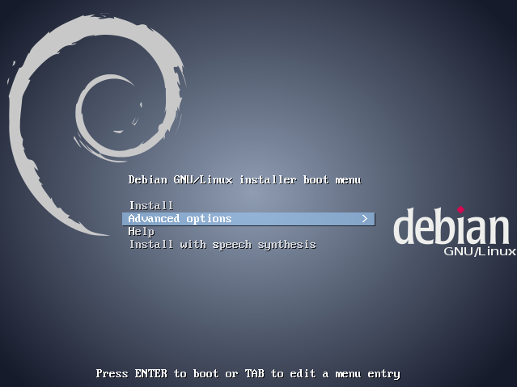

Dans l'interface qui apparaît à l'écran, choisir **Advanced options** puis **Expert install**.
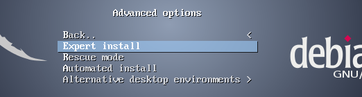

Ce mode d'installation présente toutes les questions qu'il est possible de poser. Cela vous permettra de gérer plus finement certaines étapes de l'installation.

Dans ce qui suit, la plupart du temps, il suffira d'appuyer sur la touche `Entrée` pour accepter l'option proposée par défaut.

Le menu principal indique les principales étapes :
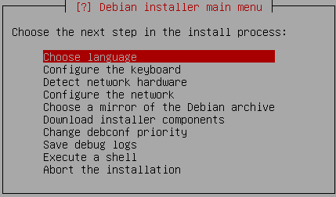


### Langue, pays, clavier

Au début, le menu principal est en anglais mais une fois les locales configurées, il sera en français.

* Choose language : `Entrée`
    * la langue : **Français**
    * le pays (**France**) : `Entrée`
    * les paramètres régionaux (**fr\_FR.UTF-8**) : `Entrée`
    * paramètres supplémentaires : `Entrée`
* Configurer le clavier : `Entrée`
    * disposition du clavier (**Français**) : `Entrée`


### Le réseau

* Détecter le matériel réseau : `Entrée`

**Remarque :** il se peut que l'on vous demande un pilote spécifique pour la carte réseau du serveur. Cela peut se paramétrer une fois l'installation terminée. Cependant, si vous avez récupéré [les fichiers des firmwares](http://cdimage.debian.org/cdimage/unofficial/non-free/firmware/wheezy/current/) pour les extraire sur une clé `usb`, vous pouvez fournir le pilote concerné en suivant les indications données par l'installateur. Si le pilote n'est pas présent dans les firmwares, notez bien les indications affichées pour résoudre le problème ultérieurement.

* Configurer le réseau : `Entrée`
    * Faut-il configurer le réseau automatiquement : **Non**
    * Donner l'adresse `IP` du serveur : **192.168.0.60**
    * Valeur du masque-réseau (**255.255.255.0**) : `Entrée`
    * Passerelle (**192.168.0.1**) : `Entrée`
    * Serveur de noms (**192.168.0.1**) : `Entrée`
    
    Un récapitulatif est affiché.
    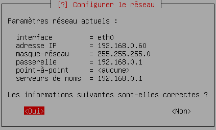
    
    Si c'est bon, il suffit de Choisir `Oui`. Sinon, pour modifier un des paramètres du réseau, choisir `Non`.
    
    * Un délai de détection du réseau est proposé : `Entrée`
    * Nom de machine : **se3test**
    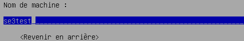
    
    * Domaine : **local**

**Remarque :** les différents paramètres (ip, nom du serveur, domaine,…) doivent correspondre à ceux du fichier **setup_se3.data**.

* Choix d'un miroir de l'archive `Debian` : `Entrée`
    * protocole de téléchargements (**http**) : `Entrée`
    * pays du miroir (**France**) : `Entrée`
    * miroir de l'archive Debian (**ftp.fr.debian.org**) : `Entrée`
    * mandataire http (à laiser vide) : `Entrée`
    * version de Debian à installer (**wheezy - ancienne version stable**) : `Entrée`

* Télécharger des composants d'installation : `Entrée`


### Les utilisateurs et mots de passe

Un seul utilisateur suffit, il s'agit du compte **root** du `se3`.

* Créer les utilisateurs et mots de passe : `Entrée`
    * Activer les mots de passe cachés (**Oui**) : `Entrée`
    * Autoriser les connexions du super utilisateur (**Oui**) : `Entrée`
    * mot de passe du superutilisateur root : **à compléter**
    * confirmer le mot de passe root
    * compte utilisateur ordinaire : **Non**


### Le serveur de temps

On peut profiter du serveur de temps de la passerelle, que ce soit un `Amon` ou un `Slis`.

* Configurer l'horloge : `Entrée`
    * utiliser NTP : **Oui**
    * serveur ntp : **192.168.0.1**
    * fuseau horaire : **Europe/Paris**

**Remarque :** pour que votre `Amon` soit serveur de temps, il suffit d'en faire la demande auprès de l'administrateur de cet `Amon` via un ticket `Cariina`.


### Partitionnement des disques

**Remarque importante :** si vous avez utilisé une clé `usb` pour l'archive d'installation, **il faut la retirer avant de lancer la détection des disques**. Pour la suite, elle ne servira plus car l'archive d'installation a été chargée dans la mémoire vive de la machine.

* Détecter les disques : `Entrée`
* Partitionner les disques : `Entrée`
    * Méthode de partitionnement : **Manuel**
    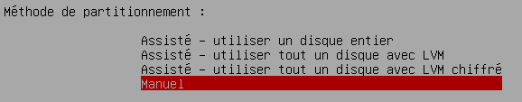
    * Choisir le disque sda puis utiliser la touche `Entrée`
    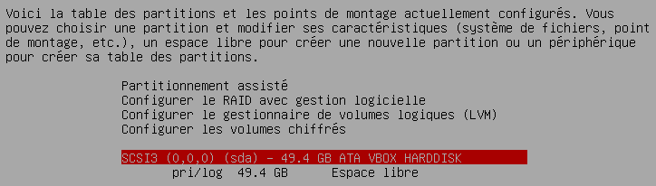
    * Créer une nouvelle table des partitions : **Oui**
    * Type de la table des partitions : **msdos**

Dans ce qui suit, on va partitionner le disque (**sda**) en 3 partitions primaires (**swap**, **/** et **/var**) et 2 partitions logiques (**/var/se3** et **/home**).

Si vous avez 2 disques, le premier (**sda**) sera partitionné en 3 partitions primaires (**swap**, **/** et **/var**) et 1 partition logique (/var/se3) et le deuxième (**sdb**) en une seule partition primaire (**/home**).

* Paramétrage de la 1ère partition (**swap**)
    * Se positionner sur l'espace libre du 1er disque (**sda** dans notre exemple)
    * Créer une nouvelle partition
    * Nouvelle taille de la partition : **1 GB**
    * Type de la nouvelle partition : **Primaire**
    * Emplacement : début
    * Utiliser comme : avec la touche `Entrée`, choisir **espace d'échange (swap)**
    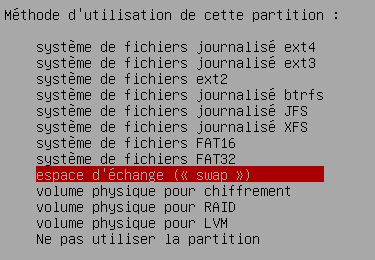
    * Fin du paramétrage de cette partition
* Paramétrage de la 2ème partition (**/**)
    * Se positionner sur l'espace libre du 1er disque (**sda** dans notre exemple) + `Entrée`
    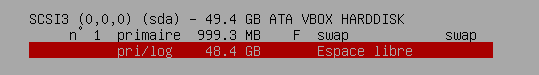
    * Créer une nouvelle partition
    * Nouvelle taille de la partition : **5 GB**
    * Type de la nouvelle partition : **Primaire**
    * Emplacement : début
    * Utiliser comme : avec la touche `Entrée`, choisir le système **ext3**
    * Formater la partition : **Oui, formater** → utiliser la touche `Entrée`
    * point de montage : **/**
    * indicateur d'amorçage : pour le positionner en **présent**, utiliser la touche `Entrée`
    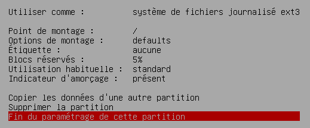
    * Fin du paramétrage de cette partition
* Paramétrage de la 3ème partition (**/var**)
    * Se positionner sur l'espace libre du 1er disque (**sda** dans notre exemple)
    * Créer une nouvelle partition
    * Nouvelle taille de la partition : **10 GB**
    * Type de la nouvelle partition : **Primaire**
    * Emplacement : début
    * Utiliser comme : avec la touche `Entrée`, choisir le système **ext3**
    * Formater la partition : **Oui, formater** → utiliser la touche `Entrée`
    * point de montage : **/var**
    * Fin du paramétrage de cette partition
* Paramétrage de la 4ème partition (**/var/se3**)
    * Se positionner sur l'espace libre du 1er disque (**sda** dans notre exemple)
    * Créer une nouvelle partition
    * Nouvelle taille de la partition : **11 GB**
    * Type de la nouvelle partition : **Logique**
    * Emplacement : début
    * Utiliser comme : avec la touche `Entrée`, choisir le système **XFS**
    * Formater la partition : **Oui, formater** → utiliser la touche `Entrée`
    * point de montage : **/var/se3** il faudra utiliser **Autre choix** dans la liste des noms de partitions proposées
    * Fin du paramétrage de cette partition
* Paramétrage de la 5ème partition (**/home**)
    * Se positionner sur l'espace libre du disque **sda** (ou sur le 2ème disque, **sdb** selon la situation)
    * Créer une nouvelle partition
    * Nouvelle taille de la partition : accepter la valeur proposée (le reste disponible)
    * Type de la nouvelle partition : **Logique**
    * Emplacement : début
    * Utiliser comme : avec la touche `Entrée`, choisir le système **XFS**
    * Formater la partition : **Oui, formater** → utiliser la touche `Entrée`
    * point de montage : **/home**
    * Fin du paramétrage de cette partition
    
    Notez bien le **B** pour la partition d'amorçage **/** et le **F** qui indique que toutes les partitions vont être formatées.
    
* Terminer le partitionnemnt et appliquer les changements : `Entrée`

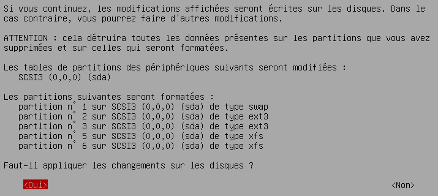
* Faut-il appliquer les changements sur les disques : **Oui**


### Installation du système de base

Dans cette partie, il suffira de prendre les paramètres proposés par défaut.

* Installer le système de base : `Entrée`
    * Noyau à installer (linux-image-amd64) : `Entrée`
    * Pilotes à inclure (image générique) : `Entrée`


### Outil de gestion des paquets (APT)

Dans cette partie, il suffira de prendre les paramètres proposés par défaut.

* Configurer l'outil de gestion des paquets : `Entrée`
    * Utiliser des logiciels non libres : **Non**
    * Utiliser des logiciels contrib : **Non**
    * services (sécurité et publication) : accepter les paramètres proposés `Entrée`


### Choisir et installer des logiciels

* Choisir et installer des logiciels : `Entrée`
    * Étude statistique d'utilisation des paquets : **Non**
    * droits programmes `man` et `mandb` : **Non**
    * Logiciels à installer : (cocher/décocher à l'aide de la barre d'espace)
        * décocher l'environnement de Bureau `Debian`
        * décocher le serveur d'impression
        * cocher le serveur `SSH`
        
        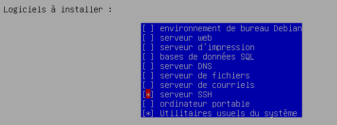
        * Valider les choix à l'aide de la touche `Entrée`


### Programme de démarrage `GRUB`

* Installer GRUB : `Entrée`
    * Installer GRUB sur le secteur d'amorçage : **Oui**


### Fin de l'installation

* Terminer l'installation : `Entrée`
    * heure universelle (UTC) : **Oui**
    * **Retirer le CD** (s'il y a lieu) puis `Entrée`

Le système redémarre…


## Installation des paquets `se3` (Phase 2)

### Le fichier setup_se3.data

La seconde phase correspond à l'installation des paquets spécifiques au serveur `se3`.

Pour cela, il faudra fournir au serveur le fichier **setup_se3.data** (à mettre dans une clé usb) et le script **install_phase2.sh** (à récupérer via le réseau).

Voici les détails de ces opérations à effectuer à l'aide d'une session **root** en `ssh`.

* se connecter en **root** via `ssh` sur le serveur
* brancher la clé `usb`

* repérer le nom de la clé `usb`
Cela peut se faire à l'aide de la commande suivante :
```sh
lsblk
```
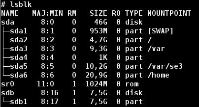

Vous pouvez repérer le nom attribué à la clé `usb` : dans la copie d'écran ci-dessus, **sda** est le disque dur sur lequel a été installé le système de base (les différentes partitions créées sont bien visibles) et **sdb** est le nom de la clé `usb` branchée.

**Remarque :** avant de brancher la clé `usb`, on peut lancer la commande `lsblk` puis brancher la clé `usb` et relancer la commande `lsblk` ; ainsi, par différence entre les deux affichages, vous repérerez bien le nom de la clé `usb`.

* monter la clé `usb` et vérifier la présence du fichier `setup_se3.data` :
```sh
mount /dev/sdb1 /mnt
ls -l /mnt
```

* créer le répertoire `/etc/se3` et y copier le fichier `setup_se3.data` :
```sh
mkdir /etc/se3
cp /mnt/setup_se3.data /etc/se3
ls -l /etc/se3
```


### Le script `install_phase2.sh`

Toujours avec la session en **root** via `ssh` sur le serveur, télécharger le script `install_phase2.sh` :
```sh
cd /root
wget http://dimaker.tice.ac-caen.fr/diSE3/se3scripts/install_phase2.sh
chmod +x install_phase2.sh
```

### Lancement du script de la phase 2

Toujours avec la session en **root** via `ssh` sur le serveur, on lance le script :
```sh
./install_phase2.sh
```

À partir de là, vous pourrez vous référer à [l'installation automatique (phase3)](http://wwdeb.crdp.ac-caen.fr/mediase3/index.php/Installation#Phase_3_:_Apr.C3.A8s_le_reboot_installation_automatique_du_paquet_se3_et_consort) pour la suite de l'installation.


