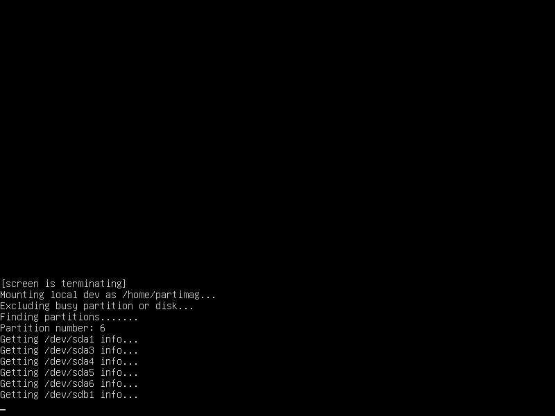
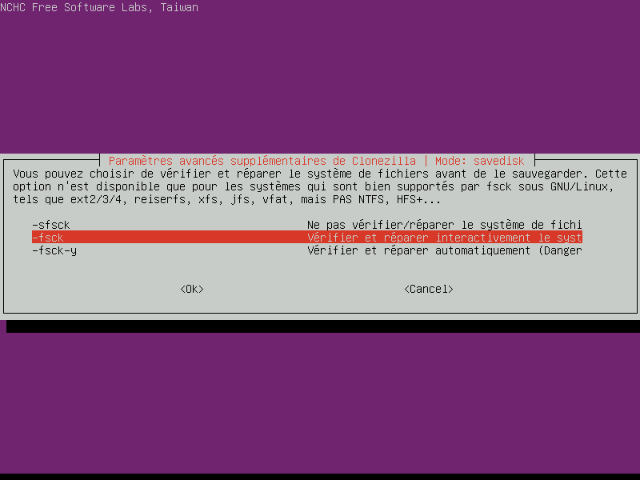
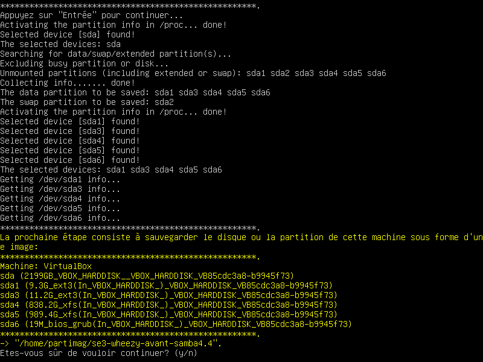

# Cloner un `se3`

… article en chantier …

* [Présentation](#présentation)
* [Préparation de `Clonezilla`](#préparation-de-clonezilla)
    * [Télécharger `Clonezilla`](#télécharger-clonezilla)
    * [Graver sur un `CD`](#graver-sur-un-cd)
        * [En mode graphique](#en-mode-graphique)
        * [En ligne de commande](#en-ligne-de-commande)
    * [Copier sur une clé `usb`](#copier-sur-une-clé-usb)
* [Préparation du support de sauvegarde](#pr%C3%A9paration-du-support-de-sauvegarde)
* [Clonage d'un disque du `se3`](#clonage-dun-disque-du-se3)
* [Restauration d'une image sur un des disques du `se3`](#restauration-dune-image-sur-un-des-disques-du-se3)
* [Références](#références)


## Présentation

Le but est de se sortir très rapidement d'une situation critique à l'aide d'images récentes des disques du se3. Cela peut se produire lors d'une mise à jour du se3 pouvant poser problème ou si lors d'une migration (par exemple de Wheezy à Jessie) a lieu une coupure du réseau électrique ou autre événement imprévu de cet ordre, événement improbable mais dont la probabilité n'est pas à négliger.

Il est aussi tout à fait possible de restaurer cette image sur une machine virtuelle pour ses tests personnels. Ainsi, vous disposez d'une vm ayant exactement les mêmes paramêtres que le serveur de prod. Il faut quand même faire quelques ajustements (proxy, utiliser un routeur virtuel ayant le même plan d'adressage ip que le se3).

Voici ce que nous vous proposons pour la fabrication des images des disques du `se3` :

- graver `Clonezilla` sur un `CD`
- redémarrer le `se3` via le `CD` pour se trouver avec `Clonezilla` en `live`
- repérer le disque à transformer en une image
- repérer un périphérique local : un disque externe `usb` convient (ou un `NAS`) ? Si j'ai la place, je peux utiliser celui qui me sert pour la vraie sauvegarde en créant à sa racine un répertoire /image_se3 par exemple.
- lancer le clonage → temps indicatif ?
- recommencer, avec le 2ème disque qui contient `/home` (par exemple), les étapes 3, 4 et 5


## Préparation de `Clonezilla`

Il s'agit de télécharger `Clonezilla` et de le graver sur un `CD` ou de le copier sur une clé `usb`, les deux solutions étant possibles.


### Télécharger `Clonezilla`

On télécharge une archive de `Clonezilla` selon le média utilisé : `CD` ou clé `usb`.

* pour un `CD`
```sh
wget https://osdn.net/projects/clonezilla/downloads/67139/clonezilla-live-2.5.0-25-amd64.iso
```

* pour une clé `usb`
```sh
wget https://sourceforge.net/projects/clonezilla/files/clonezilla_live_stable/2.5.0-25/clonezilla-live-2.5.0-25-amd64.zip
```

**Remarque :** la version stable indiquée dans les lignes de commande ci-dessus est la **2.5.0-25**. Vérifiez [sur le site de Clonezilla](http://clonezilla.org/downloads/download.php?branch=stable) que c'est bien toujours la version stable et, si elle a changé, n'hésitez pas à modifier la référence correspondante.


### Graver sur un `CD`

#### En mode graphique

* Insérez un `CD` dans le lecteur de votre ordinateur  
Avec une taille supérieure à la taille de l'image `iso` (supérieure à 205 Mo environ)

* Cliquez-droit sur l'archive téléchargée **clonezilla-live-2.5.0-25-amd64.iso**  
Dans le menu contextuel, choisir **Graver sur le disque…**  
Vous obtenez la fenêtre suivante :  


* Lancez la gravure du `CD`  
Cliquez sur **Graver**  
Une confirmation est demandée…  
  
Cliquez sur **Effacer le disque**

* Plusieurs étapes lors de la gravure  
Après l'effacement du disque, a lieu la gravure de l'archive `iso`, la fermeture du disque, la création d'une somme de contrôle et enfin l'éjection du disque gravé.

Le `CD` contenant `Clonezilla` est prêt à être utilisé : [voir ci-dessous](#clonage-dun-disque-du-se3).


#### En ligne de commande

… à venir …


### Copier sur une clé `usb`

… à venir …

## Préparation du support de sauvegarde

La sauvegarde peut-être faite sur un partage `samba`, mais il sera bien plus pratique d'effectuer cette sauvegarde sur un disque dur externe.

Le disque dur peut-être en partition `fat32`, `ntfs`, `ext3` ou `ext4`. Un très grand nombre de formats sont pris en charge par `Clonezilla`. La sauvegarde est découpée en fichiers de 4Go, donc le format `fat32` est aussi valable.
Les sauvegardes sont compressées, un disque de 1To peut donc servir de sauvegarde pour un se3 placé sur un disque de 2 To.

Le disque peut contenir d'autres fichiers. De ce fait, l'utilisation du disque dur externe servant à [la sauvegarde par le script **sauve_se3.sh**](sauverestaure.md#sauvegarder-et-restaurer-un-serveur-se3) peut convenir.


## Clonage d'un disque du `se3`

Une fois un `CD` ou une clé `usb` prêt, on peut redémarrer le `se3`, et lancer la création des images des disques durs.

Évidemment, le serveur sera indisponible pendant un certain temps… Pensez à prévenir les utilisateurs ; mais le mieux est de choisir un moment où aucun utilisateur n'est présent, ou du moins le moins possible.

Si le serveur est sur des partitions classiques sans `LVM`, et que les `home` et `/var/se3` sont sur des disques séparés, alors la sauvegarde sera relativement rapide (compter une demi-heure pour la sauvegarde suivie de vérification). En effet, le disque ne contient que la racine `/`, la partition `/var` et le `swap`.

Cette opération sera à répeter **avant** chaque changement important concernant le `se3` (et aussi **après**, si tout s'est bien déroulé). Une gestion rigoureuse n'est pas à négliger…

Choisir :  
→ la bonne *langue* et le bon codage *clavier*  
Si le clavier est toujours en qwerty, il faut alors faire *Choisir un clavier dans la liste complète, puis PC-azerty-Same As X11*  
→ le mode *débutant*  (à choisir plus tard)
→ le mode *device-image disque/partition vers/depuis image*  


 → *monter un périphérique local* . Une liste des périphériques possibles apparait.


On attend ensuite quelques secondes que le disque soit bien pris en charge par le système, puis on appuie sur `Entrée` :  


* Ici Clonezilla a bien détecté le disque du se3 de 2 To (sda), et le disque dur de sauvegarde (1To) 
Une analyse de chaque partition va être faite.


→ on choisit le bon disque de sauvegarde (sdb dans le cas présent).


`Clonezilla` étant un `livecd` basé sur `Débian` (ou `Ubuntu` selon la version choisie) , il possède une arborescence `Linux` et donc un répertoire `home`. `Clonezilla` a donc besoin de créer la sauvegarde dans son répertoire `/home/partimag/`. 

Le disque de sauvegarde sera monté *automatiquement* par le `livecd` comme son `/home/partimag` ( home qui n'a rien à voir avec celui du `se3` évidemment, `Clonezilla` faisant exactement la même chose pour une image d'un poste Windows).

*Aucun répertoire ou manipulation en ligne de commande n'est à faire.*

On peut choisir de placer l'image du 'se3' (contenue dans un répertoire) directement à la racine du disque (faire "done") ou dans un sous-répertoire.


→ on choisit *le type de sauvegarde* : `savedisk` pour le disque entier ou `saveparts` pour ne sauvegarder que quelques partitions .


(On peut restaurer seulement quelques partitions avec une image de disque entier. De même, si on ne souhaite sauvegarder que les partitions racines `/`, `/var` et `swap` parce qu'on a d'autres sauvegardes des `home` et `/var/se3`, on utilisera `saveparts`)  
→ Choisir le disque qui sera sauvegardé (donc celui qui contient la racine du `se3`).
'Le disque de sauvegarde (sdb) ayant été choisi pour la sauvegarde, il n'apparait plus dans la liste des disques à sauvegarder.'


→ Choisir *le nom de la sauvegarde* (ex: se3-wheezy-avant-samba-4.4_date)


→ Choisir de vérifier le disque du se3  (utile que pour les partitions `Linux`) 


→ Choisir de vérifier l'image sauvegardée 


→ appuyer sur `yes` pour lancer la sauvegarde après la demande de validation.


La sauvegarde du se3 est en cours


## Restauration d'une image sur un des disques du `se3`

Et oui, la catastrophe est arrivée… mais vous avez une image `Clonezilla` qui va vous permettre de remettre en ordre de marche votre `se3`. Suivez le guide !

Avant de commencer la sauvegarde, il convient de préciser qu'une restauration doit toujours être faite avec une version de `Clonezilla` au moins aussi récente.

… à venir …


## Références

* Le site de [Clonezilla](http://clonezilla.org/) : of course !
* La page [Clonezilla d'Ubuntu](https://doc.ubuntu-fr.org/clonezilla), à ne pas négliger
* Un tutoriel d'[utilisation de Clonezilla](http://www.fredzone.org/tutoriel-clonezilla-sauvegarde-restauration-disque-dur)

